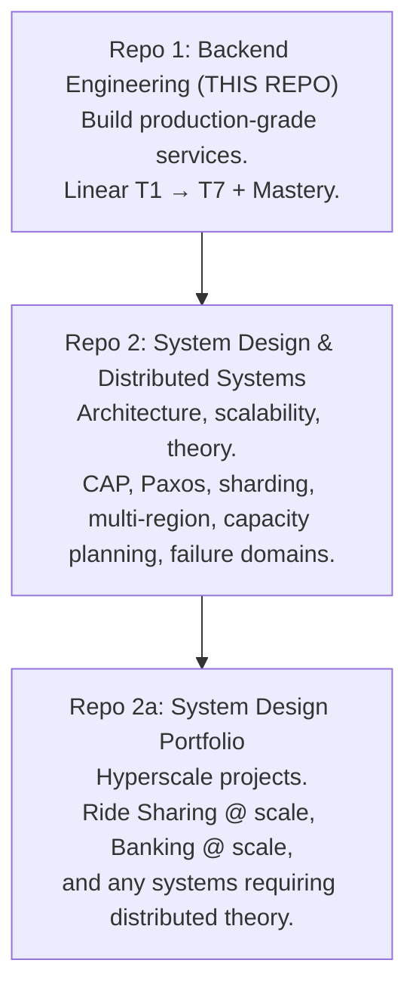
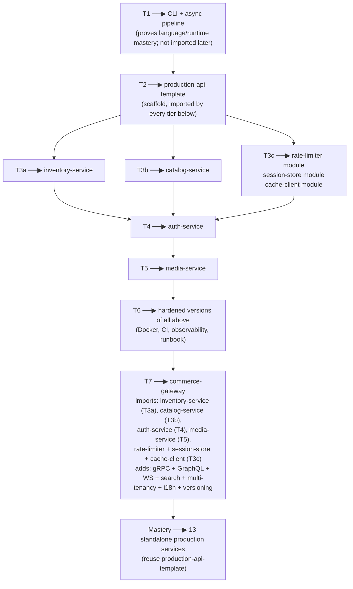

# Backend Engineering — Production-Grade Services

> A linear, capability-based curriculum for becoming a senior-level backend engineer.
> Covers Node.js + TypeScript + Express + Postgres + MongoDB + Redis + the production stack around them.
> Does **not** cover distributed systems theory, consensus, sharding, or multi-region architecture — those belong in the separate **System Design & Distributed Systems** curriculum.

---

## 1. What This Curriculum Is

A hands-on path from "I can write JavaScript" to "I can design, build, test, secure, deploy, debug, profile, and maintain production backend services at a senior engineer's level."

**Core principle**: every topic is either **BUILD** (you implement it), **USE** (you consume a library/tool), or **KNOW** (awareness only). You never waste time building Kafka from scratch, and you never skip building your own rate limiter.

**Non-goal**: this is _not_ a system design curriculum. If a topic only matters at FAANG hyperscale (CAP theorem, Paxos, sharding algorithms, multi-region active-active, capacity planning), it lives in the sibling repo, not here.

---

## 2. The Three-Repo Structure



**Build order**: Repo 1 → Repo 2 → Repo 2a. Do not start Repo 2 until Repo 1's Core Mastery projects are done.

---

## 3. The 7 Tiers + Mastery Phase

| Tier        | Capability                                                                                                       | Anchored Project                                                  |
| ----------- | ---------------------------------------------------------------------------------------------------------------- | ----------------------------------------------------------------- |
| **T1**      | Language & runtime fluency — write idiomatic TypeScript, reason about Node's execution model without hand-waving | CLI + async data pipeline                                         |
| **T2**      | Service construction — layered, validated, logged, error-handled HTTP service                                    | **Production API Template** (reused by every later tier)          |
| **T3a**     | Relational data — model, migrate, query, tune Postgres safely under concurrency                                  | `inventory-service`                                               |
| **T3b**     | Document data — model, query, and transact MongoDB                                                               | `catalog-service`                                                 |
| **T3c**     | Key-value state — Redis data structures, atomic ops, caching, rate limiting primitives                           | Reusable modules: `rate-limiter`, `session-store`, `cache-client` |
| **T4**      | Identity & boundary security — authenticate, authorize, harden every entry point                                 | `auth-service`                                                    |
| **T5**      | Async work & reliability — move work off the request path, survive dependency failure                            | `media-service`                                                   |
| **T6**      | Production operations — test, containerize, deploy, observe, debug under load                                    | Harden T3a–T5 services                                            |
| **T7**      | Enterprise & multi-protocol surfaces — expose over gRPC/GraphQL/WS, add search, multi-tenancy, i18n              | `commerce-gateway` (composes T3a + T3b + T4 + T5)                 |
| **Mastery** | Build production services without tutorials                                                                      | 13 projects (Core 6 + Optional 7)                                 |

**T3 is split into three sub-tiers** because Postgres, MongoDB, and Redis are three distinct data paradigms, each deserving a dedicated learning pass.

---

## 4. The 11-Tag Legend

Every topic carries these tags. Format is compact — two lines per topic.

| Tag                        | Meaning                                                                                                            |
| -------------------------- | ------------------------------------------------------------------------------------------------------------------ |
| `BUILD` / `USE` / `KNOW`   | Depth mode. BUILD = you implement it from scratch. USE = you consume the library correctly. KNOW = awareness only. |
| `Anchor: <project>`        | The project where this topic is exercised.                                                                         |
| `Deps: <topics>`           | What must come before this topic.                                                                                  |
| `Fails: <symptom>`         | What breaks in production if you skip or half-learn this topic.                                                    |
| `Interview: Y/N/S`         | Frequently asked in MAANG backend interviews (Y = yes, N = no, S = sometimes).                                     |
| `Artifact: <file/module>`  | The hands-on output proving you learned it.                                                                        |
| `Mistake: <trap>`          | The most common mistake engineers make with this topic.                                                            |
| `Ref: <tier>`              | Where this topic reappears or is built upon.                                                                       |
| `Theory X / Practice Y`    | Rough weight split for this topic.                                                                                 |
| `Local` / `Cloud-optional` | Whether it runs on local Docker only, or has a free-tier cloud fallback.                                           |

**Example** (topic + tags, exactly as they appear in tier files):

```
- **Closures**: lexical capture, memory retention, module pattern
  `BUILD` · `Anchor: T1-CLI` · `Deps: scopes` · `Fails: retained large objects in long-lived callbacks` · `Interview: Y` · `Artifact: closure-exercises.ts` · `Mistake: assuming loop variable is per-iteration` · `Ref: T2, T5` · `Theory 50/Practice 50` · `Local`
```

---

## 5. Architecture Composition Map

Every tier produces something that a later tier consumes. Nothing is built in isolation.



**The rule**: you never rebuild the scaffold. T2's `production-api-template` is the base of every project after it.

---

## 6. IN / OUT Boundary

### ✅ IN (Backend Engineering)

- Everything needed to **build, run, debug, ship a single service**
- Tool _usage_ (Kafka, RabbitMQ, Elasticsearch as consumers)
- Production practices (testing, CI, Docker, K8s at developer level, observability, runbooks)
- Language, runtime, DB, auth, security, ops
- _Just enough_ theory to use a tool correctly (e.g., "why MVCC matters" — not "how MVCC is implemented")

### ❌ OUT (→ System Design curriculum)

- Consensus protocols (Paxos, Raft, ZAB)
- Distributed theory (CAP, PACELC, FLP, vector clocks, Lamport clocks, CRDTs)
- Algorithms you never write (consistent hashing internals, quorum math, gossip protocols)
- Multi-region architecture, active-active, service mesh internals, sharding algorithms
- Capacity planning, failure-domain design, cell architecture
- Database engine internals (LSM vs B+ tree implementation, WAL internals)
- High-scale load balancing algorithm design

### ⚠️ GRAY ZONE

| Topic                                             | Handling                      |
| ------------------------------------------------- | ----------------------------- |
| Kafka _usage_ (producer/consumer/consumer groups) | IN — as a job queue           |
| Kafka _internals_                                 | OUT                           |
| Redis _usage_ (cache, rate limit, locks)          | IN                            |
| Redis _cluster internals_                         | OUT                           |
| Transactions & isolation levels                   | IN                            |
| Distributed transactions (Saga usage)             | IN (usage); 2PC internals OUT |
| Connection pooling & PgBouncer                    | IN                            |
| Replication & failover internals                  | OUT                           |
| Consistent hashing _awareness_                    | IN (one paragraph)            |
| Consistent hashing _implementation_               | OUT                           |
| HTTP/2 & HTTP/3 usage                             | IN                            |
| TCP congestion control internals                  | OUT                           |

**Rule of thumb**: if a senior backend engineer at a 200-person company needs it to ship reliably, it's IN. If it only matters when operating at hyperscale with dedicated infra teams, it's OUT.

---

## 7. The Stack

| Layer             | Primary                                           | Awareness / Alternatives       |
| ----------------- | ------------------------------------------------- | ------------------------------ |
| Language          | TypeScript (strict)                               | —                              |
| Runtime           | Node.js LTS                                       | Bun, Deno (awareness)          |
| HTTP Framework    | Express                                           | Fastify (comparison in T2)     |
| Validation        | Zod                                               | Valibot, ArkType (awareness)   |
| Logging           | Pino                                              | Winston (comparison)           |
| Relational DB     | PostgreSQL                                        | —                              |
| Query Builder     | Kysely                                            | Drizzle, Prisma (comparison)   |
| Document DB       | MongoDB                                           | —                              |
| Key-Value / Cache | Redis                                             | KeyDB, Dragonfly (awareness)   |
| Job Queue         | BullMQ                                            | pg-boss, RabbitMQ (comparison) |
| Object Storage    | MinIO (S3 API)                                    | Real S3 (drop-in)              |
| Email             | Resend or Brevo (free tier)                       | Nodemailer + SMTP (awareness)  |
| Testing           | Vitest + Testcontainers + MSW                     | Jest (awareness)               |
| Containers        | Docker + Docker Compose                           | —                              |
| CI/CD             | GitHub Actions                                    | —                              |
| Orchestration     | Kubernetes (developer level)                      | Docker Compose (single host)   |
| Metrics           | Prometheus + Grafana                              | —                              |
| Tracing           | OpenTelemetry + Jaeger or Tempo                   | —                              |
| Errors            | Sentry (self-hosted or free tier)                 | —                              |
| Real-time         | WebSockets (ws), SSE                              | Socket.IO (awareness)          |
| RPC               | gRPC (@grpc/grpc-js)                              | tRPC (awareness)               |
| Graph API         | GraphQL (Apollo Server or Mercurius) + DataLoader | —                              |
| Search            | Meilisearch (small) or Elasticsearch (large)      | Postgres full-text (baseline)  |

**Every tool** is free, open-source, self-hostable via Docker, or has a genuine free tier. **Zero paid subscriptions required** anywhere in this curriculum.

---

## 8. Local Docker vs Free Cloud Tier

Every tier file will tag data/infra topics with `Local` or `Cloud-optional`.

- **`Local`** = runs entirely on your machine via Docker. Default for Postgres, MongoDB, Redis, MinIO, Kafka, RabbitMQ, Elasticsearch, Prometheus, Grafana, Jaeger, Sentry.
- **`Cloud-optional`** = has a free-tier cloud alternative if local hardware can't run it (e.g., Managed Postgres via NeonDB, Managed Redis via Upstash).

**Default**: local Docker. Cloud only when local is genuinely impossible.

---

## 9. The One Rule That Matters

**Every BUILD topic gets built. No skipping.** USE and KNOW topics can be deferred or trimmed. BUILD topics are the spine — the whole point of this curriculum is that you can implement the mechanics yourself, not just `npm install` them.

If you're ever short on time, cut KNOW first, then USE, then extend your timeline. Never cut BUILD.

---

## 10. Case Studies & Seminal Papers

Case studies and seminal papers are **separate documents**, not embedded in tier files.

- **`13-case-studies.md`** — enterprise/MAANG case studies, organized by tier, each with a short "why this matters" note and a pointer to the relevant tier topic.
- **`14-papers.md`** — seminal systems papers, organized by tier, with reading-time budgets and "why this matters today" annotations.

**Placement rule**:

- If a case study or paper reinforces a **backend engineering topic** (Postgres, idempotency, queues, caching, API design, tracing, incident response) → lives in `13-` or `14-`, cross-referenced from the relevant tier file.
- If it reinforces **distributed systems theory** (consensus, sharding algorithms, multi-region, CRDTs) → lives in **Repo 2** (System Design), cross-referenced from Repo 1 if applicable.

**Attach pattern**: each tier file ends with a two-line footer:

```
## Case Studies & Papers
See `13-case-studies.md § T<tier>` and `14-papers.md § T<tier>`.
```

**Contents (Repo 1)**:

Case studies (14 primary + 4 cross-referenced from Repo 2):

- Stripe ledger & idempotency → T4
- Stripe date-based API versioning → T7
- Segment $1M Kafka incident → T5, T6
- Discord Cassandra → ScyllaDB → T3a
- Instagram Postgres sharding → T3a
- GitHub MySQL → Vitess → T3a
- Reddit queue architecture → T5
- Slack job queue & fan-out → T5, T7
- Cloudflare postmortem culture → T6
- Airbnb service mesh → T7
- WhatsApp small server footprint → T1, T5
- Meta TAO & Haystack → T3a, T3b, T5
- Figma/Docs CRDT vs OT → T7
- Shopify Pods architecture → T7 (cross-ref Repo 2)
- Amazon Prime Video reversal → T7 (cross-ref Repo 2)
- Netflix chaos engineering → T6 (cross-ref Repo 2)
- Uber H3 geospatial → T7 (cross-ref Repo 2)
- Google GFS & Bigtable in practice → T3b awareness (cross-ref Repo 2)
- Amazon Dynamo vs DynamoDB → T3a awareness (cross-ref Repo 2)

Papers (Repo 1):

- Google Dapper → T6
- Google MapReduce → T5

Papers moved to **Repo 2** (System Design): Lamport clocks, Sagas, Paxos, Chord, GFS, Bigtable, Dynamo, Dremel, ZooKeeper, Kafka paper, Spanner, TAO, Raft, Aurora.

---

## 11. Repo Files

```
00-overview.md
01-tier-1-language-runtime.md
02-tier-2-service-construction.md
03-tier-3a-relational-postgres.md
04-tier-3b-document-mongodb.md
05-tier-3c-keyvalue-redis.md
06-tier-4-identity-security.md
07-tier-5-async-reliability.md
08-tier-6-production-operations.md
09-tier-7-enterprise-surfaces.md
10-backend-mastery-projects.md
11-progress-tracker.md
12-problems-tools-index.md
13-case-studies.md
14-papers.md
```

**Course-material files** (deep dives per subtopic) live in a separate folder, generated on demand:

```
course-materials/
  01-tier-1/
    01-01-closures.md
    01-02-this-binding.md
    01-03-esm-cjs-interop.md
    ...
```

Each tier file is a **map**. Course-material files are the **territory**.

---

## 12. How to Use This Repo

1. **Read this file once.** Understand the structure.
2. **Open `01-tier-1`.** Work through topics linearly.
3. **When you reach a BUILD topic**, generate a course-material file for it (or ask your AI instructor to).
4. **Update `11-progress-tracker.md`** at the end of each session.
5. **Use `12-problems-tools-index.md`** when you're stuck on "which tool solves this?".
6. **Use `13-case-studies.md` and `14-papers.md`** as supplementary reading — organized by tier.
7. **Do not skip tiers.** The spine is linear for a reason — each tier assumes the previous.

---

## 13. What "Done" Looks Like

You've completed this curriculum when:

- All T1–T7 BUILD topics are built and understood
- T7's `commerce-gateway` composes the earlier services and runs end-to-end
- Backend Mastery **Core 6** projects are built, tested, containerized, and deployed
- You can pick up any unfamiliar backend problem and know which tools to reach for — without looking them up

Optional 7 Mastery projects are exactly that: optional. Stop at Core 6 and the curriculum is complete.
