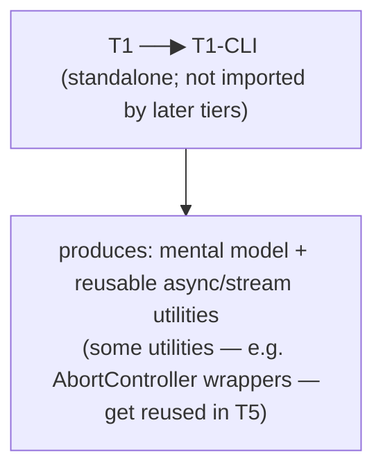

# Tier 1 — Language & Runtime Fluency

> The deepest tier in the curriculum. Language and runtime mastery compounds into everything that follows.
> **Option X**: this file is a map. Deep dives per topic are generated on demand as separate course-material files.

---

## Purpose

By the end of T1, you can:

- Read and write idiomatic TypeScript without reaching for `any` or fighting the type system
- Predict exactly what Node.js will do with any async code before you run it
- Reason about memory, streams, and the event loop without hand-waving
- Debug a stack trace to its root cause without guessing
- Know the difference between "this works" and "this is correct"

T1 is where you build the mental model that every later tier relies on. Skipping T1 means fighting the language and runtime forever.

---

## Anchored Project

**T1-CLI: Async Data Pipeline**

A command-line tool that:

1. Reads a large NDJSON/CSV file (streaming, not buffered)
2. Transforms records (async enrichment via mock API)
3. Writes output to disk with backpressure handling
4. Reports progress with accurate throughput metrics
5. Handles cancellation gracefully (`Ctrl+C`)
6. Uses worker threads for one CPU-bound transformation step

**What it proves**: you can reason about streams, backpressure, async concurrency, cancellation, workers, and TypeScript types — all without HTTP or a database.

**Deliverables**:

- Source code with strict TS, zero `any`
- Unit tests (Vitest) for transform logic
- README with architecture notes
- A short `NOTES.md` documenting the 5 trickiest bugs you hit and how you root-caused them

---

## How T1 Fits the Architecture

T1 doesn't produce a service. It produces **fluency**. Later tiers assume you have it.

---

## Topics (Linear Spine)

### T1.1 — JavaScript Execution Model

- **Scopes & lexical environment**: global/function/block scope, TDZ, hoisting, `var` vs `let` vs `const`
  `BUILD` · `Anchor: T1-CLI` · `Deps: —` · `Fails: subtle bugs from var hoisting and TDZ misuse` · `Interview: Y` · `Artifact: scope-exercises.ts` · `Mistake: assuming let in a loop creates fresh bindings without a block` · `Ref: T1.2, T1.6` · `Theory 60/Practice 40` · `Local`

- **Closures**: lexical capture, memory retention, module pattern, IIFE, partial application
  `BUILD` · `Anchor: T1-CLI` · `Deps: T1.1 scopes` · `Fails: retained large objects in long-lived callbacks → memory leak` · `Interview: Y` · `Artifact: closure-exercises.ts` · `Mistake: assuming loop variable is per-iteration` · `Ref: T1.7, T5` · `Theory 50/Practice 50` · `Local`

- **`this` binding**: default, implicit, explicit (`bind`/`call`/`apply`), `new`, arrow functions, hard binding
  `BUILD` · `Anchor: T1-CLI` · `Deps: T1.1` · `Fails: silent this bugs in callbacks → undefined property access` · `Interview: Y` · `Artifact: this-exercises.ts` · `Mistake: assuming arrow this binds at call site` · `Ref: T2` · `Theory 60/Practice 40` · `Local`

- **Prototypes & prototype chain**: `__proto__` vs `prototype`, constructor functions, `Object.create`, inheritance
  `BUILD` · `Anchor: T1-CLI` · `Deps: T1.1` · `Fails: inheritance bugs when mixing class and prototype patterns` · `Interview: S` · `Artifact: prototype-exercises.ts` · `Mistake: mutating Object.prototype` · `Ref: T1.5` · `Theory 70/Practice 30` · `Local`

- **Classes**: `class` syntax, `extends`, `super`, static members, private fields (`#`), getters/setters
  `BUILD` · `Anchor: T1-CLI` · `Deps: T1.4` · `Fails: subtle super timing bugs in subclass constructors` · `Interview: S` · `Artifact: class-exercises.ts` · `Mistake: assuming class is more than syntax sugar over prototypes` · `Ref: T1.5` · `Theory 40/Practice 60` · `Local`

- **Property descriptors & reflection**: `Object.defineProperty`, `getOwnPropertyDescriptor`, `Proxy`, `Reflect`
  `KNOW` · `Anchor: T1-CLI` · `Deps: T1.4` · `Fails: unexpected behavior when libraries do meta-programming` · `Interview: N` · `Artifact: —` · `Mistake: overriding non-writable properties` · `Ref: T1.5` · `Theory 80/Practice 20` · `Local`

- **Modules: ESM vs CommonJS**: syntax differences, interop, dynamic `import()`, `package.json` `"type"`, conditional exports
  `BUILD` · `Anchor: T1-CLI` · `Deps: T1.1` · `Fails: require of ESM-only package throws; dual-package hazard` · `Interview: Y` · `Artifact: dual-module-demo/` · `Mistake: assuming require can load ESM synchronously` · `Ref: T2, T6` · `Theory 40/Practice 60` · `Local`

- **Iterators & iterables**: `Symbol.iterator`, `Symbol.asyncIterator`, custom iterables, generator functions, `yield`, `yield*`
  `BUILD` · `Anchor: T1-CLI` · `Deps: T1.1` · `Fails: memory blowup when eagerly materializing lazy iterables` · `Interview: S` · `Artifact: iterators-exercises.ts` · `Mistake: forgetting generators are lazy — infinite loop if never consumed` · `Ref: T1.2, T1.8, T5` · `Theory 50/Practice 50` · `Local`

**Deep-dive candidates**: closures, `this` binding, ESM/CJS interop — generate course-material files on demand.

---

### T1.2 — Async Model

- **Event loop phases**: timers, pending callbacks, poll, check, close callbacks; when each runs; starvation risks
  `BUILD` · `Anchor: T1-CLI` · `Deps: —` · `Fails: event loop starvation from recursive nextTick; blocked I/O` · `Interview: Y` · `Artifact: event-loop-trace.ts` · `Mistake: assuming setTimeout(fn, 0) runs before setImmediate` · `Ref: T1.8, T5` · `Theory 70/Practice 30` · `Local`

- **Microtasks vs macrotasks**: `process.nextTick` queue, Promise microtask queue, ordering guarantees, starvation
  `BUILD` · `Anchor: T1-CLI` · `Deps: T1.2 event loop` · `Fails: nextTick starvation starves I/O; ordering bugs across microtask boundaries` · `Interview: Y` · `Artifact: microtask-ordering.ts` · `Mistake: assuming Promise.resolve().then runs immediately` · `Ref: T1.3, T2` · `Theory 60/Practice 40` · `Local`

- **Promises**: states, `then`/`catch`/`finally`, chaining, `Promise.resolve/reject/all/allSettled/any/race`, unhandled rejections
  `BUILD` · `Anchor: T1-CLI` · `Deps: T1.2 microtasks` · `Fails: unhandled rejection crashes process in newer Node; Promise.all partial failure` · `Interview: Y` · `Artifact: promise-exercises.ts` · `Mistake: forgetting Promise.all rejects on first failure and loses others` · `Ref: T1.3, T5` · `Theory 50/Practice 50` · `Local`

- **`async`/`await` mechanics**: how it desugars to promises, execution suspension, error propagation, `await` on non-promises
  `BUILD` · `Anchor: T1-CLI` · `Deps: T1.2 promises` · `Fails: async errors bypass Express error middleware` · `Interview: Y` · `Artifact: async-await-trace.ts` · `Mistake: assuming await blocks the thread` · `Ref: T2` · `Theory 60/Practice 40` · `Local`

- **Async iteration**: `for await...of`, async generators, `Symbol.asyncIterator`, stream interop
  `BUILD` · `Anchor: T1-CLI` · `Deps: T1.1 iterators, T1.2 async/await` · `Fails: unbounded buffering when mixing sync and async iteration` · `Interview: S` · `Artifact: async-iteration.ts` · `Mistake: assuming for await applies backpressure automatically` · `Ref: T1.8 streams, T5` · `Theory 40/Practice 60` · `Local`

- **Cancellation with `AbortController`/`AbortSignal`**: propagation, `signal.reason`, integration with fetch/streams/timers/DB drivers
  `BUILD` · `Anchor: T1-CLI` · `Deps: T1.2 async/await` · `Fails: orphaned in-flight requests after client disconnects` · `Interview: Y` · `Artifact: cancellation.ts` · `Mistake: assuming all libraries honor AbortSignal` · `Ref: T2, T5` · `Theory 40/Practice 60` · `Local`

- **Unhandled rejection & uncaught exception policy**: process-level handlers, restart strategy, what NOT to do
  `BUILD` · `Anchor: T1-CLI` · `Deps: T1.2 promises` · `Fails: process crash without logs; silent half-failure state` · `Interview: Y` · `Artifact: process-handlers.ts` · `Mistake: swallowing errors in unhandledRejection` · `Ref: T2, T6` · `Theory 40/Practice 60` · `Local`

**Deep-dive candidates**: event loop phases, promise internals, `AbortController` — generate on demand.

---

### T1.3 — Error Handling Discipline

- **Sync vs async error propagation**: throw, reject, callback err, event `error`, listener leaks
  `BUILD` · `Anchor: T1-CLI` · `Deps: T1.2 async/await` · `Fails: silent failures when error isn't caught or propagated` · `Interview: Y` · `Artifact: error-propagation.ts` · `Mistake: forgetting EventEmitter throws on unhandled error event` · `Ref: T2` · `Theory 40/Practice 60` · `Local`

- **Custom error classes**: extending `Error`, `cause`, `instanceof` caveats, serialization
  `BUILD` · `Anchor: T1-CLI` · `Deps: T1.3 propagation` · `Fails: instanceof fails across module boundaries` · `Interview: Y` · `Artifact: errors/` · `Mistake: forgetting Object.setPrototypeOf when targeting older JS` · `Ref: T2` · `Theory 30/Practice 70` · `Local`

- **Error taxonomy**: operational vs programmer, expected vs unexpected, retryable vs terminal
  `BUILD` · `Anchor: T1-CLI` · `Deps: T1.3 custom errors` · `Fails: retrying non-retryable errors; giving up on transient errors` · `Interview: Y` · `Artifact: error-taxonomy.md` · `Mistake: treating all errors as fatal` · `Ref: T2, T5` · `Theory 50/Practice 50` · `Local`

- **Stack traces & error context**: `Error.captureStackTrace`, cause chains, preserving context through async boundaries
  `BUILD` · `Anchor: T1-CLI` · `Deps: T1.3 custom errors` · `Fails: lost root cause when wrapping errors` · `Interview: S` · `Artifact: cause-chains.ts` · `Mistake: discarding the original error when wrapping` · `Ref: T2, T6` · `Theory 40/Practice 60` · `Local`

**Deep-dive candidate**: error taxonomy — generate on demand.

---

### T1.4 — Memory & Garbage Collection

- **V8 heap structure**: new space, old space, large object space, code space
  `KNOW` · `Anchor: T1-CLI` · `Deps: —` · `Fails: misdiagnosing heap growth without understanding the model` · `Interview: S` · `Artifact: —` · `Mistake: assuming heap size = resident memory` · `Ref: T1.7, T6` · `Theory 80/Practice 20` · `Local`

- **GC algorithms**: Scavenger (minor GC), Mark-Sweep-Compact (major GC), generational hypothesis, incremental/concurrent marking
  `KNOW` · `Anchor: T1-CLI` · `Deps: T1.4 heap` · `Fails: pauses during major GC under load; misattributed latency spikes` · `Interview: S` · `Artifact: —` · `Mistake: assuming GC is free — it costs CPU cycles` · `Ref: T6` · `Theory 80/Practice 20` · `Local`

- **Memory leak patterns in Node**: dangling closures, unbounded caches, event listener leaks, retained streams, global registries
  `BUILD` · `Anchor: T1-CLI` · `Deps: T1.1 closures, T1.4 heap` · `Fails: gradual memory growth → OOMKill in production` · `Interview: Y` · `Artifact: leak-repro.ts` · `Mistake: assuming Map/Set are freed when they aren't` · `Ref: T6` · `Theory 40/Practice 60` · `Local`

- **Heap snapshots & heap limits**: `v8.getHeapSnapshot`, `--max-old-space-size`, `--inspect` heap profiling
  `USE` · `Anchor: T1-CLI` · `Deps: T1.4 leaks` · `Fails: unable to diagnose production leak without tooling` · `Interview: S` · `Artifact: heap-snapshot-demo/` · `Mistake: taking snapshot too late (GC already collapsed the leak)` · `Ref: T6` · `Theory 30/Practice 70` · `Local`

- **`WeakRef` & `FinalizationRegistry`**: when to use, when NOT to use
  `KNOW` · `Anchor: T1-CLI` · `Deps: T1.4 GC` · `Fails: unpredictable behavior if used for correctness` · `Interview: N` · `Artifact: —` · `Mistake: relying on finalizers for cleanup timing` · `Ref: T1.5` · `Theory 90/Practice 10` · `Local`

**Deep-dive candidate**: memory leak patterns in Node — generate on demand.

---

### T1.5 — TypeScript Fundamentals

- **Primitive & literal types**: `string`, `number`, `boolean`, `null`, `undefined`, `symbol`, `bigint`, literal types, `as const`
  `BUILD` · `Anchor: T1-CLI` · `Deps: —` · `Fails: widening types unintentionally; as const misuse` · `Interview: S` · `Artifact: primitives.ts` · `Mistake: assuming const implies literal type for object properties` · `Ref: T1.6` · `Theory 40/Practice 60` · `Local`

- **Interfaces vs type aliases vs classes**: when to use each, declaration merging, extension differences
  `BUILD` · `Anchor: T1-CLI` · `Deps: T1.5 primitives` · `Fails: interface merging conflicts in libraries` · `Interview: S` · `Artifact: interfaces-vs-types.ts` · `Mistake: using interface for union-like shapes (impossible)` · `Ref: T2, T7` · `Theory 50/Practice 50` · `Local`

- **Unions & intersections**: discriminated unions, exhaustive checking with `never`, narrowing
  `BUILD` · `Anchor: T1-CLI` · `Deps: T1.5 interfaces` · `Fails: missing cases in switch silently compile` · `Interview: Y` · `Artifact: discriminated-unions.ts` · `Mistake: forgetting the default case in exhaustive never checks` · `Ref: T2, T7` · `Theory 40/Practice 60` · `Local`

- **Functions & overloads**: parameter variance, rest/spread, overload signatures, `this` typing
  `BUILD` · `Anchor: T1-CLI` · `Deps: T1.5 unions` · `Fails: bivariant parameter acceptance causing runtime bugs` · `Interview: S` · `Artifact: function-typing.ts` · `Mistake: writing overloads that never resolve` · `Ref: T2` · `Theory 40/Practice 60` · `Local`

- **Generics**: type parameters, constraints (`extends`), defaults, generic functions/classes/interfaces
  `BUILD` · `Anchor: T1-CLI` · `Deps: T1.5 unions` · `Fails: unconstrained generics losing type safety` · `Interview: Y` · `Artifact: generics.ts` · `Mistake: over-constraining generics, forcing callers to cast` · `Ref: T1.6` · `Theory 50/Practice 50` · `Local`

- **Utility types**: `Partial`, `Required`, `Readonly`, `Pick`, `Omit`, `Record`, `Exclude`, `Extract`, `NonNullable`, `ReturnType`, `Parameters`, `Awaited`
  `USE` · `Anchor: T1-CLI` · `Deps: T1.5 generics` · `Fails: verbose hand-written types where a utility type suffices` · `Interview: S` · `Artifact: utility-types.ts` · `Mistake: using Omit when Pick would be safer against upstream changes` · `Ref: T2` · `Theory 30/Practice 70` · `Local`

**Deep-dive candidates**: discriminated unions, generics — generate on demand.

---

### T1.6 — Advanced TypeScript

- **Mapped types**: `[K in keyof T]`, modifiers (`+?`, `-?`, `+readonly`, `-readonly`), key remapping with `as`
  `BUILD` · `Anchor: T1-CLI` · `Deps: T1.5 generics` · `Fails: incorrect key transforms → runtime mismatch` · `Interview: S` · `Artifact: mapped-types.ts` · `Mistake: assuming mapped types are eager — they're lazy until instantiated` · `Ref: T2` · `Theory 60/Practice 40` · `Local`

- **Conditional types**: `T extends U ? X : Y`, distributive conditionals, `infer`, variance behavior
  `BUILD` · `Anchor: T1-CLI` · `Deps: T1.6 mapped types` · `Fails: any in conditional produces union of both branches` · `Interview: S` · `Artifact: conditional-types.ts` · `Mistake: forgetting distribution only happens over naked type parameters` · `Ref: T1.6 infer` · `Theory 70/Practice 30` · `Local`

- **`infer` keyword**: extracting types from functions/promises/arrays/tuples, recursive inference
  `BUILD` · `Anchor: T1-CLI` · `Deps: T1.6 conditional types` · `Fails: writing custom utility types that silently fall back to any` · `Interview: S` · `Artifact: infer-exercises.ts` · `Mistake: using infer outside conditional types` · `Ref: T1.6 template literals` · `Theory 60/Practice 40` · `Local`

- **Template literal types**: string pattern matching, key remapping, combining with unions
  `BUILD` · `Anchor: T1-CLI` · `Deps: T1.6 conditional types` · `Fails: exponential type expansion blowing compile times` · `Interview: N` · `Artifact: template-literals.ts` · `Mistake: over-using template literal types — compile-time cost is real` · `Ref: T7` · `Theory 70/Practice 30` · `Local`

- **`never`, `unknown`, `any`, `satisfies`**: differences, when each is correct, `satisfies` for validation-preserving inference
  `BUILD` · `Anchor: T1-CLI` · `Deps: T1.5 unions` · `Fails: any silently disabling type safety across call chains` · `Interview: Y` · `Artifact: never-unknown-any.ts` · `Mistake: using any where unknown would force proper narrowing` · `Ref: T2` · `Theory 40/Practice 60` · `Local`

- **Declaration files & module augmentation**: `.d.ts`, `declare module`, `declare global`, ambient types
  `BUILD` · `Anchor: T1-CLI` · `Deps: T1.5 interfaces` · `Fails: untyped third-party libraries producing any leakage` · `Interview: N` · `Artifact: augmentation-demo/` · `Mistake: augmenting global when module augmentation would do` · `Ref: T6` · `Theory 50/Practice 50` · `Local`

- **Type-only imports/exports**: `import type`, `export type`, `verbatimModuleSyntax`
  `USE` · `Anchor: T1-CLI` · `Deps: T1.1 modules` · `Fails: runtime imports of type-only modules bloating bundles` · `Interview: N` · `Artifact: —` · `Mistake: not enabling verbatimModuleSyntax in new projects` · `Ref: T6` · `Theory 30/Practice 70` · `Local`

- **`tsconfig` deep dive**: `strict`, `moduleResolution` (`node16`/`bundler`), `target`, `lib`, `paths`, `project references`, `composite`
  `BUILD` · `Anchor: T1-CLI` · `Deps: T1.1 modules` · `Fails: subtle build/run mismatches between dev and prod` · `Interview: S` · `Artifact: tsconfig-notes.md` · `Mistake: leaving strict: false in production projects` · `Ref: T2, T6` · `Theory 50/Practice 50` · `Local`

**Deep-dive candidates**: conditional types + `infer`, `satisfies` — generate on demand.

---

### T1.7 — Node.js Runtime Fundamentals

- **libuv architecture**: thread pool, event loop integration, `UV_THREADPOOL_SIZE`, what runs on the pool vs main thread
  `KNOW` · `Anchor: T1-CLI` · `Deps: T1.2 event loop` · `Fails: pool starvation when doing heavy crypto/fs work` · `Interview: S` · `Artifact: —` · `Mistake: assuming all async work happens on the main thread` · `Ref: T1.8, T6` · `Theory 80/Practice 20` · `Local`

- **`process` object**: `argv`, `env`, `cwd`, `exit`, signals (`SIGINT`, `SIGTERM`), `nextTick`, `hrtime`
  `BUILD` · `Anchor: T1-CLI` · `Deps: —` · `Fails: process ignores shutdown signal; unclean exit` · `Interview: S` · `Artifact: process-demo.ts` · `Mistake: calling process.exit() before flushing stdout` · `Ref: T5, T6` · `Theory 30/Practice 70` · `Local`

- **Buffers**: `Buffer.from`, encoding, `ArrayBuffer` vs `Buffer` vs `Uint8Array`, zero-copy slices
  `BUILD` · `Anchor: T1-CLI` · `Deps: T1.4 memory` · `Fails: accidental buffer copies causing memory spikes` · `Interview: S` · `Artifact: buffers.ts` · `Mistake: assuming Buffer.slice copies data (it shares memory)` · `Ref: T1.8, T5` · `Theory 40/Practice 60` · `Local`

- **Streams**: Readable, Writable, Transform, Duplex; `pipe`, `pipeline`; `highWaterMark`; backpressure; `objectMode`; error propagation
  `BUILD` · `Anchor: T1-CLI` · `Deps: T1.2 async iteration, T1.7 buffers` · `Fails: memory blowup from unhandled backpressure; leaked file handles on error` · `Interview: Y` · `Artifact: streams-pipeline.ts` · `Mistake: using .pipe() without error handling → silent failures` · `Ref: T5, T6` · `Theory 50/Practice 50` · `Local`

- **Filesystem (`fs/promises`, `fs` sync/stream)**: `readFile`, `createReadStream`, `mkdir`, `readdir`, `stat`, `watch`
  `USE` · `Anchor: T1-CLI` · `Deps: T1.7 streams` · `Fails: synchronous fs calls blocking the event loop under load` · `Interview: N` · `Artifact: —` · `Mistake: using fs.readFileSync in request handlers` · `Ref: T5, T6` · `Theory 20/Practice 80` · `Local`

- **`path` & `os`**: cross-platform path handling, `path.resolve` vs `join`, CPU/memory introspection
  `USE` · `Anchor: T1-CLI` · `Deps: —` · `Fails: Windows path bugs in prod; wrong resource calculations` · `Interview: N` · `Artifact: —` · `Mistake: string-concatenating paths instead of using path` · `Ref: T6` · `Theory 20/Practice 80` · `Local`

- **`events` (EventEmitter)**: `on`/`once`/`off`/`emit`, listener leaks, `error` event semantics, `EventTarget` alternative
  `BUILD` · `Anchor: T1-CLI` · `Deps: T1.3 errors` · `Fails: listener leak → MaxListenersExceededWarning → memory growth` · `Interview: S` · `Artifact: event-emitter.ts` · `Mistake: forgetting to remove listeners on cleanup` · `Ref: T5, T6` · `Theory 30/Practice 70` · `Local`

- **Worker threads**: `Worker`, `parentPort`, `MessageChannel`, transferables, worker pools (`Piscina` awareness)
  `BUILD` · `Anchor: T1-CLI` · `Deps: T1.2 event loop, T1.7 libuv` · `Fails: CPU-bound work blocking main thread → request stalls` · `Interview: S` · `Artifact: worker-demo.ts` · `Mistake: sending large objects via postMessage without transferables` · `Ref: T5, T6` · `Theory 40/Practice 60` · `Local`

- **`cluster` module**: forking, primary/worker roles, shared port, zero-downtime restart awareness
  `KNOW` · `Anchor: T1-CLI` · `Deps: T1.7 worker threads` · `Fails: incorrect primary/worker logic leaking state across processes` · `Interview: N` · `Artifact: —` · `Mistake: assuming cluster shares memory (it doesn't)` · `Ref: T6` · `Theory 70/Practice 30` · `Local`

- **Timers**: `setTimeout`, `setInterval`, `setImmediate`, `queueMicrotask`, drift, unref'd timers, long-running timer accuracy
  `BUILD` · `Anchor: T1-CLI` · `Deps: T1.2 event loop` · `Fails: setInterval drift accumulating over days; process not exiting due to active timers` · `Interview: S` · `Artifact: timers.ts` · `Mistake: assuming setInterval fires exactly on schedule` · `Ref: T5` · `Theory 40/Practice 60` · `Local`

- **`crypto` module**: `randomBytes`, `createHash`, `createHmac`, `timingSafeEqual`, `webcrypto` alternative
  `USE` · `Anchor: T1-CLI` · `Deps: T1.7 buffers` · `Fails: weak randomness; timing attacks on hash comparisons` · `Interview: S` · `Artifact: —` · `Mistake: using === to compare HMACs (not timing-safe)` · `Ref: T4` · `Theory 40/Practice 60` · `Local`

- **`perf_hooks`**: `performance.now`, `PerformanceObserver`, custom marks/measures
  `USE` · `Anchor: T1-CLI` · `Deps: T1.7 process` · `Fails: unable to measure where time is spent in prod` · `Interview: N` · `Artifact: perf-demo.ts` · `Mistake: using Date.now() for high-resolution timing` · `Ref: T6` · `Theory 30/Practice 70` · `Local`

- **`inspector` protocol & debugging**: `--inspect`, breakpoints, `node --inspect-brk`, VS Code integration
  `USE` · `Anchor: T1-CLI` · `Deps: —` · `Fails: relying on console.log for all debugging (slow, lossy)` · `Interview: N` · `Artifact: —` · `Mistake: not knowing how to attach a debugger to a running process` · `Ref: T6` · `Theory 20/Practice 80` · `Local`

**Deep-dive candidates**: libuv internals, streams & backpressure — generate on demand.

---

### T1.8 — Integration: The T1-CLI Project

- **Streaming pipeline design**: read → transform → write with backpressure and error handling
  `BUILD` · `Anchor: T1-CLI` · `Deps: T1.7 streams, T1.2 async iteration` · `Fails: pipeline that OOMs on large input or stalls silently` · `Interview: Y` · `Artifact: pipeline.ts` · `Mistake: chaining pipe without pipeline (no error propagation)` · `Ref: T5` · `Theory 30/Practice 70` · `Local`

- **Concurrency limiting**: `p-limit`, `p-map`, custom semaphore; balancing throughput vs resource usage
  `BUILD` · `Anchor: T1-CLI` · `Deps: T1.2 promises` · `Fails: unbounded parallelism → memory blowup, rate-limit bans` · `Interview: Y` · `Artifact: concurrency.ts` · `Mistake: assuming Promise.all is a concurrency limiter` · `Ref: T5` · `Theory 30/Practice 70` · `Local`

- **Cancellation propagation**: `AbortController` threaded through the pipeline; graceful shutdown on `SIGINT`
  `BUILD` · `Anchor: T1-CLI` · `Deps: T1.2 AbortController, T1.7 process signals` · `Fails: Ctrl+C leaves in-flight work, partial writes, corrupted state` · `Interview: Y` · `Artifact: cancellation.ts` · `Mistake: not awaiting in-flight promises before process exit` · `Ref: T5, T6` · `Theory 30/Practice 70` · `Local`

- **Worker-thread offload**: moving one CPU-bound transform to a worker pool
  `BUILD` · `Anchor: T1-CLI` · `Deps: T1.7 worker threads` · `Fails: main thread stalls on CPU-bound step, throughput collapses` · `Interview: S` · `Artifact: worker-pool.ts` · `Mistake: sending large buffers without transferables (copy overhead)` · `Ref: T5` · `Theory 30/Practice 70` · `Local`

- **Structured logging**: Pino basic usage, JSON logs, log levels, correlation via a run ID
  `USE` · `Anchor: T1-CLI` · `Deps: T1.3 errors` · `Fails: unstructured console.log noise that can't be parsed` · `Interview: N` · `Artifact: logger.ts` · `Mistake: logging sensitive fields without redaction` · `Ref: T2, T6` · `Theory 20/Practice 80` · `Local`

- **Testing with Vitest**: unit tests for pure transforms, async tests, mocking with `vi`
  `USE` · `Anchor: T1-CLI` · `Deps: T1.2 async/await` · `Fails: untested transform logic breaks silently on edge cases` · `Interview: N` · `Artifact: *.test.ts` · `Mistake: over-mocking (test asserts mocks, not behavior)` · `Ref: T6` · `Theory 20/Practice 80` · `Local`

---

## Why Not?

### Why Not Choose a Different Runtime?

- **Bun** — faster startup and native TypeScript, but smaller ecosystem, less battle-tested at production scale, and not a drop-in for every Node API. For learning runtime internals, Node teaches you the mechanics that Bun abstracts.
- **Deno** — stricter security defaults and first-class TypeScript, but the npm ecosystem interop is still maturing and enterprise adoption is lower.
- **Go / Rust / Java** — different concurrency models entirely. Go uses goroutines + channels, Java uses thread pools, Rust uses async runtimes. Node's single-threaded event loop is what makes it a distinctive teaching target.

### Why Not TypeScript Alternatives?

- **Flow** — effectively unmaintained; the ecosystem moved to TypeScript.
- **JSDoc-only typing** — works for small scripts, falls apart on codebases with generics, mapped types, and complex inference.
- **ReScript / Elm / PureScript** — compile-to-JS languages that trade ergonomics for soundness. Overkill for backend services where pragmatism beats purity.

### Why Not Skip the Runtime Depth?

- **"I'll learn it when I need it"** — you'll hit event-loop bugs, memory leaks, and stream backpressure issues in real work, and without a mental model you'll debug them by guessing. Building the model now is cheaper than learning it under production pressure.

---

## Exit Criteria

You've completed T1 when you can:

- Explain the event loop phases and predict execution order of `setTimeout`, `setImmediate`, `nextTick`, and promise callbacks — **without running the code**
- Write a streaming pipeline that handles backpressure and cancellation correctly, with tests
- Explain why `this` is `undefined` in a specific callback, and fix it correctly (not by guessing `bind`)
- Use `AbortController` end-to-end without leaking in-flight work
- Write TypeScript with zero `any`, using generics, discriminated unions, and conditional types where appropriate
- Debug a memory leak with heap snapshots and identify the retaining path
- Recognize the 5 most common Node memory leak patterns by sight
- Read a stack trace and identify the root cause without adding `console.log`

---

## Cross-Tier References

**Depends on**: nothing (T1 is the root).

**Depended on by**:

- T2 — every async/error/TS pattern
- T3a/T3b/T3c — TS types for DB layers
- T4 — `crypto` module, error taxonomy
- T5 — streams, cancellation, worker threads, concurrency limiting
- T6 — memory profiling, process signals, debugging
- T7 — advanced TS (generics, conditional types, declaration merging)

---

## Common Failure Modes for the Tier as a Whole

- **Skipping the async model**: you'll write code that "works" but has subtle ordering bugs you can't explain. This compounds into Express middleware failures, stream backpressure bugs, and cache stampede races in later tiers.
- **Avoiding TypeScript generics**: you'll write `any`-ridden code that compiles but provides zero safety. Every later tier assumes you can type a repository interface, a Zod schema inference, or a discriminated error union.
- **Never debugging with a profiler**: you'll ship memory leaks you can't diagnose. T6 will hurt.
- **Treating streams as "just `.pipe()`"**: backpressure bugs surface in T5 (media service) and cause OOMKills in T6 deployments.
- **Skipping `AbortController`**: T2 has to handle client disconnects; without cancellation you leak sockets and DB connections.

---

## Next

→ `02-tier-2-service-construction.md` (builds the reusable `production-api-template`)
