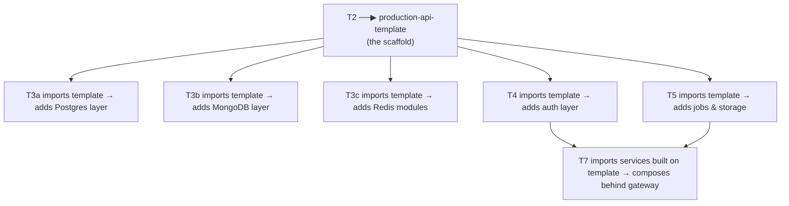

# Tier 2 — Service Construction

> Build a layered, validated, logged, error-handled HTTP service from scratch. This tier produces the reusable scaffold that every later tier builds on.

---

## Purpose

By the end of T2, you can:

- Build a production-grade HTTP service with a clean layered architecture
- Validate all input with Zod and infer TypeScript types from schemas
- Log structured events with Pino and propagate request context via `AsyncLocalStorage`
- Handle errors through a centralized typed `AppError` hierarchy with RFC 7807 envelopes
- Configure the service with fail-fast environment validation
- Document the API with OpenAPI and test it with Bruno/Postman
- Reason about HTTP semantics without hand-waving

T2 is where "I can write a server" becomes "I can write a service a senior engineer would approve in code review."

---

## Anchored Project

**T2: Production API Template**

A reusable Express + TypeScript scaffold that becomes the base of every project after T2 (T3a onward).

**What it includes:**
1. Layered architecture: `config → routes → controllers → services → repositories`
2. Zod-validated configuration with fail-fast startup
3. Zod-validated request bodies, params, query strings
4. Pino structured logging with request-scoped correlation IDs (via `AsyncLocalStorage`)
5. Centralized error handling: `AppError` base class + typed subclasses + RFC 7807 responses
6. `asyncHandler` wrapper to eliminate repetitive try/catch
7. Health check endpoints (`/health/live`, `/health/ready`)
8. Graceful shutdown skeleton (SIGTERM/SIGINT handlers)
9. OpenAPI spec generation + Scalar/Redoc UI
10. Bruno collection for manual API testing
11. Strict TypeScript, ESLint, Prettier, zero `any`

**What it proves**: you can construct a service that a senior engineer would not need to rewrite.

**Deliverables:**
- `projects/t2-production-api-template/` — full repo scaffold
- README with architecture diagram
- At least 3 endpoints demonstrating the full stack (e.g., `POST /items`, `GET /items/:id`, `GET /items`)
- Request/response flow documented in README

---

## How T2 Fits the Architecture

**The rule**: you never rebuild the scaffold. Once T2 is complete, `production-api-template` is cloned/copied for every subsequent tier's project.

---

## Topics (Linear Spine)

### T2.1 — HTTP Semantics & Protocol Discipline

- **HTTP request/response model**: methods (GET, POST, PUT, PATCH, DELETE, HEAD, OPTIONS), idempotency, safety
  `KNOW` · `Anchor: T2` · `Deps: T1` · `Fails: using POST for idempotent reads; confusing PUT vs PATCH` · `Interview: Y` · `Artifact: —` · `Mistake: assuming DELETE must be idempotent for the client` · `Ref: T7` · `Theory 60/Practice 40` · `Local`

- **Status code taxonomy**: 2xx, 3xx, 4xx, 5xx, semantic meaning of each
  `KNOW` · `Anchor: T2` · `Deps: —` · `Fails: returning 200 with error body; 500 for client mistakes` · `Interview: Y` · `Artifact: —` · `Mistake: overusing 400 when 422/409/412 is correct` · `Ref: T7` · `Theory 60/Practice 40` · `Local`

- **Headers & content negotiation**: `Content-Type`, `Accept`, `Vary`, `Cache-Control`, custom headers
  `KNOW` · `Anchor: T2` · `Deps: —` · `Fails: clients receive wrong format; caches serve stale content` · `Interview: S` · `Artifact: —` · `Mistake: forgetting `Vary: Accept-Encoding` behind a CDN` · `Ref: T5, T6` · `Theory 50/Practice 50` · `Local`

- **Conditional requests**: `ETag`, `If-Match`, `If-None-Match`, `If-Modified-Since`, `304 Not Modified`
  `USE` · `Anchor: T2` · `Deps: T2.1 headers` · `Fails: lost updates in concurrent edits; wasted bandwidth` · `Interview: S` · `Artifact: etag-demo.ts` · `Mistake: strong vs weak ETag confusion` · `Ref: T3a` · `Theory 40/Practice 60` · `Local`

- **Content negotiation with `q=` weights**: `Accept-Language`, `Accept-Encoding`, `Accept` priorities
  `KNOW` · `Anchor: T2` · `Deps: T2.1 headers` · `Fails: i18n breaks under multi-language clients` · `Interview: N` · `Artifact: —` · `Mistake: ignoring `q=` weights` · `Ref: T7` · `Theory 60/Practice 40` · `Local`

- **Redirect semantics**: 301 vs 302 vs 307 vs 308, method preservation rules
  `KNOW` · `Anchor: T2` · `Deps: —` · `Fails: POST becomes GET after redirect; wrong caching behavior` · `Interview: S` · `Artifact: —` · `Mistake: using 301 when you need 308` · `Ref: T7` · `Theory 50/Practice 50` · `Local`

**Deep-dive candidates**: conditional requests, status code taxonomy — generate on demand.

---

### T2.2 — Express Fundamentals & Layered Architecture

- **Express request lifecycle**: middleware chain, `req`/`res`, `next()`, error-handling middleware
  `BUILD` · `Anchor: T2` · `Deps: T1.2 async` · `Fails: middleware order bugs; errors bypass error handler` · `Interview: Y` · `Artifact: express-lifecycle.ts` · `Mistake: forgetting that Express 4 doesn't catch async errors` · `Ref: T2.3` · `Theory 40/Practice 60` · `Local`

- **Routing structure**: routers, nested routers, route params, query parsing
  `BUILD` · `Anchor: T2` · `Deps: T2.2 middleware` · `Fails: route collisions; unintentional param capture` · `Interview: S` · `Artifact: routes/` · `Mistake: not using routers for modularity` · `Ref: T7` · `Theory 30/Practice 70` · `Local`

- **Layered architecture (routes → controllers → services → repositories → config)**
  `BUILD` · `Anchor: T2` · `Deps: T2.2 routing` · `Fails: business logic leaks into controllers; untestable code` · `Interview: Y` · `Artifact: layers/` · `Mistake: putting DB queries directly in controllers` · `Ref: T3a, T4` · `Theory 40/Practice 60` · `Local`

- **Dependency injection (manual constructor DI)**: services depend on interfaces, not concrete implementations
  `BUILD` · `Anchor: T2` · `Deps: T2.2 layers` · `Fails: untestable services; tight coupling to DB` · `Interview: S` · `Artifact: di/` · `Mistake: reaching for a DI container before manual DI is painful` · `Ref: T3a` · `Theory 40/Practice 60` · `Local`

- **Interface-driven design for repositories**: swappable storage engines
  `BUILD` · `Anchor: T2` · `Deps: T2.2 DI` · `Fails: rewriting service code when DB changes` · `Interview: S` · `Artifact: repository-interfaces.ts` · `Mistake: exposing DB-specific types in the interface` · `Ref: T3a, T3b` · `Theory 40/Practice 60` · `Local`

- **Express vs Fastify comparison**: routing performance, schema-first design, plugin model, ecosystem
  `KNOW` · `Anchor: T2` · `Deps: T2.2 Express` · `Fails: not knowing the trade-offs if you switch frameworks` · `Interview: N` · `Artifact: —` · `Mistake: assuming Fastify's speed matters at typical scale` · `Ref: T7` · `Theory 60/Practice 40` · `Local`

**Deep-dive candidates**: Express request lifecycle, layered architecture — generate on demand.

---

### T2.3 — Validation, Type Safety & DTOs

- **Zod fundamentals**: `z.object`, `z.string`, `z.number`, `z.array`, `z.enum`, `z.union`, `z.discriminatedUnion`
  `BUILD` · `Anchor: T2` · `Deps: T1.5 TS` · `Fails: runtime type errors from unvalidated input` · `Interview: Y` · `Artifact: schemas/` · `Mistake: over-validating (Zod isn't a security tool)` · `Ref: T4` · `Theory 30/Practice 70` · `Local`

- **Zod type inference**: `z.infer<typeof Schema>` — one source of truth for runtime + compile time
  `BUILD` · `Anchor: T2` · `Deps: T2.3 Zod` · `Fails: schema and type drift` · `Interview: Y` · `Artifact: inferred-types.ts` · `Mistake: writing types by hand when Zod inference exists` · `Ref: T3a, T4` · `Theory 30/Practice 70` · `Local`

- **DTOs and request/response shapes**: input DTOs validated, output DTOs typed, no leaking internals
  `BUILD` · `Anchor: T2` · `Deps: T2.3 Zod` · `Fails: DB rows leak into API responses; sensitive fields exposed` · `Interview: Y` · `Artifact: dtos/` · `Mistake: returning DB entities directly` · `Ref: T3a` · `Theory 40/Practice 60` · `Local`

- **Validation middleware**: Zod-parsed `body`, `params`, `query`, `headers` injected into `req`
  `BUILD` · `Anchor: T2` · `Deps: T2.3 Zod, T2.2 middleware` · `Fails: repetitive try/catch validation in every controller` · `Interview: S` · `Artifact: validate.ts` · `Mistake: validating in controllers instead of middleware` · `Ref: T4` · `Theory 30/Practice 70` · `Local`

- **Injection defense awareness**: SQLi, NoSQLi, XSS, HTTP parameter pollution, path traversal
  `KNOW` · `Anchor: T2` · `Deps: T2.3 validation` · `Fails: injection vulnerabilities in production` · `Interview: Y` · `Artifact: —` · `Mistake: assuming Zod alone prevents injection` · `Ref: T3a, T4` · `Theory 60/Practice 40` · `Local`

- **Strict TypeScript discipline**: no `any`, no `as` casts without justification, `unknown` at boundaries
  `BUILD` · `Anchor: T2` · `Deps: T1.5, T1.6` · `Fails: type safety evaporates; refactors become dangerous` · `Interview: S` · `Artifact: tsconfig-strict` · `Mistake: disabling strict mode to "move faster"` · `Ref: T6` · `Theory 20/Practice 80` · `Local`

**Deep-dive candidates**: Zod discriminated unions, DTOs vs entities — generate on demand.

---

### T2.4 — Configuration & Environment Management

- **Type-safe env validation with Zod**: fail-fast on startup if any required var is missing/malformed
  `BUILD` · `Anchor: T2` · `Deps: T2.3 Zod` · `Fails: service starts with undefined config; runtime crashes later` · `Interview: Y` · `Artifact: config/index.ts` · `Mistake: reading `process.env.FOO` directly across the codebase` · `Ref: T6` · `Theory 30/Practice 70` · `Local`

- **Layered configuration hierarchy**: base defaults → environment-specific overrides → runtime secrets
  `BUILD` · `Anchor: T2` · `Deps: T2.4 validation` · `Fails: config drift between environments` · `Interview: S` · `Artifact: config/layers.ts` · `Mistake: mixing secrets into committed config files` · `Ref: T6` · `Theory 40/Practice 60` · `Local`

- **`.env` handling & `.env.example` schema**: what gets committed, what doesn't
  `BUILD` · `Anchor: T2` · `Deps: T2.4 validation` · `Fails: secrets in git; new devs can't bootstrap` · `Interview: S` · `Artifact: .env.example` · `Mistake: committing `.env` (even accidentally)` · `Ref: T6` · `Theory 20/Practice 80` · `Local`

- **Secrets handling conventions**: environment variable injection vs secret managers; preventing leaks in dumps/logs
  `KNOW` · `Anchor: T2` · `Deps: T2.4 .env` · `Fails: secrets logged in error traces; leaked in crash dumps` · `Interview: S` · `Artifact: —` · `Mistake: logging entire config object for debugging` · `Ref: T4, T6` · `Theory 60/Practice 40` · `Local`

**Deep-dive candidates**: layered config, secrets handling — generate on demand.

---

### T2.5 — Logging, Context Propagation & Correlation

- **Pino fundamentals**: structured JSON logging, log levels, child loggers
  `USE` · `Anchor: T2` · `Deps: T1.3 errors` · `Fails: unstructured logs; can't parse or query` · `Interview: S` · `Artifact: logger.ts` · `Mistake: using `console.log` in production code` · `Ref: T6` · `Theory 30/Practice 70` · `Local`

- **Log level strategy per environment**: `DEBUG` in dev, `INFO`/`WARN`/`ERROR` in prod; runtime policies
  `BUILD` · `Anchor: T2` · `Deps: T2.5 Pino` · `Fails: log volume overwhelm; missing critical logs` · `Interview: S` · `Artifact: log-levels.ts` · `Mistake: logging DEBUG in production` · `Ref: T6` · `Theory 40/Practice 60` · `Local`

- **`AsyncLocalStorage` for request-scoped context**: propagate request ID, user ID, tenant ID without parameter drilling
  `BUILD` · `Anchor: T2` · `Deps: T1.2 async` · `Fails: no way to correlate logs to a specific request` · `Interview: Y` · `Artifact: request-context.ts` · `Mistake: assuming `AsyncLocalStorage` works across worker threads` · `Ref: T6, T7` · `Theory 50/Practice 50` · `Local`

- **Correlation IDs**: generate per-request; propagate via headers; include in every log line
  `BUILD` · `Anchor: T2` · `Deps: T2.5 AsyncLocalStorage` · `Fails: can't trace a request across services or logs` · `Interview: Y` · `Artifact: correlation.ts` · `Mistake: generating new IDs mid-request` · `Ref: T6, T7` · `Theory 30/Practice 70` · `Local`

- **Request/response logging middleware**: redacted payloads, status codes, duration, correlation ID
  `BUILD` · `Anchor: T2` · `Deps: T2.5 correlation` · `Fails: no visibility into what requests hit the service` · `Interview: S` · `Artifact: http-logger.ts` · `Mistake: logging request bodies without redacting passwords/tokens` · `Ref: T4, T6` · `Theory 30/Practice 70` · `Local`

- **PII redaction policy**: explicit classification (passwords, JWTs, card numbers, SSNs, emails, IPs)
  `BUILD` · `Anchor: T2` · `Deps: T2.5 logging` · `Fails: PII leaks into logs; compliance violations` · `Interview: S` · `Artifact: redaction.ts` · `Mistake: relying on a blacklist instead of a whitelist` · `Ref: T4, T6` · `Theory 40/Practice 60` · `Local`

- **Standardized log envelope fields**: `userId`, `requestId`, `tenantId`, `durationMs`, `errorCode`, `httpMethod`, `path`
  `BUILD` · `Anchor: T2` · `Deps: T2.5 logging` · `Fails: inconsistent log schemas across services; broken dashboards` · `Interview: S` · `Artifact: log-schema.ts` · `Mistake: ad-hoc fields per log line` · `Ref: T6` · `Theory 30/Practice 70` · `Local`

- **Dynamic runtime log level toggling**: flip log levels at runtime without restart
  `KNOW` · `Anchor: T2` · `Deps: T2.5 log levels` · `Fails: can't debug an incident without restarting the service` · `Interview: N` · `Artifact: —` · `Mistake: leaving DEBUG on permanently after incident` · `Ref: T6` · `Theory 60/Practice 40` · `Local`

**Deep-dive candidates**: `AsyncLocalStorage` internals, PII redaction — generate on demand.

---

### T2.6 — Error Handling Architecture

- **`AppError` base class + typed subclasses**: `BadRequestError`, `NotFoundError`, `ConflictError`, `UnauthorizedError`, `ForbiddenError`, `InternalError`
  `BUILD` · `Anchor: T2` · `Deps: T1.3 custom errors` · `Fails: inconsistent error responses across endpoints` · `Interview: Y` · `Artifact: errors/AppError.ts` · `Mistake: throwing plain `Error` everywhere` · `Ref: T4` · `Theory 40/Practice 60` · `Local`

- **Error classification taxonomy**: client (4xx) vs server (5xx) vs upstream integration vs unknown uncaught
  `BUILD` · `Anchor: T2` · `Deps: T2.6 AppError` · `Fails: wrong status codes; misrouted alerts` · `Interview: Y` · `Artifact: error-taxonomy.ts` · `Mistake: treating all 5xx as "someone else's problem"` · `Ref: T5, T6` · `Theory 50/Practice 50` · `Local`

- **Stable error codes for machines**: `AUTH_INVALID_TOKEN`, `PAYMENT_CARD_DECLINED` — programmatic handling by clients
  `BUILD` · `Anchor: T2` · `Deps: T2.6 AppError` · `Fails: clients parse human-readable strings; break on wording change` · `Interview: S` · `Artifact: error-codes.ts` · `Mistake: reusing the same code for different errors` · `Ref: T4, T7` · `Theory 30/Practice 70` · `Local`

- **RFC 7807 Problem Details envelopes**: `type`, `title`, `status`, `detail`, `instance`, `code`
  `BUILD` · `Anchor: T2` · `Deps: T2.6 error codes` · `Fails: ad-hoc error shapes; clients can't parse consistently` · `Interview: S` · `Artifact: problem-details.ts` · `Mistake: omitting `instance` (request URI)` · `Ref: T7` · `Theory 30/Practice 70` · `Local`

- **Centralized error-handling middleware**: single place that converts thrown errors → HTTP responses
  `BUILD` · `Anchor: T2` · `Deps: T2.6 RFC 7807` · `Fails: error logic duplicated across controllers` · `Interview: Y` · `Artifact: error-handler.ts` · `Mistake: forgetting it must have 4 args to be recognized by Express` · `Ref: T4` · `Theory 30/Practice 70` · `Local`

- **`asyncHandler` wrapper**: eliminate repetitive try/catch in controllers
  `BUILD` · `Anchor: T2` · `Deps: T2.2 Express, T1.2 async` · `Fails: async errors bypass Express error middleware` · `Interview: Y` · `Artifact: async-handler.ts` · `Mistake: writing try/catch in every controller` · `Ref: T4` · `Theory 20/Practice 80` · `Local`

- **Operational vs programmer errors**: which to catch, which to crash on
  `BUILD` · `Anchor: T2` · `Deps: T2.6 error taxonomy` · `Fails: swallowing bugs that should crash; crashing on transient failures` · `Interview: Y` · `Artifact: error-policy.md` · `Mistake: catching everything with a bare `try {} catch {}`` · `Ref: T5, T6` · `Theory 50/Practice 50` · `Local`

- **`unhandledRejection` / `uncaughtException` handlers**: last-resort logging and process restart
  `BUILD` · `Anchor: T2` · `Deps: T1.2 process handlers` · `Fails: silent crashes; no logs when the process dies` · `Interview: Y` · `Artifact: process-handlers.ts` · `Mistake: trying to "recover" from an uncaught exception` · `Ref: T6` · `Theory 40/Practice 60` · `Local`

**Deep-dive candidates**: RFC 7807 details, operational vs programmer errors — generate on demand.

---

### T2.7 — API Documentation & Developer Experience

- **OpenAPI spec fundamentals**: paths, operations, parameters, request/response schemas, components
  `USE` · `Anchor: T2` · `Deps: T2.3 Zod` · `Fails: no machine-readable API contract; clients guess` · `Interview: S` · `Artifact: openapi.yaml` · `Mistake: hand-writing OpenAPI that drifts from code` · `Ref: T7` · `Theory 40/Practice 60` · `Local`

- **Auto-generating OpenAPI from Zod schemas**: single source of truth
  `USE` · `Anchor: T2` · `Deps: T2.7 OpenAPI` · `Fails: spec drifts from implementation` · `Interview: N` · `Artifact: openapi-gen.ts` · `Mistake: using a library that requires duplicated schema definitions` · `Ref: T7` · `Theory 30/Practice 70` · `Local`

- **Scalar / Redoc / Swagger UI**: interactive API documentation
  `USE` · `Anchor: T2` · `Deps: T2.7 OpenAPI` · `Fails: consumers can't explore the API` · `Interview: N` · `Artifact: docs-route.ts` · `Mistake: shipping docs on the public internet without auth` · `Ref: T7` · `Theory 20/Practice 80` · `Local`

- **Bruno / Postman collections**: manual API testing, saved requests, environments
  `USE` · `Anchor: T2` · `Deps: T2.7 OpenAPI` · `Fails: no repeatable way to test endpoints manually` · `Interview: N` · `Artifact: bruno/` · `Mistake: hardcoding secrets in collections` · `Ref: T6` · `Theory 20/Practice 80` · `Local`

- **API versioning awareness**: URI path vs header vs media type — brief
  `KNOW` · `Anchor: T2` · `Deps: T2.7 OpenAPI` · `Fails: breaking changes ship silently` · `Interview: S` · `Artifact: —` · `Mistake: versioning before you need to` · `Ref: T7` · `Theory 70/Practice 30` · `Local`

**Deep-dive candidates**: OpenAPI-from-Zod, Scalar setup — generate on demand.

---

### T2.8 — Health Checks, Graceful Shutdown & Integration

- **Liveness vs readiness probes**: `/health/live` (process alive) vs `/health/ready` (can accept traffic)
  `BUILD` · `Anchor: T2` · `Deps: T2.1 HTTP` · `Fails: K8s restarts healthy pods; routes traffic to unready pods` · `Interview: Y` · `Artifact: health.ts` · `Mistake: doing expensive checks in liveness` · `Ref: T6` · `Theory 40/Practice 60` · `Local`

- **SIGTERM / SIGINT handling**: trap signals, stop accepting new requests, drain in-flight, close resources
  `BUILD` · `Anchor: T2` · `Deps: T1.7 process signals` · `Fails: deploy kills in-flight requests; DB connections leak` · `Interview: Y` · `Artifact: shutdown.ts` · `Mistake: calling `process.exit()` before draining` · `Ref: T6` · `Theory 40/Practice 60` · `Local`

- **Graceful shutdown orchestration**: server close, DB pool close, Redis client close, in-flight request drain
  `BUILD` · `Anchor: T2` · `Deps: T2.8 SIGTERM` · `Fails: partial shutdown leaves connections dangling` · `Interview: Y` · `Artifact: graceful-shutdown.ts` · `Mistake: forgetting non-HTTP resources` · `Ref: T6` · `Theory 30/Practice 70` · `Local`

- **Integration — assembling the T2 template**: wire layers, config, logging, errors, docs, health
  `BUILD` · `Anchor: T2` · `Deps: all T2 subsections` · `Fails: template that doesn't actually work end-to-end` · `Interview: Y` · `Artifact: production-api-template/` · `Mistake: stopping at "it compiles"` · `Ref: T3a onward` · `Theory 20/Practice 80` · `Local`

**Deep-dive candidates**: graceful shutdown orchestration — generate on demand.

---

## Exit Criteria

You've completed T2 when you can:

- Build a layered Express + TypeScript service from scratch in under an hour
- Validate any input with Zod and infer types without duplicating schemas
- Trace a request through logs using its correlation ID
- Return RFC 7807-compliant error responses for every failure mode
- Fail-fast on misconfigured environments at startup
- Document the API with auto-generated OpenAPI
- Handle `SIGTERM` without dropping in-flight requests
- Explain why `asyncHandler` exists and when it's not enough

---

## Cross-Tier References

**Depends on**: T1 (all of it).

**Depended on by**:
- T3a — uses the template + adds repository layer
- T3b — uses the template + adds document repository
- T3c — uses the template + adds caching/rate-limit modules
- T4 — uses the template + adds auth middleware
- T5 — uses the template + adds background job handlers
- T6 — hardens the template (CI, Docker, observability)
- T7 — composes services built on the template

---

## Common Failure Modes for the Tier as a Whole

- **Skipping `AsyncLocalStorage`**: you'll end up passing `requestId` through every function signature. Later tiers will hate this.
- **Returning DB entities directly**: sensitive fields leak; API shape drifts with schema changes.
- **Ad-hoc error shapes**: clients can't parse errors consistently; observability tools can't group them.
- **No graceful shutdown**: every deploy drops in-flight requests. Users see 502s.
- **`try/catch` in every controller**: tedious, error-prone, and forgettable. `asyncHandler` exists for a reason.
- **Skipping OpenAPI**: docs rot. Clients guess. Breaking changes ship silently.
- **Over-validating with Zod**: Zod is not a security tool. Sanitization, parameterized queries, and output encoding matter more.

---

## Case Studies & Papers

See `13-case-studies.md § T2` and `14-papers.md § T2`.