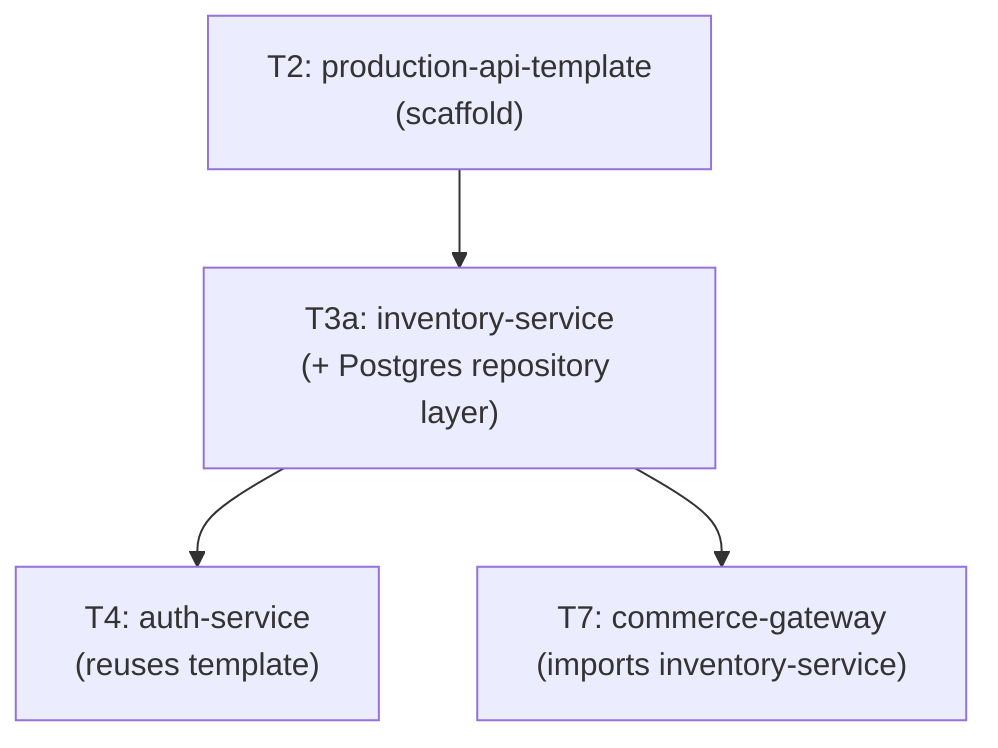

# Tier 3a — Relational / Postgres

> Model, migrate, query, and tune Postgres safely under concurrency. This tier produces the `inventory-service` that T7 composes.

---

## Purpose

By the end of T3a, you can:

- Model relational data correctly (normalization, aggregates, ER design)
- Write SQL from raw queries through a type-safe query builder (Kysely)
- Reason about transactions, isolation levels, and locking without hand-waving
- Detect and fix slow queries with `EXPLAIN ANALYZE`
- Handle money, Unicode, and nulls correctly in production
- Run zero-downtime migrations using the expand-contract pattern
- Diagnose pool exhaustion and connection issues

T3a is where "I can use a database" becomes "I can design and operate a Postgres layer that a senior engineer would trust with money."

---

## Anchored Project

**T3a: `inventory-service`**

A Postgres-backed inventory service built on the T2 `production-api-template`.

**What it includes:**

1. Relational schema: `products`, `inventory`, `stock_movements`, `warehouses`
2. Money-safe columns: prices as integer minor units, `NUMERIC` for ledger entries
3. Migrations with Kysely (`up`/`down`, expand-contract)
4. Repository layer using Kysely (type-safe queries) with raw SQL escape hatch
5. Transactional operations: stock adjustments, transfers, reservations
6. Optimistic locking on stock rows; `SELECT ... FOR UPDATE` for critical sections
7. Connection pooling configured and tuned
8. `EXPLAIN ANALYZE`-verified indexes for common queries
9. Testcontainers-based integration tests
10. Money precision tests, Unicode handling tests, null semantics tests

**What it proves**: you can build a data layer that handles real-world correctness (money, concurrency, migrations) without corruption.

**Deliverables:**

- `projects/t3a-inventory-service/` — full repo
- SQL schema + migrations
- Repository layer with Kysely
- Integration tests using Testcontainers
- README with ER diagram and query plan screenshots

---

## How T3a Fits the Architecture

**What it produces**: `inventory-service` — imported by T7 as the inventory component.

---

## Topics (Linear Spine)

### T3a.1 — Relational Data Modeling

- **Entity-relationship design**: entities, relationships, cardinality, keys
  `BUILD` · `Anchor: T3a` · `Deps: T2` · `Fails: unnormalized schemas cause update anomalies; duplicate data drifts` · `Interview: Y` · `Artifact: schema.sql` · `Mistake: skipping ER design and going straight to CREATE TABLE` · `Ref: T3a.2` · `Theory 50/Practice 50` · `Local`

- **Normalization (1NF → 3NF)**: when to normalize, when to denormalize
  `BUILD` · `Anchor: T3a` · `Deps: T3a.1 ER` · `Fails: either over-normalized (slow joins) or under-normalized (update anomalies)` · `Interview: Y` · `Artifact: schema.sql` · `Mistake: denormalizing before measuring` · `Ref: T3a.7` · `Theory 60/Practice 40` · `Local`

- **Aggregate boundaries**: which entities belong in the same transaction; which don't
  `BUILD` · `Anchor: T3a` · `Deps: T3a.1 normalization` · `Fails: cross-aggregate transactions cause contention and locking` · `Interview: S` · `Artifact: aggregates.md` · `Mistake: treating the entire DB as one aggregate` · `Ref: T7` · `Theory 50/Practice 50` · `Local`

- **Primary keys**: natural vs surrogate, UUID vs BIGSERIAL, ULID, snowflake IDs
  `BUILD` · `Anchor: T3a` · `Deps: T3a.1 ER` · `Fails: sequential IDs leak business volume; UUID v4 causes index bloat` · `Interview: Y` · `Artifact: keys.md` · `Mistake: using UUID v4 as primary key without understanding index impact` · `Ref: T3a.4` · `Theory 40/Practice 60` · `Local`

- **Foreign keys & cascades**: `ON DELETE CASCADE`, `ON DELETE RESTRICT`, `SET NULL`, when each is appropriate
  `BUILD` · `Anchor: T3a` · `Deps: T3a.1 ER` · `Fails: orphaned rows; cascading deletes wipe unexpected data` · `Interview: S` · `Artifact: schema.sql` · `Mistake: adding cascade without thinking through the blast radius` · `Ref: T3a.6` · `Theory 40/Practice 60` · `Local`

- **Soft-delete vs hard-delete**: `deleted_at` column, query filtering, cascade soft-delete, when hard-delete is correct
  `BUILD` · `Anchor: T3a` · `Deps: T3a.1 ER` · `Fails: every query must remember `WHERE deleted_at IS NULL`; missing it leaks deleted rows` · `Interview: Y` · `Artifact: soft-delete.ts` · `Mistake: soft-deleting everything, including audit-critical rows` · `Ref: T3a.6` · `Theory 40/Practice 60` · `Local`

**Deep-dive candidates**: primary key strategies, soft-delete patterns — generate on demand.

---

### T3a.2 — Raw SQL Fundamentals

- **CRUD statements**: `SELECT`, `INSERT`, `UPDATE`, `DELETE`, `RETURNING`
  `BUILD` · `Anchor: T3a` · `Deps: T3a.1 schema` · `Fails: basic CRUD bugs; wrong WHERE clauses deleting too much` · `Interview: Y` · `Artifact: crud.sql` · `Mistake: forgetting `RETURNING` (extra round-trip)` · `Ref: T3a.3` · `Theory 20/Practice 80` · `Local`

- **Joins**: inner, left, right, full, cross, self — and when NOT to use joins
  `BUILD` · `Anchor: T3a` · `Deps: T3a.2 CRUD` · `Fails: wrong join type silently drops or duplicates rows` · `Interview: Y` · `Artifact: joins.sql` · `Mistake: using a `LEFT JOIN`where an`INNER JOIN` was intended (or vice versa)` · `Ref: T3a.3` · `Theory 40/Practice 60` · `Local`

- **Subqueries**: scalar, `IN`, `EXISTS`, correlated; when subquery vs join
  `BUILD` · `Anchor: T3a` · `Deps: T3a.2 joins` · `Fails: correlated subqueries executing per row (N+1 in disguise)` · `Interview: Y` · `Artifact: subqueries.sql` · `Mistake: not comparing plans for subquery vs join` · `Ref: T3a.8` · `Theory 40/Practice 60` · `Local`

- **Aggregates & `GROUP BY` / `HAVING`**: `SUM`, `AVG`, `COUNT`, `MIN`, `MAX`, `FILTER`
  `BUILD` · `Anchor: T3a` · `Deps: T3a.2 CRUD` · `Fails: wrong aggregation scope; filtering after aggregation` · `Interview: Y` · `Artifact: aggregates.sql` · `Mistake: confusing `WHERE`(pre-aggregation) and`HAVING` (post-aggregation)` · `Ref: T3a.4` · `Theory 30/Practice 70` · `Local`

- **CTEs**: `WITH`, recursive CTEs, materialization behavior
  `BUILD` · `Anchor: T3a` · `Deps: T3a.2 subqueries` · `Fails: unreadable nested subqueries; recursive queries without CTEs are painful` · `Interview: S` · `Artifact: ctes.sql` · `Mistake: assuming CTEs are always materialized (Postgres changed this)` · `Ref: T3a.8` · `Theory 40/Practice 60` · `Local`

- **Window functions**: `ROW_NUMBER`, `RANK`, `LAG`/`LEAD`, `PARTITION BY`, running totals, top-N-per-group
  `BUILD` · `Anchor: T3a` · `Deps: T3a.2 aggregates` · `Fails: writing app-side loops when a window function would work` · `Interview: Y` · `Artifact: window-functions.sql` · `Mistake: forgetting `PARTITION BY` and computing across the entire result set` · `Ref: T3a.8` · `Theory 40/Practice 60` · `Local`

- **`INSERT ... ON CONFLICT`**: upsert semantics, `DO NOTHING` vs `DO UPDATE`
  `BUILD` · `Anchor: T3a` · `Deps: T3a.2 CRUD` · `Fails: race conditions between check-then-insert` · `Interview: Y` · `Artifact: upsert.sql` · `Mistake: assuming `ON CONFLICT` requires a unique constraint (it does)` · `Ref: T4, T5` · `Theory 30/Practice 70` · `Local`

- **`RETURNING` clause**: get inserted/updated values back in a single round-trip
  `BUILD` · `Anchor: T3a` · `Deps: T3a.2 CRUD` · `Fails: extra SELECT after every write` · `Interview: S` · `Artifact: returning.sql` · `Mistake: not knowing `RETURNING`works on`INSERT`, `UPDATE`, and `DELETE``·`Ref: T4`·`Theory 20/Practice 80`·`Local`

**Deep-dive candidates**: window functions, CTEs vs subqueries — generate on demand.

---

### T3a.3 — Transactions & Isolation Levels

- **Transaction basics**: `BEGIN`, `COMMIT`, `ROLLBACK`, `SAVEPOINT`
  `BUILD` · `Anchor: T3a` · `Deps: T3a.2 CRUD` · `Fails: partial writes when a multi-step operation fails midway` · `Interview: Y` · `Artifact: transactions.sql` · `Mistake: never committing or rolling back (connection held indefinitely)` · `Ref: T3a.6` · `Theory 30/Practice 70` · `Local`

- **ACID properties**: atomicity, consistency, isolation, durability — concrete examples of each failing
  `KNOW` · `Anchor: T3a` · `Deps: T3a.3 transactions` · `Fails: misunderstanding what the DB actually guarantees` · `Interview: Y` · `Artifact: —` · `Mistake: assuming ACID means "no race conditions ever"` · `Ref: T6` · `Theory 70/Practice 30` · `Local`

- **Isolation levels**: Read Committed, Repeatable Read, Serializable — what each prevents
  `BUILD` · `Anchor: T3a` · `Deps: T3a.3 ACID` · `Fails: unexpected data changes mid-transaction; writes lost silently` · `Interview: Y` · `Artifact: isolation.sql` · `Mistake: assuming the default (Read Committed) is enough for everything` · `Ref: T6` · `Theory 60/Practice 40` · `Local`

- **Read anomalies demonstrated**: dirty reads, non-repeatable reads, phantom reads, lost updates — **see each one happen in code**
  `BUILD` · `Anchor: T3a` · `Deps: T3a.3 isolation` · `Fails: silent data corruption from races you didn't know existed` · `Interview: Y` · `Artifact: anomalies.ts` · `Mistake: believing "I don't need isolation levels, my app is small"` · `Ref: T6` · `Theory 50/Practice 50` · `Local`

- **Optimistic locking**: version column + retry on conflict
  `BUILD` · `Anchor: T3a` · `Deps: T3a.3 anomalies` · `Fails: lost updates when two clients edit the same row` · `Interview: Y` · `Artifact: optimistic-lock.ts` · `Mistake: forgetting the retry (throws error to user instead of retrying)` · `Ref: T3a.7` · `Theory 40/Practice 60` · `Local`

- **Pessimistic locking**: `SELECT ... FOR UPDATE`, `FOR SHARE`, `NOWAIT`, `SKIP LOCKED`
  `BUILD` · `Anchor: T3a` · `Deps: T3a.3 isolation` · `Fails: race conditions on critical sections (bank transfers, stock decrements)` · `Interview: Y` · `Artifact: pessimistic-lock.ts` · `Mistake: holding locks across network calls` · `Ref: T3a.7, T5` · `Theory 40/Practice 60` · `Local`

- **When to use which locking strategy**: optimistic for low contention, pessimistic for high contention
  `BUILD` · `Anchor: T3a` · `Deps: T3a.3 optimistic + pessimistic` · `Fails: choosing the wrong strategy → either deadlocks or lost updates` · `Interview: Y` · `Artifact: locking-strategy.md` · `Mistake: defaulting to one strategy for all cases` · `Ref: T5` · `Theory 50/Practice 50` · `Local`

- **Advisory locks**: `pg_advisory_lock`, session vs transaction scoped
  `KNOW` · `Anchor: T3a` · `Deps: T3a.3 pessimistic` · `Fails: app-level locks without a DB primitive; distributed lock complexity` · `Interview: N` · `Artifact: —` · `Mistake: using advisory locks when a row lock would be simpler` · `Ref: T5` · `Theory 60/Practice 40` · `Local`

**Deep-dive candidates**: isolation anomalies, optimistic vs pessimistic locking — generate on demand.

---

### T3a.4 — Indexes & Query Planning

- **Index fundamentals**: B-tree structure, when an index helps, when it hurts
  `KNOW` · `Anchor: T3a` · `Deps: T3a.2 SQL` · `Fails: no index on WHERE/ORDER BY columns → slow queries` · `Interview: Y` · `Artifact: —` · `Mistake: indexing every column "just in case"` · `Ref: T3a.8` · `Theory 60/Practice 40` · `Local`

- **Single-column vs composite indexes**: leftmost-prefix rule
  `BUILD` · `Anchor: T3a` · `Deps: T3a.4 index` · `Fails: composite index unused because query order doesn't match prefix` · `Interview: Y` · `Artifact: composite-index.sql` · `Mistake: assuming `(a, b)`index helps queries on`b` alone` · `Ref: T3a.8` · `Theory 40/Practice 60` · `Local`

- **Partial indexes**: index only rows matching a condition (e.g., `WHERE deleted_at IS NULL`)
  `BUILD` · `Anchor: T3a` · `Deps: T3a.4 composite` · `Fails: full index bloated with rows you never query` · `Interview: S` · `Artifact: partial-index.sql` · `Mistake: forgetting the partial predicate in queries` · `Ref: T3a.6` · `Theory 40/Practice 60` · `Local`

- **Expression / functional indexes**: index `LOWER(email)`, `date_trunc('day', created_at)`
  `BUILD` · `Anchor: T3a` · `Deps: T3a.4 partial` · `Fails: case-insensitive lookups scan full table` · `Interview: S` · `Artifact: expression-index.sql` · `Mistake: indexing `LOWER(email)`but querying`email = ?``·`Ref: T3a.6`·`Theory 40/Practice 60`·`Local`

- **JSONB GIN indexes**: query inside JSON columns efficiently
  `BUILD` · `Anchor: T3a` · `Deps: T3a.4 index` · `Fails: JSONB queries always scan; slow performance` · `Interview: S` · `Artifact: jsonb-index.sql` · `Mistake: using `->>` without a matching expression index` · `Ref: T3a.6` · `Theory 40/Practice 60` · `Local`

- **Covering indexes & index-only scans**: include additional columns to avoid heap fetch
  `KNOW` · `Anchor: T3a` · `Deps: T3a.4 composite` · `Fails: extra heap fetch per row (index scan + heap scan)` · `Interview: N` · `Artifact: —` · `Mistake: adding INCLUDE columns that break the index's usefulness` · `Ref: T3a.8` · `Theory 60/Practice 40` · `Local`

- **Reading `EXPLAIN` and `EXPLAIN ANALYZE`**: Seq Scan vs Index Scan vs Bitmap Heap Scan; cost vs actual time
  `BUILD` · `Anchor: T3a` · `Deps: T3a.4 index` · `Fails: can't diagnose why a query is slow` · `Interview: Y` · `Artifact: explain-notes.md` · `Mistake: looking at "cost" without looking at actual rows/time` · `Ref: T6` · `Theory 50/Practice 50` · `Local`

- **Spotting disk-based sorts**: `Sort Method: external merge Disk`
  `BUILD` · `Anchor: T3a` · `Deps: T3a.4 EXPLAIN` · `Fails: queries that spill to disk under load; unpredictable latency` · `Interview: S` · `Artifact: sort-analysis.md` · `Mistake: increasing `work_mem` without understanding why the sort is large` · `Ref: T6` · `Theory 40/Practice 60` · `Local`

- **Index bloat & maintenance**: `REINDEX CONCURRENTLY`, `pg_stat_user_indexes` usage stats, bloat ratios
  `KNOW` · `Anchor: T3a` · `Deps: T3a.4 index` · `Fails: index grows forever; slower writes` · `Interview: N` · `Artifact: —` · `Mistake: never checking unused indexes` · `Ref: T6` · `Theory 60/Practice 40` · `Local`

**Deep-dive candidates**: composite index strategy, EXPLAIN ANALYZE reading — generate on demand.

---

### T3a.5 — Kysely (Type-Safe Query Builder)

- **Kysely fundamentals**: `Kysely<DB>` instance, `db.selectFrom`, `db.insertInto`, `db.updateTable`, `db.deleteFrom`
  `USE` · `Anchor: T3a` · `Deps: T3a.2 SQL` · `Fails: raw SQL string concatenation → injection risk` · `Interview: S` · `Artifact: db.ts` · `Mistake: string-concatenating queries` · `Ref: T3a.6` · `Theory 30/Practice 70` · `Local`

- **Database type definitions**: TypeScript interfaces for tables, generated from schema
  `BUILD` · `Anchor: T3a` · `Deps: T3a.5 Kysely` · `Fails: hand-maintained types drift from actual schema` · `Interview: S` · `Artifact: db-types.ts` · `Mistake: not using a schema type generator` · `Ref: T3a.6` · `Theory 30/Practice 70` · `Local`

- **Joins in Kysely**: `innerJoin`, `leftJoin`, type-safe join results
  `BUILD` · `Anchor: T3a` · `Deps: T3a.5 types` · `Fails: join result types incorrect; missing fields at runtime` · `Interview: S` · `Artifact: joins.kysely.ts` · `Mistake: selecting `\*` and getting unexpected columns` · `Ref: T3a.7` · `Theory 30/Practice 70` · `Local`

- **Transactions in Kysely**: `db.transaction().execute(async (trx) => {...})`
  `BUILD` · `Anchor: T3a` · `Deps: T3a.3 transactions` · `Fails: transactions not scoped correctly; leaks` · `Interview: Y` · `Artifact: transactions.kysely.ts` · `Mistake: passing the outer `db`instead of the transaction`trx` into nested calls` · `Ref: T3a.7` · `Theory 30/Practice 70` · `Local`

- **Migrations with Kysely**: `up`/`down` functions, migration runner, schema versioning
  `BUILD` · `Anchor: T3a` · `Deps: T3a.5 Kysely` · `Fails: schema drift between environments; manual ALTER statements` · `Interview: Y` · `Artifact: migrations/` · `Mistake: editing migrations after they've been applied` · `Ref: T3a.6` · `Theory 30/Practice 70` · `Local`

- **Raw SQL escape hatch**: `sql` template literal for Kysely-unsupported queries
  `BUILD` · `Anchor: T3a` · `Deps: T3a.5 Kysely` · `Fails: stuck when Kysely doesn't support a Postgres feature` · `Interview: S` · `Artifact: raw-sql.ts` · `Mistake: using raw SQL everywhere (loses type safety)` · `Ref: T3a.8` · `Theory 20/Practice 80` · `Local`

- **Streaming results**: `.stream()` for large result sets
  `KNOW` · `Anchor: T3a` · `Deps: T3a.5 Kysely` · `Fails: large results OOM the process` · `Interview: N` · `Artifact: —` · `Mistake: fetching millions of rows into memory` · `Ref: T5` · `Theory 60/Practice 40` · `Local`

- **Kysely vs Prisma vs Drizzle**: comparison of query builders/ORMs
  `KNOW` · `Anchor: T3a` · `Deps: T3a.5 Kysely` · `Fails: choosing wrong tool for the project` · `Interview: N` · `Artifact: —` · `Mistake: using an ORM when a query builder fits better (or vice versa)` · `Ref: T6` · `Theory 70/Practice 30` · `Local`

**Deep-dive candidates**: Kysely migrations, Kysely transactions — generate on demand.

---

### T3a.6 — Migrations & Schema Evolution

- **Migration fundamentals**: versioned, idempotent, reversible, run-once
  `BUILD` · `Anchor: T3a` · `Deps: T3a.5 Kysely` · `Fails: untracked schema changes; environments diverge` · `Interview: Y` · `Artifact: migrations/` · `Mistake: running migrations manually in prod` · `Ref: T6` · `Theory 40/Practice 60` · `Local`

- **Expand-contract pattern**: add nullable → dual-write → backfill → drop old
  `BUILD` · `Anchor: T3a` · `Deps: T3a.6 migration basics` · `Fails: `ALTER TABLE` locks the table; downtime on rename/drop` · `Interview: Y` · `Artifact: expand-contract/` · `Mistake: renaming columns directly (breaks running app)` · `Ref: T6` · `Theory 50/Practice 50` · `Local`

- **Zero-downtime migrations**: avoiding `ACCESS EXCLUSIVE` locks on live tables
  `BUILD` · `Anchor: T3a` · `Deps: T3a.6 expand-contract` · `Fails: 30-second table lock during peak traffic = outage` · `Interview: Y` · `Artifact: safe-migrations.md` · `Mistake: adding a NOT NULL column without a default on a big table` · `Ref: T6` · `Theory 50/Practice 50` · `Local`

- **Batched idempotent background backfills**: filling new columns without locking
  `BUILD` · `Anchor: T3a` · `Deps: T3a.6 expand-contract` · `Fails: single UPDATE statement locks table for hours` · `Interview: S` · `Artifact: backfill.ts` · `Mistake: running unbounded UPDATE on millions of rows` · `Ref: T5, T6` · `Theory 40/Practice 60` · `Local`

- **Rollback safety**: reversible vs irreversible migrations; when to plan forward-only
  `BUILD` · `Anchor: T3a` · `Deps: T3a.6 migration basics` · `Fails: no way to undo a bad migration` · `Interview: S` · `Artifact: rollback-plan.md` · `Mistake: writing down migrations that lose data` · `Ref: T6` · `Theory 40/Practice 60` · `Local`

- **Migration tooling comparison**: Kysely, Prisma Migrate, `node-pg-migrate`, Flyway, dbmate
  `KNOW` · `Anchor: T3a` · `Deps: T3a.6 basics` · `Fails: tool choice locks you in` · `Interview: N` · `Artifact: —` · `Mistake: switching tools mid-project` · `Ref: T6` · `Theory 70/Practice 30` · `Local`

- **Testing migrations against production-sized copies**: how to validate before deploying
  `KNOW` · `Anchor: T3a` · `Deps: T3a.6 zero-downtime` · `Fails: migrations pass in dev, fail in prod due to scale` · `Interview: N` · `Artifact: —` · `Mistake: testing migrations only on empty databases` · `Ref: T6` · `Theory 60/Practice 40` · `Local`

- **Schema drift CI enforcement**: detect when prod schema diverges from code
  `KNOW` · `Anchor: T3a` · `Deps: T3a.6 basics` · `Fails: prod schema silently diverges; deploys break` · `Interview: N` · `Artifact: —` · `Mistake: allowing manual schema changes in prod` · `Ref: T6` · `Theory 60/Practice 40` · `Local`

**Deep-dive candidates**: expand-contract walkthrough, zero-downtime migrations — generate on demand.

---

### T3a.7 — Data Correctness & Concurrency in Practice

- **Optimistic locking with retry**: version column, `UPDATE ... WHERE version = ?`, retry on 0 rows affected
  `BUILD` · `Anchor: T3a` · `Deps: T3a.3 optimistic` · `Fails: lost updates under concurrent edits` · `Interview: Y` · `Artifact: optimistic-lock.ts` · `Mistake: not bounding retries (infinite loop)` · `Ref: T3a.8` · `Theory 40/Practice 60` · `Local`

- **Pessimistic locking for critical sections**: `SELECT ... FOR UPDATE` for stock decrements, balance updates
  `BUILD` · `Anchor: T3a` · `Deps: T3a.3 pessimistic` · `Fails: overselling, negative balances` · `Interview: Y` · `Artifact: pessimistic-lock.ts` · `Mistake: holding the lock across a network call` · `Ref: T3a.8` · `Theory 40/Practice 60` · `Local`

- **Keeping transactions short**: never hold a DB lock across a network call
  `BUILD` · `Anchor: T3a` · `Deps: T3a.7 pessimistic` · `Fails: pool exhaustion under load; lock waits pile up` · `Interview: Y` · `Artifact: short-transactions.md` · `Mistake: calling external APIs inside a transaction` · `Ref: T5, T6` · `Theory 40/Practice 60` · `Local`

- **Detecting deadlocks**: lock ordering, retry strategy, `deadlock_timeout`
  `BUILD` · `Anchor: T3a` · `Deps: T3a.7 pessimistic` · `Fails: transactions abort randomly under concurrent writes` · `Interview: Y` · `Artifact: deadlock-detection.ts` · `Mistake: no retry on deadlock (500 to user)` · `Ref: T6` · `Theory 50/Practice 50` · `Local`

- **Idempotency at the DB level**: `INSERT ... ON CONFLICT DO NOTHING`, unique constraints, natural keys
  `BUILD` · `Anchor: T3a` · `Deps: T3a.2 upsert` · `Fails: duplicate records from retries; double charges` · `Interview: Y` · `Artifact: db-idempotency.ts` · `Mistake: relying on app-side "check then insert" (race condition)` · `Ref: T4, T5` · `Theory 30/Practice 70` · `Local`

**Deep-dive candidates**: optimistic + pessimistic locking comparison, deadlock diagnosis — generate on demand.

---

### T3a.8 — Performance, Pooling & Diagnostics

- **Connection pool tuning**: `max`, `idleTimeoutMillis`, `connectionTimeoutMillis`
  `BUILD` · `Anchor: T3a` · `Deps: T3a.5 Kysely` · `Fails: either too few connections (queueing) or too many (DB overwhelm)` · `Interview: Y` · `Artifact: pool-config.ts` · `Mistake: setting max to a large number "just in case"` · `Ref: T6` · `Theory 40/Practice 60` · `Local`

- **Pool exhaustion diagnosis**: `pg_stat_activity`, waiting queries, statement timeout vs query timeout vs acquire timeout
  `BUILD` · `Anchor: T3a` · `Deps: T3a.8 pooling` · `Fails: pool exhaustion takes down the service; no visibility into why` · `Interview: Y` · `Artifact: pg-stat-activity.sql` · `Mistake: no acquire timeout (requests wait forever)` · `Ref: T6` · `Theory 40/Practice 60` · `Local`

- **Lock graph inspection**: `pg_locks`, `pg_blocking_pids()`
  `BUILD` · `Anchor: T3a` · `Deps: T3a.7 deadlocks` · `Fails: can't identify which query is blocking which` · `Interview: S` · `Artifact: lock-inspection.sql` · `Mistake: killing the wrong session` · `Ref: T6` · `Theory 40/Practice 60` · `Local`

- **`pg_stat_statements`**: top slow queries, mean/max time, rows per call
  `USE` · `Anchor: T3a` · `Deps: T3a.4 EXPLAIN` · `Fails: no visibility into which queries are slow at scale` · `Interview: Y` · `Artifact: pg-stat-statements.sql` · `Mistake: not enabling the extension until after a crisis` · `Ref: T6` · `Theory 30/Practice 70` · `Local`

- **`auto_explain`**: log slow query plans automatically
  `USE` · `Anchor: T3a` · `Deps: T3a.4 EXPLAIN` · `Fails: slow queries in prod without plans recorded` · `Interview: N` · `Artifact: auto-explain.conf` · `Mistake: setting the threshold too low (log spam)` · `Ref: T6` · `Theory 40/Practice 60` · `Local`

- **PgBouncer awareness**: transaction pooling, session pooling, prepared statement handling
  `KNOW` · `Anchor: T3a` · `Deps: T3a.8 pooling` · `Fails: hitting Postgres connection limits with many app instances` · `Interview: S` · `Artifact: —` · `Mistake: using session pooling when transaction pooling is correct` · `Ref: T6` · `Theory 60/Practice 40` · `Local`

- **Read replica routing awareness**: split read/write connections, replication lag handling
  `KNOW` · `Anchor: T3a` · `Deps: T3a.8 pooling` · `Fails: read replicas serve stale data; users see old state` · `Interview: S` · `Artifact: —` · `Mistake: assuming replicas are always up-to-date` · `Ref: T6` · `Theory 60/Practice 40` · `Local`

- **Statement timeout discipline**: `statement_timeout`, `idle_in_transaction_session_timeout`
  `BUILD` · `Anchor: T3a` · `Deps: T3a.8 pooling` · `Fails: runaway queries hold connections forever` · `Interview: S` · `Artifact: timeouts.conf` · `Mistake: no timeout at all` · `Ref: T6` · `Theory 40/Practice 60` · `Local`

**Deep-dive candidates**: pool exhaustion debugging, pg_stat_statements workflow — generate on demand.

---

### T3a.9 — Data Correctness: Money, Unicode, Nulls

- **Money as integer minor units**: cents as `BIGINT`, no floats ever
  `BUILD` · `Anchor: T3a` · `Deps: T3a.2 SQL` · `Fails: `0.1 + 0.2 !== 0.3`; totals off by pennies; audits fail` · `Interview: Y` · `Artifact: money.ts` · `Mistake: using `FLOAT`or`MONEY` for currency` · `Ref: T7` · `Theory 40/Practice 60` · `Local`

- **`NUMERIC` for ledger entries**: arbitrary precision when cents aren't enough
  `BUILD` · `Anchor: T3a` · `Deps: T3a.9 integer money` · `Fails: high-precision financial calculations lossy` · `Interview: S` · `Artifact: ledger-schema.sql` · `Mistake: using `NUMERIC`for everything (slower than`BIGINT`)` · `Ref: T7` · `Theory 40/Practice 60` · `Local`

- **Banker's rounding (half-even)**: correct rounding for financial totals
  `BUILD` · `Anchor: T3a` · `Deps: T3a.9 NUMERIC` · `Fails: systematic rounding bias over millions of transactions` · `Interview: S` · `Artifact: rounding.ts` · `Mistake: using JS `Math.round` (half-up, biased)` · `Ref: T7` · `Theory 40/Practice 60` · `Local`

- **ISO 4217 minor units**: JPY (0 decimals), USD (2), KWD (3) — not all currencies are cents
  `KNOW` · `Anchor: T3a` · `Deps: T3a.9 integer money` · `Fails: JPY stored as 100x too much; KWD loses precision` · `Interview: N` · `Artifact: —` · `Mistake: assuming 2 decimals for all currencies` · `Ref: T7` · `Theory 60/Practice 40` · `Local`

- **BigInt vs number overflow**: IDs, timestamps, balances beyond `Number.MAX_SAFE_INTEGER`
  `BUILD` · `Anchor: T3a` · `Deps: T3a.9 integer money` · `Fails: silent precision loss on large numbers` · `Interview: S` · `Artifact: bigint.ts` · `Mistake: using `number` for money over 2^53` · `Ref: T7` · `Theory 40/Practice 60` · `Local`

- **Unicode normalization**: NFC/NFD/NFKC/NFKD, email uniqueness, username collisions
  `BUILD` · `Anchor: T3a` · `Deps: T3a.2 SQL` · `Fails: two "same" emails store as different strings; lookups fail` · `Interview: S` · `Artifact: unicode.ts` · `Mistake: normalizing inconsistently across code paths` · `Ref: T7` · `Theory 40/Practice 60` · `Local`

- **Grapheme clusters**: emoji sequences, ZWJ families, flag emoji, skin tone modifiers
  `KNOW` · `Anchor: T3a` · `Deps: T3a.9 Unicode` · `Fails: `'👨👩👧'.length` counts code units, not characters` · `Interview: N` · `Artifact: —` · `Mistake: using `.length` for string sizing` · `Ref: T7` · `Theory 60/Practice 40` · `Local`

- **Case folding edge cases**: Turkish dotless `ı`, German `ß`, Greek sigma
  `KNOW` · `Anchor: T3a` · `Deps: T3a.9 Unicode` · `Fails: case-insensitive lookups fail in non-English locales` · `Interview: N` · `Artifact: —` · `Mistake: using `toLowerCase()` for all locales` · `Ref: T7` · `Theory 60/Practice 40` · `Local`

- **ICU collation for locale-aware sorting**: Swedish vs German string ordering
  `KNOW` · `Anchor: T3a` · `Deps: T3a.9 Unicode` · `Fails: strings sort wrong in non-English locales` · `Interview: N` · `Artifact: —` · `Mistake: using default collation for multi-locale apps` · `Ref: T7` · `Theory 60/Practice 40` · `Local`

- **SQL three-valued logic**: `NULL = NULL` is `UNKNOWN`, not `TRUE`
  `BUILD` · `Anchor: T3a` · `Deps: T3a.2 SQL` · `Fails: `WHERE x = NULL` returns zero rows; surprising query results` · `Interview: Y` · `Artifact: null-semantics.sql` · `Mistake: using `= NULL`instead of`IS NULL``·`Ref: T7`·`Theory 50/Practice 50`·`Local`

- **`null` vs `undefined` vs missing across JSON/Postgres/TS**: consistency rules
  `BUILD` · `Anchor: T3a` · `Deps: T3a.9 null logic` · `Fails: DB sees `null`, JSON omits field, TS sees `undefined` — bugs` · `Interview: S` · `Artifact: null-consistency.ts` · `Mistake: no convention; every layer handles nulls differently` · `Ref: T7` · `Theory 40/Practice 60` · `Local`

- **Empty array vs null vs 404 for empty collections**: API design consistency
  `KNOW` · `Anchor: T3a` · `Deps: T3a.9 null consistency` · `Fails: clients can't distinguish "no items" from "not found"` · `Interview: S` · `Artifact: —` · `Mistake: returning `404` for empty collection` · `Ref: T7` · `Theory 60/Practice 40` · `Local`

**Deep-dive candidates**: money correctness end-to-end, Unicode normalization for emails — generate on demand.

---

### T3a.10 — Integration: The inventory-service Project

- **Schema design for the domain**: products, warehouses, inventory, stock movements
  `BUILD` · `Anchor: T3a` · `Deps: all T3a` · `Fails: service that works for demos but breaks under real load` · `Interview: Y` · `Artifact: schema.sql` · `Mistake: modeling inventory as a single number (no movements)` · `Ref: T7` · `Theory 30/Practice 70` · `Local`

- **Repository layer with Kysely**: all DB access behind typed interfaces
  `BUILD` · `Anchor: T3a` · `Deps: T3a.5 Kysely` · `Fails: SQL scattered across the codebase` · `Interview: Y` · `Artifact: repositories/` · `Mistake: bypassing repositories "just this once"` · `Ref: T7` · `Theory 30/Practice 70` · `Local`

- **Transactional stock adjustments**: reserve, confirm, release — all atomic
  `BUILD` · `Anchor: T3a` · `Deps: T3a.3 transactions, T3a.7 locking` · `Fails: overselling; stock counts drift from reality` · `Interview: Y` · `Artifact: stock-service.ts` · `Mistake: not using transactions for multi-step stock ops` · `Ref: T7` · `Theory 30/Practice 70` · `Local`

- **Money-safe pricing**: prices stored as cents, totals computed with banker's rounding
  `BUILD` · `Anchor: T3a` · `Deps: T3a.9 money` · `Fails: totals off by pennies; customer disputes` · `Interview: Y` · `Artifact: pricing.ts` · `Mistake: computing totals in floats` · `Ref: T7` · `Theory 30/Practice 70` · `Local`

- **Integration tests with Testcontainers**: real Postgres, real migrations, real queries
  `BUILD` · `Anchor: T3a` · `Deps: T2, T6` · `Fails: tests that mock the DB pass but production fails` · `Interview: Y` · `Artifact: *.integration.test.ts` · `Mistake: using SQLite or mocked DB in tests` · `Ref: T6` · `Theory 20/Practice 80` · `Local`

- **README with ER diagram and query plans**: document the schema and prove the indexes work
  `BUILD` · `Anchor: T3a` · `Deps: all T3a` · `Fails: no record of design decisions; can't onboard others` · `Interview: N` · `Artifact: README.md` · `Mistake: skipping docs because "the code speaks for itself"` · `Ref: T6` · `Theory 20/Practice 80` · `Local`

---

## Why Not?

### Why PostgreSQL Instead of MySQL / MariaDB / SQL Server / SQLite?

- **MySQL** — fine, but Postgres has richer types (JSONB, arrays, ranges, enums, UUID, `NUMERIC` precision, `ILIKE`, full-text search), better standards compliance, better concurrency (MVCC done properly), and a richer extension ecosystem.
- **MariaDB** — MySQL fork, similar trade-offs, smaller momentum in greenfield.
- **SQL Server** — excellent but commercial, Windows-centric historically, and licence costs make it a poor fit for a zero-spend curriculum.
- **SQLite** — brilliant for embedded, but single-writer. Not suitable for a multi-instance backend service.

**When Postgres isn't right**: read-heavy KV workloads (Redis, Dynamo), wide-column time-series (Cassandra, TimescaleDB), full-text at scale (Elasticsearch), document-shaped data (MongoDB). Choose based on workload shape, not preference.

### Why Kysely Instead of Prisma / Drizzle?

See T2's "Why Not?" section. Same reasoning applies here. Kysely in T3a assumes you already learned raw SQL — it's the "typed SQL" layer, not an ORM.

### Why Explicit Transactions Instead of ORM Auto-Transactions?

- ORM-managed transactions hide when commits happen. You lose track of what's atomic.
- Explicit `BEGIN` / `COMMIT` / `ROLLBACK` (or `db.transaction()` in Kysely) makes transaction boundaries visible in code. This is non-negotiable for money-correct systems.
- ORMs encourage long transactions (because they're eager to batch queries). Long transactions hold locks. Short explicit transactions are the discipline.

### Why Optimistic Locking Over Pessimistic as Default?

- **Optimistic** (version column + retry): scales well, no locks held, works for low-contention writes.
- **Pessimistic** (`SELECT ... FOR UPDATE`): correct for high-contention critical sections, but holds locks and blocks readers.
- **Default to optimistic**. Use pessimistic only when the contention is proven and the critical section is short. Then combine with `SKIP LOCKED` for queue-style access.

### Why Integer Minor Units (Cents) Instead of `NUMERIC` for Money?

- **`BIGINT` cents** — fast, exact, no floating-point risk, works with any currency (multiply by 10^n for storage). Downside: need a currency code alongside.
- **`NUMERIC(19,4)`** — exact, arbitrary precision, good for ledger entries where sub-cent precision is required (interest calculations, FX).
- **`FLOAT` / `DOUBLE`** — never for money. `0.1 + 0.2 !== 0.3`. Silent precision loss.
- **Rule**: `BIGINT` cents for transactional amounts; `NUMERIC` for ledger/interest/tax calculations. Never floats.

### Why Expand-Contract Migrations Instead of Renaming/Dropping in Place?

- **Direct rename / drop** — acquires `ACCESS EXCLUSIVE` lock on the table. On a large table, that means minutes to hours of downtime.
- **Expand-contract** — add nullable → dual-write → backfill in batches → cut over → drop old. Zero downtime, rollback-safe at every step.
- The cost is a few extra deploys and more code. The benefit is you never take the service down for a migration.

### Why Raw SQL First, Then Kysely?

- **Raw SQL first** — you learn what the database actually does. Joins, aggregates, window functions, `EXPLAIN` output — all become concrete.
- **Kysely second** — you learn the typed layer that composes the SQL you already understand.
- **Skipping raw SQL** — you'll be stuck when Kysely can't express a query and you have to drop to raw SQL anyway.

### Why Testcontainers Instead of Mocked DB?

- **Mocked DB** — tests pass, production fails. Mock drift is invisible until it's an incident.
- **SQLite in-memory** — different engine, different behavior. Fails on Postgres-specific features (`JSONB`, `RETURNING`, `ON CONFLICT`).
- **Testcontainers** — real Postgres, real migrations, real queries. Tests catch what production would catch.

---

## Exit Criteria

You've completed T3a when you can:

- Design a relational schema for a business domain from scratch
- Write both raw SQL and Kysely queries for the same operation
- Explain optimistic vs pessimistic locking and choose correctly
- Read `EXPLAIN ANALYZE` and identify why a query is slow
- Run a zero-downtime migration on a live table
- Diagnose pool exhaustion from `pg_stat_activity`
- Handle money, Unicode, and nulls correctly — with tests to prove it
- Build an integration test suite against a real Postgres via Testcontainers

---

## Cross-Tier References

**Depends on**: T1 (async, error handling), T2 (template, config, logging).

**Depended on by**:

- T3b — Mongo patterns mirror relational ones
- T4 — auth service stores users, sessions, refresh tokens in Postgres
- T5 — background jobs update Postgres state, read/write through repositories
- T6 — production ops (migration safety, pool tuning, query diagnostics)
- T7 — `inventory-service` is imported into `commerce-gateway`

---

## Common Failure Modes for the Tier as a Whole

- **Floating-point money**: off-by-penny drift compounds. Audits fail. Customers dispute.
- **Skipping transactions on multi-step writes**: partial state corrupts data silently.
- **No index on `WHERE` columns**: queries are fast in dev, slow in prod.
- **Long-held locks across network calls**: pool exhaustion takes down the service.
- **Migrations that lock tables**: 30-second outage on every schema change.
- **`= NULL` instead of `IS NULL`**: queries return zero rows, silently.
- **No Testcontainers**: mocked DB tests pass; production queries fail on the real DB.
- **Skipping `EXPLAIN ANALYZE`**: you never actually know why a query is slow — you just guess and add indexes.

---

## Case Studies & Papers

See `13-case-studies.md § T3a` and `14-papers.md § T3a`.
