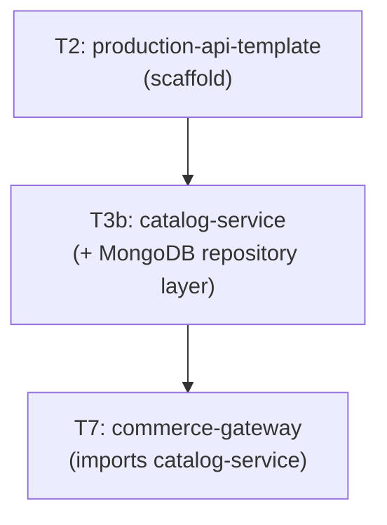

# Tier 3b — Document / MongoDB

> Model, query, and transact document-shaped data. This tier produces the `catalog-service` that T7 composes.

---

## Purpose

By the end of T3b, you can:

- Decide when document modeling is correct (and when it isn't)
- Design MongoDB schemas that avoid unbounded arrays and duplication debt
- Write aggregation pipelines that replace app-side joins
- Read `.explain()` and diagnose slow queries
- Use MongoDB transactions correctly (and know when not to)
- Build a product catalog service that a senior engineer would trust

T3b is where "Mongo is schemaless, so anything goes" becomes "Mongo is schema-flexible, but the schema still matters."

---

## Anchored Project

**T3b: `catalog-service`**

A MongoDB-backed product catalog service built on the T2 `production-api-template`.

**What it includes:**
1. Document schema design: products, categories, reviews (embedded vs referenced decisions documented)
2. Aggregation pipeline for product listing with filters and facets
3. Compound, multikey, text, and sparse indexes with `.explain()` verification
4. Multi-document transactions for critical updates (e.g., review creation + product rating update)
5. Repository layer with the official `mongodb` driver (no Mongoose)
6. Schema validation via MongoDB's JSON Schema validator
7. Migration/seed scripts for populating categories and sample products
8. Integration tests using Testcontainers with ephemeral MongoDB
9. Index usage tests with `.explain("executionStats")`

**What it proves**: you can design document schemas that actually fit document workloads — not relational schemas forced into documents.

**Deliverables:**
- `projects/t3b-catalog-service/` — full repo
- Document schema files + JSON Schema validators
- Aggregation pipelines with `.explain()` reports
- README with document model rationale

---

## How T3b Fits the Architecture

**What it produces**: `catalog-service` — imported by T7 as the product catalog component.

---

## Topics (Linear Spine)

### T3b.1 — When Document Modeling Is Correct

- **Document vs relational data**: nested/aggregate-shaped vs highly-related/multi-entity
  `KNOW` · `Anchor: T3b` · `Deps: T3a` · `Fails: using Mongo for relational data (or Postgres for documents)` · `Interview: Y` · `Artifact: —` · `Mistake: choosing Mongo because "schema changes are easier"` · `Ref: T3b.2` · `Theory 70/Practice 30` · `Local`

- **Aggregate-oriented design**: model around how you read, not how you normalize
  `BUILD` · `Anchor: T3b` · `Deps: T3b.1 doc-vs-relational` · `Fails: relational habits lead to normalized schemas with expensive `$lookup`s` · `Interview: Y` · `Artifact: aggregates.md` · `Mistake: normalizing because "that's what SQL taught me"` · `Ref: T3b.2` · `Theory 50/Practice 50` · `Local`

- **Embedding vs referencing**: when to nest, when to link
  `BUILD` · `Anchor: T3b` · `Deps: T3b.1 aggregate design` · `Fails: either unbounded arrays (embed everything) or expensive joins (reference everything)` · `Interview: Y` · `Artifact: embedding-decisions.md` · `Mistake: embedding data that changes frequently` · `Ref: T3b.2` · `Theory 50/Practice 50` · `Local`

- **The 16MB document limit**: hard limit, implications for array sizes
  `KNOW` · `Anchor: T3b` · `Deps: T3b.1 embedding` · `Fails: document insertion fails silently under load` · `Interview: N` · `Artifact: —` · `Mistake: designing for unbounded growth` · `Ref: T3b.5` · `Theory 70/Practice 30` · `Local`

- **Schema versioning in documents**: `_schemaVersion` field, migration strategies
  `BUILD` · `Anchor: T3b` · `Deps: T3b.1 doc-vs-relational` · `Fails: schema changes break older documents in production` · `Interview: S` · `Artifact: versioning.ts` · `Mistake: assuming all documents have the same shape` · `Ref: T7` · `Theory 40/Practice 60` · `Local`

- **When NOT to use MongoDB**: multi-entity transactions, ad-hoc analytics, strict schema requirements
  `KNOW` · `Anchor: T3b` · `Deps: T3b.1 doc-vs-relational` · `Fails: fighting the DB to get relational behavior` · `Interview: Y` · `Artifact: —` · `Mistake: using Mongo because it's "web scale"` · `Ref: T7` · `Theory 70/Practice 30` · `Local`

**Deep-dive candidates**: embedding vs referencing decisions, aggregate-oriented design — generate on demand.

---

### T3b.2 — Document Schema Design

- **The `_id` field**: ObjectId vs UUID vs custom, when each is correct
  `BUILD` · `Anchor: T3b` · `Deps: T3b.1 doc-vs-relational` · `Fails: ID collisions with custom IDs; sorting surprises with ObjectId` · `Interview: S` · `Artifact: ids.md` · `Mistake: assuming ObjectId is globally sortable by creation time (it roughly is, but not precisely)` · `Ref: T3b.4` · `Theory 40/Practice 60` · `Local`

- **Embedded documents**: sub-documents for one-to-few relationships
  `BUILD` · `Anchor: T3b` · `Deps: T3b.1 embedding` · `Fails: retrieved entire object when only one field was needed` · `Interview: Y` · `Artifact: embedded.ts` · `Mistake: embedding large or frequently-changing data` · `Ref: T3b.5` · `Theory 40/Practice 60` · `Local`

- **Referenced documents**: `$lookup` for one-to-many and many-to-many
  `BUILD` · `Anchor: T3b` · `Deps: T3b.1 referencing` · `Fails: N+1 queries when fetching references without `$lookup`` · `Interview: Y` · `Artifact: referenced.ts` · `Mistake: referencing when embedding would be simpler` · `Ref: T3b.3` · `Theory 40/Practice 60` · `Local`

- **Denormalization patterns**: duplicating data for read performance (with update strategies)
  `BUILD` · `Anchor: T3b` · `Deps: T3b.2 referenced` · `Fails: stale duplicated data; consistency bugs` · `Interview: Y` · `Artifact: denormalization.md` · `Mistake: duplicating without a strategy for updates` · `Ref: T3b.5` · `Theory 50/Practice 50` · `Local`

- **Unbounded array anti-pattern**: why arrays that grow forever break documents
  `BUILD` · `Anchor: T3b` · `Deps: T3b.1 16MB limit` · `Fails: document hits 16MB limit; inserts fail` · `Interview: Y` · `Artifact: array-patterns.md` · `Mistake: storing event logs or messages in an array` · `Ref: T3b.5` · `Theory 50/Practice 50` · `Local`

- **Bucket pattern**: grouping time-series data into bounded buckets
  `KNOW` · `Anchor: T3b` · `Deps: T3b.2 unbounded arrays` · `Fails: time-series data explodes into millions of documents` · `Interview: N` · `Artifact: —` · `Mistake: one document per event` · `Ref: T3b.5` · `Theory 70/Practice 30` · `Local`

- **Computed pattern**: precompute fields at write time (e.g., review count, average rating)
  `BUILD` · `Anchor: T3b` · `Deps: T3b.2 denormalization` · `Fails: every read computes expensive aggregates` · `Interview: S` · `Artifact: computed-pattern.ts` · `Mistake: computing on read when write-time is cheap` · `Ref: T3b.5` · `Theory 40/Practice 60` · `Local`

- **JSON Schema validation**: enforce document shape at the DB level
  `BUILD` · `Anchor: T3b` · `Deps: T3b.2 schema design` · `Fails: unvalidated documents corrupt the collection` · `Interview: S` · `Artifact: validators/` · `Mistake: assuming "schemaless" means "no validation needed"` · `Ref: T7` · `Theory 40/Practice 60` · `Local`

**Deep-dive candidates**: embedded vs referenced decision framework, denormalization patterns — generate on demand.

---

### T3b.3 — Queries & Aggregation Pipeline

- **Basic queries**: `find`, `findOne`, `insertOne`, `insertMany`, `updateOne`, `updateMany`, `deleteOne`, `deleteMany`
  `BUILD` · `Anchor: T3b` · `Deps: T3b.2 schema` · `Fails: basic CRUD bugs; wrong filters updating too much` · `Interview: S` · `Artifact: crud.ts` · `Mistake: using `updateMany` when `updateOne` was intended` · `Ref: T3b.4` · `Theory 20/Practice 80` · `Local`

- **Query operators**: `$eq`, `$gt`, `$in`, `$regex`, `$exists`, `$elemMatch`, `$and`, `$or`
  `BUILD` · `Anchor: T3b` · `Deps: T3b.3 basic queries` · `Fails: filter bugs; missing data; wrong results` · `Interview: Y` · `Artifact: operators.ts` · `Mistake: using `$regex` without anchoring (slow scans)` · `Ref: T3b.4` · `Theory 30/Practice 70` · `Local`

- **Update operators**: `$set`, `$unset`, `$inc`, `$push`, `$pull`, `$addToSet`, `$each`
  `BUILD` · `Anchor: T3b` · `Deps: T3b.3 basic queries` · `Fails: accidental overwrites; lost array elements` · `Interview: Y` · `Artifact: update-operators.ts` · `Mistake: using `$set` when `$inc` was needed (race conditions)` · `Ref: T3b.5` · `Theory 30/Practice 70` · `Local`

- **Aggregation pipeline fundamentals**: `$match`, `$project`, `$group`, `$sort`, `$limit`, `$skip`
  `BUILD` · `Anchor: T3b` · `Deps: T3b.3 queries` · `Fails: app-side filtering/grouping; massive result sets` · `Interview: Y` · `Artifact: aggregation.ts` · `Mistake: `$match` after `$group` (no index usage)` · `Ref: T3b.5` · `Theory 40/Practice 60` · `Local`

- **`$lookup`**: joining collections in-pipeline
  `BUILD` · `Anchor: T3b` · `Deps: T3b.3 aggregation` · `Fails: N+1 queries across referenced documents` · `Interview: Y` · `Artifact: lookup.ts` · `Mistake: `$lookup` without an index on the foreign field` · `Ref: T3b.4` · `Theory 40/Practice 60` · `Local`

- **`$facet`**: multi-dimensional aggregation in a single pass (search results + counts + facets)
  `BUILD` · `Anchor: T3b` · `Deps: T3b.3 aggregation` · `Fails: multiple round-trips for search + facets + counts` · `Interview: S` · `Artifact: facets.ts` · `Mistake: running separate queries for what `$facet` handles in one` · `Ref: T7` · `Theory 40/Practice 60` · `Local`

- **`$unwind`**: flattening arrays for aggregation
  `BUILD` · `Anchor: T3b` · `Deps: T3b.3 aggregation` · `Fails: can't aggregate over embedded arrays` · `Interview: S` · `Artifact: unwind.ts` · `Mistake: `$unwind` on a large array (pipeline explosion)` · `Ref: T3b.5` · `Theory 30/Practice 70` · `Local`

- **Pipeline optimization**: `$match` first, `$project` early, index usage
  `BUILD` · `Anchor: T3b` · `Deps: T3b.3 aggregation` · `Fails: aggregation pipelines scan entire collections` · `Interview: Y` · `Artifact: optimization.md` · `Mistake: filtering late in the pipeline` · `Ref: T3b.4` · `Theory 40/Practice 60` · `Local`

- **Change streams**: watch a collection for changes (for CDC-style integrations)
  `KNOW` · `Anchor: T3b` · `Deps: T3b.3 aggregation` · `Fails: polling for changes (wasteful, laggy)` · `Interview: N` · `Artifact: —` · `Mistake: using change streams as a queue` · `Ref: T7` · `Theory 70/Practice 30` · `Local`

**Deep-dive candidates**: aggregation pipeline design, `$facet` for search — generate on demand.

---

### T3b.4 — Indexes & Query Planning

- **Single-field indexes**: `createIndex({ field: 1 })`, direction matters
  `BUILD` · `Anchor: T3b` · `Deps: T3b.3 queries` · `Fails: COLLSCAN on every query; slow at scale` · `Interview: Y` · `Artifact: indexes.ts` · `Mistake: no index on query fields` · `Ref: T3b.5` · `Theory 30/Practice 70` · `Local`

- **Compound indexes**: field order matters (ESR rule: Equality, Sort, Range)
  `BUILD` · `Anchor: T3b` · `Deps: T3b.4 single-field` · `Fails: compound index unused because query order doesn't match` · `Interview: Y` · `Artifact: compound.ts` · `Mistake: assuming field order is irrelevant` · `Ref: T3b.5` · `Theory 40/Practice 60` · `Local`

- **Multikey indexes**: indexes on array fields
  `BUILD` · `Anchor: T3b` · `Deps: T3b.4 compound` · `Fails: array queries scan; slow tag/category filters` · `Interview: S` · `Artifact: multikey.ts` · `Mistake: compound multikey limits (only one array field per compound index)` · `Ref: T3b.5` · `Theory 40/Practice 60` · `Local`

- **Text indexes**: full-text search within MongoDB
  `BUILD` · `Anchor: T3b` · `Deps: T3b.4 single-field` · `Fails: regex-based search doesn't scale` · `Interview: S` · `Artifact: text-index.ts` · `Mistake: using text index when a dedicated search engine (Meilisearch/Elasticsearch) is needed` · `Ref: T7` · `Theory 40/Practice 60` · `Local`

- **Sparse and partial indexes**: index only documents that have the field / match a filter
  `BUILD` · `Anchor: T3b` · `Deps: T3b.4 single-field` · `Fails: indexes bloat with null entries; wasted RAM` · `Interview: S` · `Artifact: sparse-partial.ts` · `Mistake: sparse index not used when query doesn't include the sparse field` · `Ref: T3b.5` · `Theory 40/Practice 60` · `Local`

- **TTL indexes**: auto-delete documents after a time
  `BUILD` · `Anchor: T3b` · `Deps: T3b.4 single-field` · `Fails: session/event documents accumulate forever` · `Interview: S` · `Artifact: ttl.ts` · `Mistake: relying on TTL for correctness (deletion is eventual)` · `Ref: T3c, T7` · `Theory 30/Practice 70` · `Local`

- **Unique indexes**: enforce uniqueness at the DB level
  `BUILD` · `Anchor: T3b` · `Deps: T3b.4 single-field` · `Fails: duplicate users/emails/products` · `Interview: Y` · `Artifact: unique.ts` · `Mistake: app-side uniqueness check (race conditions)` · `Ref: T4` · `Theory 30/Practice 70` · `Local`

- **Reading `.explain("executionStats")`**: `IXSCAN` vs `COLLSCAN`, `totalDocsExamined` vs `nReturned`
  `BUILD` · `Anchor: T3b` · `Deps: T3b.4 indexes` · `Fails: can't diagnose why a query is slow` · `Interview: Y` · `Artifact: explain.md` · `Mistake: looking only at `nReturned`, ignoring `totalDocsExamined`` · `Ref: T3b.5` · `Theory 40/Practice 60` · `Local`

- **Index intersection & covered queries**: when Mongo combines indexes or answers from index alone
  `KNOW` · `Anchor: T3b` · `Deps: T3b.4 compound` · `Fails: unnecessary index fetches` · `Interview: N` · `Artifact: —` · `Mistake: relying on index intersection (rarely optimal)` · `Ref: T3b.5` · `Theory 70/Practice 30` · `Local`

**Deep-dive candidates**: ESR rule for compound indexes, explain output interpretation — generate on demand.

---

### T3b.5 — Transactions & Consistency

- **Single-document atomicity**: updates within one document are always atomic
  `KNOW` · `Anchor: T3b` · `Deps: T3b.2 schema` · `Fails: unnecessary transactions for single-doc updates` · `Interview: Y` · `Artifact: —` · `Mistake: opening transactions for what Mongo already guarantees` · `Ref: T3b.5 transactions` · `Theory 60/Practice 40` · `Local`

- **Multi-document transactions**: `session.startTransaction()`, `commitTransaction`, `abortTransaction`
  `BUILD` · `Anchor: T3b` · `Deps: T3b.3 queries` · `Fails: partial writes across collections` · `Interview: Y` · `Artifact: transactions.ts` · `Mistake: forgetting to `endSession()` (leaks)` · `Ref: T7` · `Theory 40/Practice 60` · `Local`

- **Transaction isolation in MongoDB**: snapshot isolation, write conflicts, retryable writes
  `KNOW` · `Anchor: T3b` · `Deps: T3b.5 transactions` · `Fails: unexpected write conflicts under load` · `Interview: S` · `Artifact: —` · `Mistake: assuming transactions are free (they cost performance)` · `Ref: T7` · `Theory 70/Practice 30` · `Local`

- **Retryable writes**: automatic retry on transient network errors
  `KNOW` · `Anchor: T3b` · `Deps: T3b.5 transactions` · `Fails: transient failures cause user-visible errors` · `Interview: N` · `Artifact: —` · `Mistake: disabling retryable writes for "predictability"` · `Ref: T7` · `Theory 70/Practice 30` · `Local`

- **Read concern / write concern**: `majority`, `local`, `linearizable`, `w:1`, `w:majority`
  `KNOW` · `Anchor: T3b` · `Deps: T3b.5 transactions` · `Fails: reads see stale data; writes lost on failover` · `Interview: S` · `Artifact: —` · `Mistake: using default concerns without understanding them` · `Ref: T7` · `Theory 70/Practice 30` · `Local`

- **Optimistic concurrency with version field**: `findOneAndUpdate` with version condition
  `BUILD` · `Anchor: T3b` · `Deps: T3b.3 update operators` · `Fails: lost updates when two clients edit the same doc` · `Interview: Y` · `Artifact: optimistic-lock.ts` · `Mistake: using `updateOne` without a version filter` · `Ref: T7` · `Theory 40/Practice 60` · `Local`

- **`findOneAndUpdate` atomic operations**: return doc before or after update
  `BUILD` · `Anchor: T3b` · `Deps: T3b.3 update operators` · `Fails: race between read and update` · `Interview: S` · `Artifact: findOneAndUpdate.ts` · `Mistake: not using `returnDocument: "after"` when the updated doc is needed` · `Ref: T7` · `Theory 30/Practice 70` · `Local`

**Deep-dive candidates**: transaction isolation in MongoDB, optimistic concurrency — generate on demand.

---

### T3b.6 — Integration: The catalog-service Project

- **Document schema for products, categories, reviews**: embedded vs referenced decisions
  `BUILD` · `Anchor: T3b` · `Deps: all T3b` · `Fails: schema that works for demos but collapses under real data` · `Interview: Y` · `Artifact: schemas/` · `Mistake: modeling products like SQL rows` · `Ref: T7` · `Theory 30/Practice 70` · `Local`

- **Repository layer with the official `mongodb` driver**: no ORMs
  `BUILD` · `Anchor: T3b` · `Deps: T3b.3 queries` · `Fails: hidden queries behind an ORM; less control` · `Interview: S` · `Artifact: repositories/` · `Mistake: reaching for Mongoose by default` · `Ref: T7` · `Theory 30/Practice 70` · `Local`

- **Aggregation pipeline for product search**: filters, facets, sorting
  `BUILD` · `Anchor: T3b` · `Deps: T3b.3 aggregation, T3b.4 indexes` · `Fails: search that doesn't scale; slow facets` · `Interview: Y` · `Artifact: search-pipeline.ts` · `Mistake: `$match` after `$lookup` (no index usage)` · `Ref: T7` · `Theory 30/Practice 70` · `Local`

- **JSON Schema validation for collections**: enforce structure at the DB
  `BUILD` · `Anchor: T3b` · `Deps: T3b.2 validators` · `Fails: malformed documents from any client` · `Interview: S` · `Artifact: validators/` · `Mistake: no validation, relying on app code` · `Ref: T7` · `Theory 30/Practice 70` · `Local`

- **Integration tests with Testcontainers**: real MongoDB, real aggregation, real indexes
  `BUILD` · `Anchor: T3b` · `Deps: T6` · `Fails: mock-based tests pass, prod fails` · `Interview: Y` · `Artifact: *.integration.test.ts` · `Mistake: mocking Mongo in tests` · `Ref: T6` · `Theory 20/Practice 80` · `Local`

- **README with document model rationale**: why embedded vs referenced for each relationship
  `BUILD` · `Anchor: T3b` · `Deps: all T3b` · `Fails: design decisions lost; team can't onboard` · `Interview: N` · `Artifact: README.md` · `Mistake: documenting schema without explaining why` · `Ref: T6` · `Theory 20/Practice 80` · `Local`

---

## Exit Criteria

You've completed T3b when you can:

- Decide whether a domain should be modeled relationally or as documents
- Design document schemas without unbounded arrays or duplication debt
- Write aggregation pipelines that replace app-side joins
- Read `.explain("executionStats")` and identify COLLSCANs
- Use transactions only when single-document atomicity isn't enough
- Build a catalog service with validated schemas and indexed queries
- Explain the trade-offs between embedding and referencing

---

## Cross-Tier References

**Depends on**: T1 (async, TS), T2 (template).

**Depended on by**:
- T5 — background jobs may update Mongo documents
- T6 — production ops (index management, connection tuning)
- T7 — `catalog-service` is imported into `commerce-gateway`

---

## Common Failure Modes for the Tier as a Whole

- **Modeling like SQL**: normalized collections with expensive `$lookup`s.
- **Unbounded arrays**: documents hit the 16MB limit and inserts start failing.
- **No indexes**: every query COLLSCANs. Fast in dev, slow in prod.
- **Over-using transactions**: they cost performance. Use single-document atomicity when possible.
- **Denormalizing without update strategy**: duplicated data drifts silently.
- **Using Mongoose by default**: hides queries, adds startup cost, less control. Use the official driver.
- **Skipping JSON Schema validation**: malformed documents from any client corrupt the collection.

---

## Case Studies & Papers

See `13-case-studies.md § T3b` and `14-papers.md § T3b`.