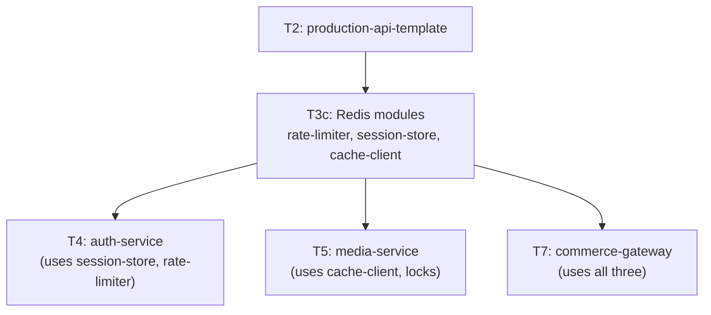

# Tier 3c — Key-Value / Redis

> Model ephemeral state, atomic operations, caching primitives, and rate limiting. This tier produces reusable modules consumed by T4, T5, and T7.

---

## Purpose

By the end of T3c, you can:

- Reason about when Redis is the right tool (and when it isn't)
- Use Redis data structures correctly (strings, hashes, sets, sorted sets, bitmaps, streams)
- Write atomic operations using `MULTI/EXEC` and Lua scripts
- Implement rate limiting, distributed locks, and session stores
- Diagnose and mitigate key eviction, hot keys, and memory pressure
- Use pipelining for throughput, persistence for durability

T3c is where "Redis is a fast cache" becomes "Redis is a set of atomic primitives that underpin correctness across the service."

---

## Anchored Project

**T3c: Reusable Redis modules**

Unlike T3a and T3b (which produce services), T3c produces **three reusable modules** consumed across T4, T5, and T7:

1. **`rate-limiter`** — a Redis-backed rate limiter with sliding-window-log and GCRA algorithms, exposed as Express middleware and library
2. **`session-store`** — a session store for authentication (used by T4)
3. **`cache-client`** — a typed caching client with cache-aside, TTL jitter, and single-flight mutex for stampede prevention

**What it includes:**

1. ioredis client with reconnect strategy and error handling
2. Rate limiter: sliding window log + GCRA, atomic via Lua
3. Session store: hash-based, TTL, refresh, revoke
4. Cache client: `getOrSet` with stampede protection, negative caching, TTL jitter
5. Distributed lock primitive (for cron single-execution)
6. Pub/Sub client wrapper (for T7)
7. Memory/eviction policy documented and tested
8. Benchmarks: ops/sec, p99 latency under load
9. Integration tests using Testcontainers with ephemeral Redis

**What it proves**: you can build Redis primitives that other services depend on, with atomicity guaranteed, without subtle race conditions.

**Deliverables:**

- `projects/t3c-modules/` — three npm packages or a monorepo
- Benchmarks with `autocannon` + `redis-benchmark`
- README for each module with usage examples

---

## How T3c Fits the Architecture

**What it produces**: reusable Redis modules consumed by T4, T5, and T7.

---

## Topics (Linear Spine)

### T3c.1 — When Redis Is the Right Tool

- **Redis vs Postgres vs in-process cache**: ephemeral state vs durable entities vs per-process memory
  `KNOW` · `Anchor: T3c` · `Deps: T3a, T3b` · `Fails: storing durable data in Redis (data loss on restart); caching in process without invalidation` · `Interview: Y` · `Artifact: —` · `Mistake: using Redis as a primary database` · `Ref: T3c.2` · `Theory 70/Practice 30` · `Local`

- **Single-threaded event loop model**: why Redis commands are atomic by default
  `KNOW` · `Anchor: T3c` · `Deps: T1.2 event loop` · `Fails: assuming commands can interleave mid-execution` · `Interview: Y` · `Artifact: —` · `Mistake: using Redis for CPU-heavy operations (blocks the loop)` · `Ref: T3c.5` · `Theory 60/Practice 40` · `Local`

- **In-memory architecture**: RAM-speed access, memory limits, eviction policies
  `KNOW` · `Anchor: T3c` · `Deps: T3c.1 single-threaded` · `Fails: Redis OOMKills; unexpected key evictions` · `Interview: S` · `Artifact: —` · `Mistake: no `maxmemory` policy configured` · `Ref: T3c.7` · `Theory 60/Practice 40` · `Local`

- **Persistence awareness (RDB, AOF)**: Redis isn't durable by default
  `KNOW` · `Anchor: T3c` · `Deps: T3c.1 in-memory` · `Fails: restart loses all data (sessions, locks, caches)` · `Interview: S` · `Artifact: —` · `Mistake: assuming Redis persists like a database` · `Ref: T3c.7` · `Theory 70/Practice 30` · `Local`

- **When NOT to use Redis**: durable storage, complex queries, large blobs, strong consistency requirements
  `KNOW` · `Anchor: T3c` · `Deps: T3c.1 redis-vs-postgres` · `Fails: fighting Redis for behavior it doesn't guarantee` · `Interview: Y` · `Artifact: —` · `Mistake: "Redis for everything"` · `Ref: T7` · `Theory 70/Practice 30` · `Local`

**Deep-dive candidates**: Redis vs in-process cache decision framework — generate on demand.

---

### T3c.2 — Core Data Structures

- **Strings**: `GET`, `SET`, `MSET`, `MGET`, `INCR`, `DECR`, `SETEX`, `SET NX EX`
  `BUILD` · `Anchor: T3c` · `Deps: T3c.1` · `Fails: race conditions on counters; missed TTLs` · `Interview: Y` · `Artifact: strings.ts` · `Mistake: using `SET`then`EXPIRE`instead of atomic`SETEX``·`Ref: T3c.3`·`Theory 20/Practice 80`·`Local`

- **Hashes**: `HSET`, `HGET`, `HGETALL`, `HDEL`, `HINCRBY` — for objects with many fields
  `BUILD` · `Anchor: T3c` · `Deps: T3c.2 strings` · `Fails: storing objects as JSON strings (slow partial updates)` · `Interview: Y` · `Artifact: hashes.ts` · `Mistake: `HGETALL` on a large hash (blocks Redis)` · `Ref: T3c.4` · `Theory 30/Practice 70` · `Local`

- **Lists**: `LPUSH`, `RPUSH`, `LPOP`, `RPOP`, `BRPOP`, `LRANGE` — for queues and recent items
  `BUILD` · `Anchor: T3c` · `Deps: T3c.2 strings` · `Fails: ad-hoc array emulation in strings` · `Interview: S` · `Artifact: lists.ts` · `Mistake: using Redis lists as a durable queue (BullMQ does it correctly)` · `Ref: T5` · `Theory 30/Practice 70` · `Local`

- **Sets**: `SADD`, `SREM`, `SISMEMBER`, `SMEMBERS`, `SINTER`, `SUNION` — for unique collections
  `BUILD` · `Anchor: T3c` · `Deps: T3c.2 strings` · `Fails: deduplicating in app code` · `Interview: S` · `Artifact: sets.ts` · `Mistake: `SMEMBERS` on a huge set (blocks Redis)` · `Ref: T4` · `Theory 30/Practice 70` · `Local`

- **Sorted sets**: `ZADD`, `ZRANGE`, `ZRANGEBYSCORE`, `ZRANK`, `ZREMRANGEBYSCORE` — for leaderboards, time-series, rate limiting
  `BUILD` · `Anchor: T3c` · `Deps: T3c.2 sets` · `Fails: can't do efficient range queries on plain sets` · `Interview: Y` · `Artifact: sorted-sets.ts` · `Mistake: not using scores for ordering when needed` · `Ref: T3c.5` · `Theory 40/Practice 60` · `Local`

- **Bitmaps**: `SETBIT`, `GETBIT`, `BITCOUNT`, `BITOP` — for presence tracking, feature flags per user
  `BUILD` · `Anchor: T3c` · `Deps: T3c.2 strings` · `Fails: per-user booleans stored as individual keys (memory waste)` · `Interview: S` · `Artifact: bitmaps.ts` · `Mistake: using bitmaps for sparse data (wastes memory)` · `Ref: T7` · `Theory 50/Practice 50` · `Local`

- **HyperLogLog**: `PFADD`, `PFCOUNT`, `PFMERGE` — approximate unique counts
  `KNOW` · `Anchor: T3c` · `Deps: T3c.2 sets` · `Fails: exact unique counts need gigabytes; HLL uses kilobytes` · `Interview: N` · `Artifact: —` · `Mistake: using HLL when exact counts matter (it's approximate)` · `Ref: T7` · `Theory 70/Practice 30` · `Local`

- **Streams**: `XADD`, `XREAD`, `XREADGROUP`, `XACK` — durable log with consumer groups
  `USE` · `Anchor: T3c` · `Deps: T3c.2 lists` · `Fails: Pub/Sub messages lost if no subscriber; Streams preserve` · `Interview: S` · `Artifact: streams.ts` · `Mistake: using Streams as a heavy event bus (use Kafka/RabbitMQ)` · `Ref: T5, T7` · `Theory 50/Practice 50` · `Local`

- **Key expiration**: `EXPIRE`, `PEXPIRE`, `TTL`, `PERSIST`
  `BUILD` · `Anchor: T3c` · `Deps: T3c.2 strings` · `Fails: keys accumulate forever; memory fills up` · `Interview: Y` · `Artifact: ttl.ts` · `Mistake: forgetting TTLs on cache keys` · `Ref: T3c.6` · `Theory 30/Practice 70` · `Local`

**Deep-dive candidates**: sorted sets for rate limiting, streams vs Pub/Sub — generate on demand.

---

### T3c.3 — Atomic Operations & Race Prevention

- **`INCR` / `DECR`**: atomic counters across all clients
  `BUILD` · `Anchor: T3c` · `Deps: T3c.2 strings` · `Fails: race conditions in app-side increments` · `Interview: Y` · `Artifact: counters.ts` · `Mistake: `GET`then`SET` (not atomic)` · `Ref: T3c.5` · `Theory 30/Practice 70` · `Local`

- **`SET key value EX ttl NX`**: atomic set-if-not-exists with TTL
  `BUILD` · `Anchor: T3c` · `Deps: T3c.2 strings` · `Fails: race conditions on "acquire if absent"` · `Interview: Y` · `Artifact: set-nx.ts` · `Mistake: `EXISTS`then`SET` (two commands, not atomic)` · `Ref: T3c.5` · `Theory 30/Practice 70` · `Local`

- **`MULTI` / `EXEC`**: transaction-like batching, but not ACID (no rollback)
  `BUILD` · `Anchor: T3c` · `Deps: T3c.3 atomic ops` · `Fails: multi-command operations torn apart by other clients` · `Interview: S` · `Artifact: multi-exec.ts` · `Mistake: assuming `MULTI` gives ACID semantics` · `Ref: T3c.3 Lua` · `Theory 40/Practice 60` · `Local`

- **Lua scripts**: server-side atomic execution of multi-command logic
  `BUILD` · `Anchor: T3c` · `Deps: T3c.3 MULTI/EXEC` · `Fails: read-then-write races that `MULTI` can't fix` · `Interview: Y` · `Artifact: lua/` · `Mistake: heavy loops in Lua (blocks Redis)` · `Ref: T3c.5, T5` · `Theory 50/Practice 50` · `Local`

- **`WATCH` / optimistic transaction**: retry on concurrent modification
  `KNOW` · `Anchor: T3c` · `Deps: T3c.3 MULTI/EXEC` · `Fails: no atomic conditional update` · `Interview: N` · `Artifact: —` · `Mistake: using `WATCH` when a Lua script is simpler` · `Ref: T3c.5` · `Theory 60/Practice 40` · `Local`

- **Distributed locks**: `SET NX EX`, lock tokens, safe release via Lua
  `BUILD` · `Anchor: T3c` · `Deps: T3c.3 set-nx` · `Fails: two workers run the same cron job; double processing` · `Interview: Y` · `Artifact: lock.ts` · `Mistake: releasing a lock without checking ownership (deletes other's lock)` · `Ref: T5` · `Theory 50/Practice 50` · `Local`

- **Redlock awareness**: multi-node locking, Kleppmann vs antirez debate
  `KNOW` · `Anchor: T3c` · `Deps: T3c.3 locks` · `Fails: relying on Redlock for correctness in adversarial conditions` · `Interview: N` · `Artifact: —` · `Mistake: assuming Redlock is bulletproof` · `Ref: T5` · `Theory 80/Practice 20` · `Local`

**Deep-dive candidates**: Lua scripting for rate limiting, distributed locks — generate on demand.

---

### T3c.4 — Client Setup & Connection Management

- **ioredis fundamentals**: `new Redis(...)`, connection options, error handling
  `USE` · `Anchor: T3c` · `Deps: T3c.2 strings` · `Fails: unhandled connection errors crash the app` · `Interview: S` · `Artifact: redis-client.ts` · `Mistake: not attaching an `error` listener` · `Ref: T3c.4 reconnect` · `Theory 30/Practice 70` · `Local`

- **Reconnection strategy**: exponential backoff, `retryStrategy`, `maxRetriesPerRequest`
  `BUILD` · `Anchor: T3c` · `Deps: T3c.4 ioredis` · `Fails: tight reconnect loops overwhelm Redis; unbounded retries hang requests` · `Interview: Y` · `Artifact: reconnect.ts` · `Mistake: no max retries (requests hang forever)` · `Ref: T6` · `Theory 40/Practice 60` · `Local`

- **Pipelining**: batch multiple commands in one round-trip
  `BUILD` · `Anchor: T3c` · `Deps: T3c.4 ioredis` · `Fails: 100 sequential round-trips instead of 1` · `Interview: S` · `Artifact: pipelining.ts` · `Mistake: pipelining non-independent commands` · `Ref: T3c.5` · `Theory 30/Practice 70` · `Local`

- **Pub/Sub client**: separate connection for subscribe vs publish
  `USE` · `Anchor: T3c` · `Deps: T3c.4 ioredis` · `Fails: subscriber connection can't publish (blocked)` · `Interview: S` · `Artifact: pubsub.ts` · `Mistake: sharing one client for pub and sub` · `Ref: T7` · `Theory 30/Practice 70` · `Local`

- **Cluster awareness**: `ioredis` cluster mode vs standalone
  `KNOW` · `Anchor: T3c` · `Deps: T3c.4 ioredis` · `Fails: standalone assumptions break when moving to cluster` · `Interview: N` · `Artifact: —` · `Mistake: multi-key operations in cluster mode without hash tags` · `Ref: T6` · `Theory 70/Practice 30` · `Local`

- **Connection pool sizing**: how many Redis connections per service
  `KNOW` · `Anchor: T3c` · `Deps: T3c.4 ioredis` · `Fails: too many connections overwhelm Redis; too few serialize requests` · `Interview: S` · `Artifact: —` · `Mistake: one connection per request` · `Ref: T6` · `Theory 60/Practice 40` · `Local`

**Deep-dive candidates**: ioredis reconnect strategy, pipelining vs Lua — generate on demand.

---

### T3c.5 — Rate Limiting Primitives

- **Fixed window**: `INCR` with TTL per window
  `BUILD` · `Anchor: T3c` · `Deps: T3c.3 INCR` · `Fails: burst at window boundary (100 requests at 11:59:59, 100 at 12:00:00)` · `Interview: Y` · `Artifact: fixed-window.ts` · `Mistake: not resetting TTL when key exists` · `Ref: T4` · `Theory 30/Practice 70` · `Local`

- **Sliding window log**: `ZADD` timestamps, `ZREMRANGEBYSCORE` old entries, `ZCARD` count
  `BUILD` · `Anchor: T3c` · `Deps: T3c.2 sorted sets` · `Fails: fixed-window boundary bursts` · `Interview: Y` · `Artifact: sliding-window-log.ts` · `Mistake: unbounded memory per key (one entry per request)` · `Ref: T4` · `Theory 40/Practice 60` · `Local`

- **Sliding window counter**: weighted average of current + previous window
  `BUILD` · `Anchor: T3c` · `Deps: T3c.5 sliding-window-log` · `Fails: log-based approaches use too much memory` · `Interview: S` · `Artifact: sliding-window-counter.ts` · `Mistake: not understanding the approximation (it's not exact)` · `Ref: T4` · `Theory 40/Practice 60` · `Local`

- **Token bucket**: bucket refills at rate `r`, capacity `b`, `INCR`-based approximation
  `BUILD` · `Anchor: T3c` · `Deps: T3c.3 INCR` · `Fails: no burst allowance for legitimate spikes` · `Interview: Y` · `Artifact: token-bucket.ts` · `Mistake: forgetting refill logic (bucket never refills)` · `Ref: T4` · `Theory 40/Practice 60` · `Local`

- **GCRA (Generic Cell Rate Algorithm)**: single-key rate limiter, most memory efficient
  `BUILD` · `Anchor: T3c` · `Deps: T3c.3 Lua` · `Fails: sliding-window-log memory explosion at scale` · `Interview: S` · `Artifact: gcra.lua` · `Mistake: implementing GCRA without testing edge cases` · `Ref: T4` · `Theory 50/Practice 50` · `Local`

- **Leaky bucket**: smooth output rate, queue requests
  `KNOW` · `Anchor: T3c` · `Deps: T3c.5 token-bucket` · `Fails: no smoothing for downstream services` · `Interview: N` · `Artifact: —` · `Mistake: using leaky bucket when token bucket fits better` · `Ref: T4` · `Theory 70/Practice 30` · `Local`

- **Concurrent request limiting**: cap in-flight requests, not requests per time window
  `BUILD` · `Anchor: T3c` · `Deps: T3c.3 locks` · `Fails: slow backends overwhelmed by concurrent requests` · `Interview: S` · `Artifact: concurrent-limit.ts` · `Mistake: confusing with rate limit (different semantics)` · `Ref: T4` · `Theory 40/Practice 60` · `Local`

- **Distributed rate limiting across instances**: all limiter state in Redis
  `BUILD` · `Anchor: T3c` · `Deps: T3c.5 all algorithms` · `Fails: in-process limiters don't work multi-instance` · `Interview: Y` · `Artifact: distributed-limiter.ts` · `Mistake: in-process `express-rate-limit` in production` · `Ref: T4` · `Theory 30/Practice 70` · `Local`

**Deep-dive candidates**: GCRA vs sliding window, distributed rate limiting — generate on demand.

---

### T3c.6 — Caching Patterns

- **Cache-aside**: read from cache first, populate on miss, invalidate on write
  `BUILD` · `Anchor: T3c` · `Deps: T3c.2 strings` · `Fails: stale cache after writes` · `Interview: Y` · `Artifact: cache-aside.ts` · `Mistake: forgetting to invalidate on write` · `Ref: T5` · `Theory 30/Practice 70` · `Local`

- **Write-through / write-behind**: write to cache and DB (or cache first)
  `KNOW` · `Anchor: T3c` · `Deps: T3c.6 cache-aside` · `Fails: cache and DB diverge under failures` · `Interview: S` · `Artifact: —` · `Mistake: write-behind without durability guarantees` · `Ref: T5` · `Theory 60/Practice 40` · `Local`

- **Read-through**: cache layer handles fetch on miss (transparent to caller)
  `KNOW` · `Anchor: T3c` · `Deps: T3c.6 cache-aside` · `Fails: callers implement cache logic repeatedly` · `Interview: N` · `Artifact: —` · `Mistake: read-through without single-flight protection` · `Ref: T5` · `Theory 60/Practice 40` · `Local`

- **Refresh-ahead**: proactively refresh hot keys before expiry
  `KNOW` · `Anchor: T3c` · `Deps: T3c.6 cache-aside` · `Fails: latency spikes when hot keys expire` · `Interview: N` · `Artifact: —` · `Mistake: refreshing everything (wastes resources)` · `Ref: T5` · `Theory 60/Practice 40` · `Local`

- **Cache stampede / thundering herd**: many requests miss simultaneously, all hit DB
  `BUILD` · `Anchor: T3c` · `Deps: T3c.3 locks` · `Fails: DB overload right after cache expiry` · `Interview: Y` · `Artifact: single-flight.ts` · `Mistake: no mutex on cache miss` · `Ref: T5` · `Theory 40/Practice 60` · `Local`

- **Single-flight mutex**: one request fetches, others wait
  `BUILD` · `Anchor: T3c` · `Deps: T3c.6 stampede` · `Fails: multiple concurrent DB fetches for same key` · `Interview: Y` · `Artifact: mutex.ts` · `Mistake: global lock instead of per-key lock` · `Ref: T5` · `Theory 40/Practice 60` · `Local`

- **TTL jitter**: add randomness to TTLs to prevent synchronized expiry
  `BUILD` · `Anchor: T3c` · `Deps: T3c.6 stampede` · `Fails: every key expires at the same time (avalanche)` · `Interview: Y` · `Artifact: ttl-jitter.ts` · `Mistake: fixed TTLs for all cache entries` · `Ref: T5` · `Theory 30/Practice 70` · `Local`

- **Negative caching**: cache "not found" results to prevent penetration
  `BUILD` · `Anchor: T3c` · `Deps: T3c.6 cache-aside` · `Fails: repeated lookups for non-existent keys hit DB` · `Interview: Y` · `Artifact: negative-cache.ts` · `Mistake: short TTL for negatives (defeats purpose) or long (stale on creation)` · `Ref: T5` · `Theory 40/Practice 60` · `Local`

- **Cache penetration vs stampede vs avalanche**: three distinct failure modes
  `KNOW` · `Anchor: T3c` · `Deps: T3c.6 all patterns` · `Fails: fixing one failure mode but not the others` · `Interview: Y` · `Artifact: —` · `Mistake: treating them as the same problem` · `Ref: T5` · `Theory 60/Practice 40` · `Local`

- **Cache invalidation strategies**: TTL, write-invalidate, version-based keys
  `BUILD` · `Anchor: T3c` · `Deps: T3c.6 cache-aside` · `Fails: stale data served after writes` · `Interview: Y` · `Artifact: invalidation.ts` · `Mistake: "there are only two hard things in CS"` · `Ref: T5` · `Theory 40/Practice 60` · `Local`

**Deep-dive candidates**: cache stampede mitigation, cache invalidation strategies — generate on demand.

---

### T3c.7 — Memory, Eviction & Persistence

- **`maxmemory` configuration**: cap Redis memory usage
  `BUILD` · `Anchor: T3c` · `Deps: T3c.1 in-memory` · `Fails: Redis consumes all available RAM; OOMKill` · `Interview: Y` · `Artifact: redis.conf` · `Mistake: no memory limit configured` · `Ref: T6` · `Theory 30/Practice 70` · `Local`

- **Eviction policies**: `noeviction`, `allkeys-lru`, `allkeys-lfu`, `volatile-lru`, `volatile-ttl`
  `BUILD` · `Anchor: T3c` · `Deps: T3c.7 maxmemory` · `Fails: unexpected key evictions (session store wiped)` · `Interview: Y` · `Artifact: eviction.conf` · `Mistake: using `allkeys-\*` when session keys must persist` · `Ref: T6` · `Theory 40/Practice 60` · `Local`

- **Key eviction under memory pressure**: what happens when Redis is full
  `KNOW` · `Anchor: T3c` · `Deps: T3c.7 eviction policies` · `Fails: writes rejected when `noeviction`; hot keys evicted` · `Interview: S` · `Artifact: —` · `Mistake: no monitoring on eviction rate` · `Ref: T6` · `Theory 60/Practice 40` · `Local`

- **RDB snapshots**: periodic point-in-time snapshots
  `KNOW` · `Anchor: T3c` · `Deps: T3c.1 persistence` · `Fails: lose data since last snapshot on crash` · `Interview: S` · `Artifact: —` · `Mistake: assuming RDB is continuous` · `Ref: T6` · `Theory 60/Practice 40` · `Local`

- **AOF (append-only file)**: log every write, replay on restart
  `KNOW` · `Anchor: T3c` · `Deps: T3c.7 RDB` · `Fails: data loss on crash; slower writes` · `Interview: S` · `Artifact: —` · `Mistake: `always`fsync (slow);`no` fsync (data loss)` · `Ref: T6` · `Theory 60/Practice 40` · `Local`

- **Hybrid persistence**: RDB + AOF together
  `KNOW` · `Anchor: T3c` · `Deps: T3c.7 RDB + AOF` · `Fails: choose one, lose the benefit of the other` · `Interview: N` · `Artifact: —` · `Mistake: not testing restore time on production-sized datasets` · `Ref: T6` · `Theory 60/Practice 40` · `Local`

- **Hot key mitigation**: shard hot keys across multiple Redis keys, use L1 cache
  `KNOW` · `Anchor: T3c` · `Deps: T3c.6 caching` · `Fails: single hot key saturates one Redis instance` · `Interview: S` · `Artifact: —` · `Mistake: sharding every key (complexity for no reason)` · `Ref: T5` · `Theory 70/Practice 30` · `Local`

- **Key naming conventions**: prefixes, namespacing, avoiding collisions
  `BUILD` · `Anchor: T3c` · `Deps: T3c.2 strings` · `Fails: collisions across services; hard to debug` · `Interview: N` · `Artifact: key-naming.md` · `Mistake: ad-hoc keys (`user:42`vs`users:42`)` · `Ref: T6` · `Theory 30/Practice 70` · `Local`

- **Monitoring memory and evictions**: `INFO memory`, `INFO stats`, `SLOWLOG`
  `USE` · `Anchor: T3c` · `Deps: T3c.7 maxmemory` · `Fails: can't diagnose memory issues until Redis crashes` · `Interview: S` · `Artifact: monitoring.md` · `Mistake: no alerting on eviction rate` · `Ref: T6` · `Theory 40/Practice 60` · `Local`

**Deep-dive candidates**: eviction policy selection, persistence trade-offs — generate on demand.

---

### T3c.8 — Integration: Redis Modules

- **`rate-limiter` module**: sliding window log + GCRA, middleware + library
  `BUILD` · `Anchor: T3c` · `Deps: T3c.5` · `Fails: ad-hoc limiters per service` · `Interview: Y` · `Artifact: rate-limiter/` · `Mistake: not testing at high concurrency` · `Ref: T4, T7` · `Theory 20/Practice 80` · `Local`

- **`session-store` module**: hash-based session storage, TTL, refresh, revoke
  `BUILD` · `Anchor: T3c` · `Deps: T3c.2 hashes` · `Fails: sessions lost on app restart` · `Interview: Y` · `Artifact: session-store/` · `Mistake: storing PII in sessions without encryption` · `Ref: T4, T7` · `Theory 20/Practice 80` · `Local`

- **`cache-client` module**: `getOrSet`, single-flight, TTL jitter, negative caching
  `BUILD` · `Anchor: T3c` · `Deps: T3c.6` · `Fails: every service reimplements caching (differently)` · `Interview: Y` · `Artifact: cache-client/` · `Mistake: no metrics on cache hit rate` · `Ref: T5, T7` · `Theory 20/Practice 80` · `Local`

- **Integration tests with Testcontainers**: real Redis, real Lua scripts, real concurrency
  `BUILD` · `Anchor: T3c` · `Deps: T6` · `Fails: in-process mocks don't catch race conditions` · `Interview: Y` · `Artifact: *.integration.test.ts` · `Mistake: mocking Redis in tests` · `Ref: T6` · `Theory 20/Practice 80` · `Local`

- **Benchmarks**: `redis-benchmark` + `autocannon` for rate limiter throughput
  `USE` · `Anchor: T3c` · `Deps: T3c.8 modules` · `Fails: no data on ops/sec or p99 latency` · `Interview: N` · `Artifact: benchmarks/` · `Mistake: benchmarking on the same machine as Redis (contention)` · `Ref: T6` · `Theory 20/Practice 80` · `Local`

---

## Why Not?

### Why Redis Instead of Memcached / KeyDB / Dragonfly?

- **Memcached** — simpler, faster for pure KV, but no persistence, no data structures beyond strings, no pub/sub, no streams, no Lua. Redis is a superset for nearly all backend use cases.
- **KeyDB** — Redis fork, multi-threaded, faster for CPU-bound workloads. Smaller community; Redis 7+ closed some performance gaps.
- **Dragonfly** — modern Redis alternative, single binary, very fast, but newer and less battle-tested at scale.
- **Redis** — the pragmatic default: rich data structures, Lua scripting, streams, mature client libraries, universally understood.

**When Redis isn't right**: durable entity storage (Postgres), complex queries (Postgres), large blobs (S3/MinIO), relational data (Postgres).

### Why Redis Instead of an In-Process Cache (`lru-cache`)?

- **In-process cache** — sub-microsecond access, no network hop. But per-process: five instances = five caches, invalidation across them is unsolved, memory unbounded per process.
- **Redis (L2)** — shared across instances, invalidation is one `DEL`. But network hop adds ~0.5–2ms latency.
- **The right answer**: often both. L1 (in-process, small, short TTL) for hottest keys; L2 (Redis) for the shared long tail. L1's short TTL limits staleness.
- **In-process only** breaks the moment you scale horizontally. Redis first; add L1 when latency matters and you can tolerate short staleness.

### Why BullMQ Instead of RabbitMQ / pg-boss / SQS?

- **RabbitMQ** — full message broker, complex routing (exchanges, topics), excellent for cross-service messaging. Overkill for in-service job queues. Adds operational burden (Erlang VM, cluster management).
- **pg-boss** — Postgres-backed queue. Excellent if you want one fewer dependency. Slower than Redis for high-throughput jobs (every job is a DB row). Choose when you already have Postgres and job volume is modest.
- **SQS** — AWS-managed, no ops. But paid (small cost), and locks you into AWS. Against the zero-spend guarantee.
- **BullMQ** — Redis-backed, TypeScript-native, rich features (delayed jobs, priorities, rate limiting, repeatable jobs, DLQ via failed-job listeners), atomic via Lua scripts. Best fit for Node + Redis stacks.

### Why Sliding Window Log Over Fixed Window for Rate Limiting?

- **Fixed window** — trivial to implement (`INCR` + `EXPIRE`), but bursty at boundaries (100 requests at 11:59:59, 100 at 12:00:00 → 200 in 2 seconds).
- **Sliding window log** — `ZADD` timestamps, `ZREMRANGEBYSCORE` old entries, `ZCARD` count. Accurate, smooth. Cost: one entry per request (memory-heavy at scale).
- **Sliding window counter** — weighted average of current + previous window. Approximate, memory-cheap, smooth.
- **Token bucket / GCRA** — best for burst tolerance. GCRA is single-key, memory-efficient, and exact.
- **Rule**: fixed window is almost always wrong. Choose based on burst tolerance (token bucket / GCRA), memory budget (sliding counter over sliding log), and required precision.

### Why `SET key value EX ttl NX` Instead of `EXISTS` + `SET`?

- **Two-command check-then-set** — race condition. Two clients can both see "not present," both set, and one silently overwrites the other.
- **`SET NX EX`** — atomic. Either you set it (you got the lock / cache slot), or you didn't (someone else did). No race.
- **This is the single most common Redis mistake** in backend code.

### Why Lua Scripts Instead of `MULTI/EXEC`?

- **`MULTI/EXEC`** — batches commands, executes them sequentially. No other client's commands interleave. But: no conditionals. You can't read a value, decide based on it, and write back — the read and write are separate operations and other clients can interleave.
- **Lua scripts** — executed server-side, atomically. You can read, branch on the value, and write in one atomic block. The engine for every real Redis rate limiter and distributed lock.
- **Caveat**: Lua in Redis is single-threaded. Long scripts block the entire Redis instance. Keep them fast (<1ms).

### Why Persistence Is Not a Substitute for Postgres?

- **RDB snapshots** — periodic. Lose everything since the last snapshot on crash.
- **AOF** — every write logged. Durable, but slower. Still not a full ACID database (no multi-key transactions with rollback, no schema, no joins).
- **Redis is for ephemeral state**: cache, sessions, rate limits, locks, pub/sub. Durable entity storage belongs in Postgres.
- **"We'll just enable AOF and use Redis as our main DB"** — this is how teams discover the hard way that Redis isn't a database.

---

## Exit Criteria

You've completed T3c when you can:

- Choose the right Redis data structure for a given problem
- Write atomic operations using Lua without introducing subtle race conditions
- Implement rate limiting with at least three algorithms and explain the trade-offs
- Implement a cache-aside layer with stampede protection and TTL jitter
- Diagnose Redis memory pressure and eviction issues
- Build reusable Redis modules that other services depend on

---

## Cross-Tier References

**Depends on**: T1 (async, Lua basics via JS), T2 (template), T3a (durable storage — Redis complements, not replaces).

**Depended on by**:

- T4 — `session-store`, `rate-limiter`
- T5 — `cache-client`, `locks`
- T6 — production ops (memory tuning, monitoring)
- T7 — all three modules + Pub/Sub for real-time

---

## Common Failure Modes for the Tier as a Whole

- **Non-atomic read-then-write**: `GET` then `SET` loses updates under concurrency. Use `INCR`/Lua.
- **No maxmemory policy**: Redis eats all RAM and OOMKills the host.
- **Using Redis as a database**: restarts lose everything. Persistence isn't a substitute for Postgres.
- **Blocking commands on hot keys**: `HGETALL`, `SMEMBERS`, `KEYS *` freeze Redis.
- **Cache stampede without single-flight**: DB overload after every hot-key expiry.
- **In-process rate limiting**: doesn't work across instances. Only distributed limiters are correct.
- **Releasing a distributed lock without checking ownership**: deletes another worker's lock.
- **No key naming convention**: collisions across services, impossible to debug.

---

## Case Studies & Papers

See `13-case-studies.md § T3c` and `14-papers.md § T3c`.
