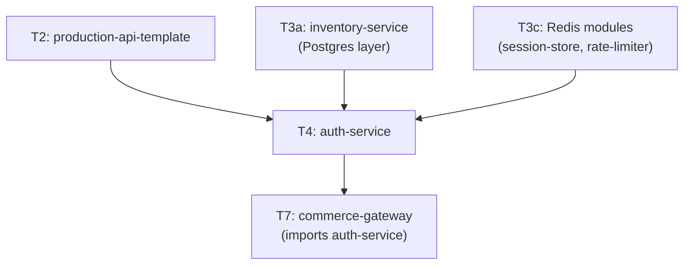

# Tier 4 — Identity & Boundary Security

> Authenticate, authorize, and harden every entry point. This tier produces the `auth-service` that T7 composes.

---

## Purpose

By the end of T4, you can:

- Hash passwords correctly (Argon2id, parameters, migration paths)
- Implement JWT access/refresh token rotation with revocation
- Integrate OAuth2/OIDC social login (Authorization Code + PKCE)
- Build MFA/TOTP, OTP, and password reset flows securely
- Enforce RBAC and ABAC at the request boundary
- Harden a service with Helmet, CORS, CSRF, and rate limiting
- Verify webhook signatures and design idempotent endpoints
- Audit security-sensitive events without leaking PII

T4 is where "I added auth" becomes "I built a service that survives an attacker who knows the framework."

---

## Anchored Project

**T4: `auth-service`**

A production-grade authentication and authorization service built on the T2 template, using T3a's Postgres layer and T3c's Redis modules.

**What it includes:**

1. User registration with email verification (OTP via Resend/Brevo free tier)
2. Password hashing with Argon2id (tuned parameters)
3. JWT access tokens + refresh token rotation (Redis-backed revocation)
4. Session management with Redis `session-store`
5. OAuth2 social login (Google/GitHub via `openid-client` + PKCE)
6. TOTP-based MFA with backup codes
7. Password reset via magic links
8. RBAC (roles: admin, user, guest) + ABAC policies (e.g., `user:edit_own_resource`)
9. Rate limiting on auth endpoints (login, OTP, password reset)
10. Security headers (Helmet: CSP, HSTS, X-Frame-Options)
11. CORS with strict origin whitelist
12. Webhook HMAC verification (for any inbound webhook endpoints)
13. Audit log table for sensitive events (login, role change, password change)
14. Integration tests covering the full auth lifecycle

**What it proves**: you can build authentication that passes a security review.

**Deliverables:**

- `projects/t4-auth-service/` — full repo
- OpenAPI spec for auth endpoints
- README with threat model notes
- Security-relevant integration tests

---

## How T4 Fits the Architecture

**What it produces**: `auth-service` — imported by T7 as the identity component. Also serves as a template for auth in every later project.

---

## Topics (Linear Spine)

### T4.1 — Password Storage & Verification

- **Why MD5/SHA-1/SHA-256 are wrong for passwords**: fast hashes = fast brute force
  `KNOW` · `Anchor: T4` · `Deps: T1.7 crypto` · `Fails: leaked password DBs get cracked in minutes` · `Interview: Y` · `Artifact: —` · `Mistake: using `crypto.createHash('sha256')` for passwords` · `Ref: T4.1 argon2` · `Theory 70/Practice 30` · `Local`

- **Argon2id**: parameters (memory, iterations, parallelism), tuning for your hardware
  `BUILD` · `Anchor: T4` · `Deps: T4.1 why-not-sha` · `Fails: hashes too weak (low memory) or too slow (server DoS)` · `Interview: Y` · `Artifact: argon2.ts` · `Mistake: copying parameters from a blog instead of tuning` · `Ref: T4.1 migration` · `Theory 40/Practice 60` · `Local`

- **bcrypt fallback awareness**: cost factor, 72-byte limit, when bcrypt is still acceptable
  `KNOW` · `Anchor: T4` · `Deps: T4.1 argon2` · `Fails: legacy systems can't migrate easily` · `Interview: S` · `Artifact: —` · `Mistake: bcrypt with cost too low` · `Ref: T4.1 migration` · `Theory 60/Practice 40` · `Local`

- **Password verification**: constant-time comparison, rehash on login if parameters changed
  `BUILD` · `Anchor: T4` · `Deps: T4.1 argon2` · `Fails: timing leaks; stuck with old parameters forever` · `Interview: S` · `Artifact: verify.ts` · `Mistake: `===` on hashes` · `Ref: T4.1 migration` · `Theory 30/Practice 70` · `Local`

- **Hash migration path**: verify with old algo, rehash with new on successful login
  `BUILD` · `Anchor: T4` · `Deps: T4.1 bcrypt, T4.1 argon2` · `Fails: no way to upgrade hash strength after an incident` · `Interview: S` · `Artifact: migration.ts` · `Mistake: forcing all users to reset passwords (bad UX, no migration)` · `Ref: T6` · `Theory 40/Practice 60` · `Local`

- **Account lockout policy**: N failed attempts → temporary lock, exponential backoff
  `BUILD` · `Anchor: T4` · `Deps: T3c.3 counters` · `Fails: unlimited brute force; or permanent lockout as DoS vector` · `Interview: Y` · `Artifact: lockout.ts` · `Mistake: permanent lockouts (attacker locks users out)` · `Ref: T4.6` · `Theory 30/Practice 70` · `Local`

**Deep-dive candidates**: Argon2id parameter tuning, hash migration strategy — generate on demand.

---

### T4.2 — Sessions, JWTs & Token Rotation

- **Session vs token comparison**: server-side session state vs stateless JWT
  `KNOW` · `Anchor: T4` · `Deps: T4.1 passwords` · `Fails: wrong choice for the use case` · `Interview: Y` · `Artifact: —` · `Mistake: using JWT for sessions (why?)` · `Ref: T4.2 jwt` · `Theory 60/Practice 40` · `Local`

- **JWT structure**: header, payload, signature; claims (`sub`, `iat`, `exp`, `aud`, `iss`, `jti`)
  `BUILD` · `Anchor: T4` · `Deps: T1.7 crypto` · `Fails: wrong claim names cause invalid tokens; missing `exp` allows indefinite use` · `Interview: Y` · `Artifact: jwt.ts` · `Mistake: storing sensitive data in payload (it's base64, not encrypted)` · `Ref: T4.2 rotation` · `Theory 40/Practice 60` · `Local`

- **Signing algorithms**: HS256 vs RS256 vs ES256, shared vs asymmetric keys
  `BUILD` · `Anchor: T4` · `Deps: T4.2 jwt structure` · `Fails: HS256 with a leaked secret allows token forgery across services` · `Interview: Y` · `Artifact: signing.ts` · `Mistake: HS256 for multi-service verification` · `Ref: T7` · `Theory 50/Practice 50` · `Local`

- **Access tokens (short-lived) + refresh tokens (long-lived, rotating)**
  `BUILD` · `Anchor: T4` · `Deps: T4.2 signing` · `Fails: single long-lived token = can't revoke on theft` · `Interview: Y` · `Artifact: tokens.ts` · `Mistake: symmetric lifetimes (both long or both short)` · `Ref: T4.2 rotation` · `Theory 40/Practice 60` · `Local`

- **Refresh token rotation**: issue new refresh token on use, invalidate old one
  `BUILD` · `Anchor: T4` · `Deps: T4.2 tokens` · `Fails: stolen refresh token works forever` · `Interview: Y` · `Artifact: rotation.ts` · `Mistake: not invalidating old refresh tokens` · `Ref: T4.2 revocation` · `Theory 40/Practice 60` · `Local`

- **Token revocation via Redis blacklist**: store revoked `jti` until expiry
  `BUILD` · `Anchor: T4` · `Deps: T4.2 rotation, T3c sets` · `Fails: logout doesn't actually log out (token still valid until expiry)` · `Interview: Y` · `Artifact: revocation.ts` · `Mistake: blacklist grows forever (must TTL to token expiry)` · `Ref: T4.2 blacklist` · `Theory 40/Practice 60` · `Local`

- **Token storage: cookies vs headers**: `HttpOnly`, `Secure`, `SameSite` for cookies; `Authorization: Bearer` for headers
  `BUILD` · `Anchor: T4` · `Deps: T4.2 tokens` · `Fails: XSS steals tokens from `localStorage`; CSRF exploits cookie storage` · `Interview: Y` · `Artifact: storage.md` · `Mistake: storing tokens in `localStorage``·`Ref: T4.3 CORS`·`Theory 40/Practice 60`·`Local`

- **JWT pitfalls**: `alg: none` attack, algorithm confusion, key ID (`kid`) injection
  `KNOW` · `Anchor: T4` · `Deps: T4.2 signing` · `Fails: forged tokens via algorithm confusion` · `Interview: Y` · `Artifact: —` · `Mistake: accepting any algorithm in `verify``·`Ref: T6`·`Theory 60/Practice 40`·`Local`

- **Session store pattern**: server-side session with Redis (opaque session ID)
  `BUILD` · `Anchor: T4` · `Deps: T3c.2 hashes` · `Fails: no server-side revocation for tokens` · `Interview: S` · `Artifact: session-store.ts` · `Mistake: storing sessions in memory (lost on restart)` · `Ref: T7` · `Theory 30/Practice 70` · `Local`

**Deep-dive candidates**: refresh token rotation, JWT pitfalls — generate on demand.

---

### T4.3 — OAuth2, OIDC & Social Login

- **OAuth2 roles**: resource owner, client, authorization server, resource server
  `KNOW` · `Anchor: T4` · `Deps: T4.2 tokens` · `Fails: confusing OAuth2 (authorization) with OIDC (identity)` · `Interview: Y` · `Artifact: —` · `Mistake: treating OAuth2 as an auth protocol` · `Ref: T4.3 oidc` · `Theory 70/Practice 30` · `Local`

- **Authorization Code Flow**: `authorization_endpoint` → code → `token_endpoint` → access token
  `BUILD` · `Anchor: T4` · `Deps: T4.3 oauth2-roles` · `Fails: manual OAuth2 implementations are error-prone` · `Interview: Y` · `Artifact: oauth-flow.ts` · `Mistake: implicit flow (deprecated)` · `Ref: T4.3 pkce` · `Theory 40/Practice 60` · `Local`

- **PKCE (Proof Key for Code Exchange)**: `code_verifier`, `code_challenge`, `S256` method
  `BUILD` · `Anchor: T4` · `Deps: T4.3 auth-code` · `Fails: code interception attacks` · `Interview: Y` · `Artifact: pkce.ts` · `Mistake: no PKCE for public clients` · `Ref: T4.3 providers` · `Theory 40/Practice 60` · `Local`

- **OIDC on top of OAuth2**: `id_token` (JWT), `userinfo` endpoint, standard claims
  `BUILD` · `Anchor: T4` · `Deps: T4.3 auth-code` · `Fails: identity verification missing` · `Interview: Y` · `Artifact: oidc.ts` · `Mistake: not validating `id_token` signature` · `Ref: T4.3 providers` · `Theory 40/Practice 60` · `Local`

- **Integrating Google/GitHub providers**: `openid-client` library, discovery endpoint
  `BUILD` · `Anchor: T4` · `Deps: T4.3 oidc` · `Fails: manual provider integrations break when providers change` · `Interview: Y` · `Artifact: providers/` · `Mistake: hardcoding provider URLs` · `Ref: T7` · `Theory 30/Practice 70` · `Local`

- **Identity linking**: same user via multiple providers, linking accounts safely
  `BUILD` · `Anchor: T4` · `Deps: T4.3 providers` · `Fails: duplicate accounts across providers` · `Interview: S` · `Artifact: linking.ts` · `Mistake: linking accounts on email match alone (email takeover risk)` · `Ref: T7` · `Theory 50/Practice 50` · `Local`

- **SSO patterns**: single sign-on across services, shared identity
  `KNOW` · `Anchor: T4` · `Deps: T4.3 oidc` · `Fails: separate logins per service` · `Interview: S` · `Artifact: —` · `Mistake: building custom SSO instead of using OIDC` · `Ref: T7` · `Theory 70/Practice 30` · `Local`

**Deep-dive candidates**: PKCE flow end-to-end, OIDC token validation — generate on demand.

---

### T4.4 — MFA, OTP & Password Reset

- **TOTP (Time-based One-Time Password)**: HMAC-based, 30-second window, RFC 6238
  `BUILD` · `Anchor: T4` · `Deps: T1.7 crypto` · `Fails: no second factor for compromised passwords` · `Interview: Y` · `Artifact: totp.ts` · `Mistake: no clock skew tolerance (±1 window)` · `Ref: T4.4 backup-codes` · `Theory 40/Practice 60` · `Local`

- **QR code provisioning**: `otpauth://` URI, Google Authenticator compatibility
  `BUILD` · `Anchor: T4` · `Deps: T4.4 totp` · `Fails: users can't add accounts to authenticator apps` · `Interview: N` · `Artifact: qr.ts` · `Mistake: storing TOTP secret in plaintext` · `Ref: T4.4 backup-codes` · `Theory 30/Practice 70` · `Local`

- **Backup recovery codes**: single-use codes, hashed at rest
  `BUILD` · `Anchor: T4` · `Deps: T4.4 totp` · `Fails: user loses device, can't log in` · `Interview: Y` · `Artifact: backup-codes.ts` · `Mistake: plaintext backup codes in DB` · `Ref: T4.4 mfa` · `Theory 30/Practice 70` · `Local`

- **MFA verification middleware**: require TOTP for sensitive operations
  `BUILD` · `Anchor: T4` · `Deps: T4.4 totp` · `Fails: MFA bypassed for admin routes` · `Interview: Y` · `Artifact: mfa-middleware.ts` · `Mistake: MFA only at login, not for elevation` · `Ref: T4.5 rbac` · `Theory 30/Practice 70` · `Local`

- **Email OTP flow**: short-lived numeric code, single-use, rate-limited
  `BUILD` · `Anchor: T4` · `Deps: T3c.3 set-nx, T4.6 rate-limit` · `Fails: email enumeration, OTP brute force` · `Interview: Y` · `Artifact: email-otp.ts` · `Mistake: 6-digit OTP without rate limit (brute-forceable in minutes)` · `Ref: T4.4 magic-links` · `Theory 40/Practice 60` · `Local`

- **Email provider integration**: Resend / Brevo free tier, templating, bounce handling
  `USE` · `Anchor: T4` · `Deps: —` · `Fails: emails not sent or go to spam` · `Interview: N` · `Artifact: email-provider.ts` · `Mistake: using SMTP directly instead of a transactional provider` · `Ref: T5` · `Theory 20/Practice 80` · `Local`

- **Magic link authentication**: short-lived single-use URL token, passwordless
  `BUILD` · `Anchor: T4` · `Deps: T1.7 crypto, T3c.3 set-nx` · `Fails: password reset emails contain no expiry; tokens reusable` · `Interview: S` · `Artifact: magic-link.ts` · `Mistake: predictable tokens (`randomBytes(8)` is too short)` · `Ref: T4.4 reset` · `Theory 40/Practice 60` · `Local`

- **Password reset flow**: request → email token → reset → invalidate all sessions
  `BUILD` · `Anchor: T4` · `Deps: T4.4 magic-links` · `Fails: stolen reset tokens; old sessions remain active after reset` · `Interview: Y` · `Artifact: password-reset.ts` · `Mistake: not invalidating existing sessions on reset` · `Ref: T4.2 revocation` · `Theory 40/Practice 60` · `Local`

- **Email verification flow**: signed verification token, single-use, expiry
  `BUILD` · `Anchor: T4` · `Deps: T4.4 magic-links` · `Fails: unverified emails used for account takeover` · `Interview: Y` · `Artifact: email-verify.ts` · `Mistake: verification not required before login` · `Ref: T4.5 rbac` · `Theory 30/Practice 70` · `Local`

- **Enumeration prevention**: responses don't reveal whether an email exists
  `BUILD` · `Anchor: T4` · `Deps: T4.4 email-otp` · `Fails: attackers enumerate registered emails` · `Interview: Y` · `Artifact: enumeration.ts` · `Mistake: "email already registered" vs "invalid credentials"` · `Ref: T6` · `Theory 40/Practice 60` · `Local`

**Deep-dive candidates**: TOTP implementation details, password reset security — generate on demand.

---

### T4.5 — RBAC, ABAC & Session Revocation

- **Role-Based Access Control (RBAC)**: roles (admin, user, guest), role → permission mapping
  `BUILD` · `Anchor: T4` · `Deps: T4.2 tokens` · `Fails: hardcoded `if (user.role === 'admin')` everywhere` · `Interview: Y` · `Artifact: rbac.ts` · `Mistake: roles as strings without central definition` · `Ref: T4.5 abac` · `Theory 40/Practice 60` · `Local`

- **Permission model**: granular permissions (`user:read`, `order:write`), role → permissions
  `BUILD` · `Anchor: T4` · `Deps: T4.5 rbac` · `Fails: role explosion when every rule needs a role` · `Interview: Y` · `Artifact: permissions.ts` · `Mistake: over-granular permissions (maintenance burden)` · `Ref: T4.5 abac` · `Theory 40/Practice 60` · `Local`

- **Hierarchical permission inheritance**: admin inherits user permissions
  `BUILD` · `Anchor: T4` · `Deps: T4.5 permissions` · `Fails: duplicated permission lists per role` · `Interview: S` · `Artifact: hierarchy.ts` · `Mistake: circular inheritance` · `Ref: T7` · `Theory 40/Practice 60` · `Local`

- **Attribute-Based Access Control (ABAC)**: policies evaluated against user, resource, and context attributes
  `BUILD` · `Anchor: T4` · `Deps: T4.5 permissions` · `Fails: rules like "edit own resource" can't be expressed as roles` · `Interview: Y` · `Artifact: abac.ts` · `Mistake: complex policy engines for simple rules` · `Ref: T7` · `Theory 50/Practice 50` · `Local`

- **Context-aware policy gates**: `user:edit_own_resource`, time-based, IP-based
  `BUILD` · `Anchor: T4` · `Deps: T4.5 abac` · `Fails: static roles can't express context-dependent rules` · `Interview: S` · `Artifact: policy.ts` · `Mistake: hardcoding context checks in controllers` · `Ref: T7` · `Theory 40/Practice 60` · `Local`

- **Authorization middleware**: `requireRole('admin')`, `requirePermission('user:write')`, `authorize(policy)`
  `BUILD` · `Anchor: T4` · `Deps: T4.5 rbac` · `Fails: authorization checks forgotten on new endpoints` · `Interview: Y` · `Artifact: auth-middleware.ts` · `Mistake: authorization in controllers instead of middleware` · `Ref: T7` · `Theory 30/Practice 70` · `Local`

- **Session revocation**: logout all devices, admin-forced logout, password-change invalidation
  `BUILD` · `Anchor: T4` · `Deps: T4.2 revocation, T3c.2 sets` · `Fails: stolen device keeps access after password change` · `Interview: Y` · `Artifact: revocation.ts` · `Mistake: revoking only the current token` · `Ref: T6` · `Theory 40/Practice 60` · `Local`

- **Audit logging for sensitive events**: role changes, login failures, password resets
  `BUILD` · `Anchor: T4` · `Deps: T2.5 logging` · `Fails: no record of who did what; compliance failures` · `Interview: S` · `Artifact: audit-log.ts` · `Mistake: logging passwords/tokens in audit entries` · `Ref: T6` · `Theory 40/Practice 60` · `Local`

- **Authorization failure semantics**: 401 Unauthorized vs 403 Forbidden, avoid leaking existence
  `BUILD` · `Anchor: T4` · `Deps: T2.6 errors` · `Fails: 403 reveals resource existence; 401 for permission failures` · `Interview: Y` · `Artifact: auth-errors.ts` · `Mistake: 404 for unauthorized resources leaks nothing, but is confusing` · `Ref: T7` · `Theory 40/Practice 60` · `Local`

**Deep-dive candidates**: RBAC vs ABAC decision framework, authorization middleware patterns — generate on demand.

---

### T4.6 — Request Hardening: Headers, CORS, Rate Limits

- **Security headers via Helmet**: CSP, HSTS, X-Frame-Options, X-Content-Type-Options, Referrer-Policy
  `BUILD` · `Anchor: T4` · `Deps: T2.2 Express` · `Fails: XSS, clickjacking, MIME sniffing` · `Interview: Y` · `Artifact: helmet.ts` · `Mistake: default CSP breaks legitimate inline scripts` · `Ref: T6` · `Theory 30/Practice 70` · `Local`

- **Content Security Policy (CSP)**: script-src, style-src, connect-src, nonce vs hash
  `BUILD` · `Anchor: T4` · `Deps: T4.6 helmet` · `Fails: XSS still possible despite headers` · `Interview: S` · `Artifact: csp.ts` · `Mistake: `unsafe-inline` defeats the purpose` · `Ref: T7` · `Theory 50/Practice 50` · `Local`

- **HSTS (HTTP Strict Transport Security)**: force HTTPS, `includeSubDomains`, `preload`
  `BUILD` · `Anchor: T4` · `Deps: T4.6 helmet` · `Fails: SSL stripping attacks; downgrade to HTTP` · `Interview: S` · `Artifact: hsts.ts` · `Mistake: `preload` without testing subdomains` · `Ref: T6` · `Theory 40/Practice 60` · `Local`

- **CORS done properly**: origin whitelist, `Access-Control-Allow-Credentials`, preflight cache via `Access-Control-Max-Age`
  `BUILD` · `Anchor: T4` · `Deps: T2.2 Express` · `Fails: `\*` origin allows any site to call your API with credentials` · `Interview: Y` · `Artifact: cors.ts` · `Mistake: `origin: true` reflects any origin` · `Ref: T7` · `Theory 40/Practice 60` · `Local`

- **CSRF protection**: double-submit cookie, `SameSite=Lax/Strict`, custom header requirement
  `BUILD` · `Anchor: T4` · `Deps: T4.2 cookies` · `Fails: state-changing requests from malicious sites` · `Interview: Y` · `Artifact: csrf.ts` · `Mistake: disabling CSRF "because we use JWTs" (cookies still vulnerable)` · `Ref: T6` · `Theory 40/Practice 60` · `Local`

- **Rate limiting on auth endpoints**: sliding window / GCRA per IP + per identifier
  `BUILD` · `Anchor: T4` · `Deps: T3c.5 rate-limit` · `Fails: credential stuffing, OTP brute force, enumeration` · `Interview: Y` · `Artifact: auth-rate-limit.ts` · `Mistake: only per-IP (attackers use botnets)` · `Ref: T7` · `Theory 40/Practice 60` · `Local`

- **Request size limits**: `express.json({ limit })`, file upload limits
  `BUILD` · `Anchor: T4` · `Deps: T2.2 Express` · `Fails: memory exhaustion from large bodies` · `Interview: S` · `Artifact: limits.ts` · `Mistake: no limit (default is 100kb, easy to override)` · `Ref: T5` · `Theory 30/Practice 70` · `Local`

- **Payload compression trade-offs**: Brotli vs gzip, BREACH attack awareness
  `KNOW` · `Anchor: T4` · `Deps: T4.6 headers` · `Fails: BREACH leaks secrets in compressed responses` · `Interview: N` · `Artifact: —` · `Mistake: compressing responses containing CSRF tokens` · `Ref: T6` · `Theory 70/Practice 30` · `Local`

- **Trusted proxies & `X-Forwarded-For`**: correctly identifying client IP behind a proxy
  `BUILD` · `Anchor: T4` · `Deps: T2.2 Express` · `Fails: rate limiting on the proxy IP (useless); IP spoofing` · `Interview: S` · `Artifact: trust-proxy.ts` · `Mistake: `trust proxy: true` blindly (spoofable)` · `Ref: T6` · `Theory 40/Practice 60` · `Local`

- **Device fingerprinting & IP geolocation**: suspicious login detection
  `KNOW` · `Anchor: T4` · `Deps: T4.6 trusted-proxies` · `Fails: no detection of impossible travel / new devices` · `Interview: N` · `Artifact: —` · `Mistake: relying on fingerprinting as primary auth` · `Ref: T6` · `Theory 70/Practice 30` · `Local`

**Deep-dive candidates**: CSP configuration, CORS pitfalls — generate on demand.

---

### T4.7 — Idempotency, Webhooks & Secrets

- **HTTP Idempotency Key architecture**: client sends key, server caches response, replays on repeat
  `BUILD` · `Anchor: T4` · `Deps: T3c.2 strings` · `Fails: duplicate charges on retry; duplicate resource creation` · `Interview: Y` · `Artifact: idempotency.ts` · `Mistake: no TTL (keys accumulate forever); no payload hash (same key, different body)` · `Ref: T5` · `Theory 40/Practice 60` · `Local`

- **Idempotency key storage**: Redis for fast lookup, DB for durability
  `BUILD` · `Anchor: T4` · `Deps: T4.7 idempotency` · `Fails: losing idempotency guarantees on Redis restart` · `Interview: S` · `Artifact: idempotency-store.ts` · `Mistake: Redis-only for financial endpoints` · `Ref: T5` · `Theory 40/Practice 60` · `Local`

- **Payload hash verification**: same key + different body = 422 conflict
  `BUILD` · `Anchor: T4` · `Deps: T4.7 idempotency` · `Fails: same key reused for different intent silently returns cached response` · `Interview: S` · `Artifact: payload-hash.ts` · `Mistake: not hashing the body` · `Ref: T5` · `Theory 30/Practice 70` · `Local`

- **Webhook HMAC-SHA256 verification**: sign payload, receiver verifies with shared secret
  `BUILD` · `Anchor: T4` · `Deps: T1.7 crypto` · `Fails: forged webhooks trigger actions` · `Interview: Y` · `Artifact: hmac.ts` · `Mistake: comparing signatures with `===` (timing attack)` · `Ref: T5` · `Theory 40/Practice 60` · `Local`

- **Timing-safe comparison**: `crypto.timingSafeEqual` for any secret comparison
  `BUILD` · `Anchor: T4` · `Deps: T1.7 crypto` · `Fails: timing attacks leak secret bytes` · `Interview: Y` · `Artifact: timing-safe.ts` · `Mistake: using `===` for HMACs, tokens, or API keys` · `Ref: T6` · `Theory 30/Practice 70` · `Local`

- **Webhook replay protection**: timestamp window, nonce, sequence
  `BUILD` · `Anchor: T4` · `Deps: T4.7 hmac` · `Fails: attacker replays captured webhook payloads` · `Interview: S` · `Artifact: replay-protection.ts` · `Mistake: no timestamp validation` · `Ref: T5` · `Theory 40/Practice 60` · `Local`

- **Secrets management**: `.env.example`, `.gitignore`, secret scanning in CI (`gitleaks`/`trufflehog`)
  `BUILD` · `Anchor: T4` · `Deps: T2.4 config` · `Fails: secrets committed to git; leaked in logs` · `Interview: Y` · `Artifact: secrets.md` · `Mistake: no CI scan; secret discovered only after incident` · `Ref: T6` · `Theory 40/Practice 60` · `Local`

- **Secret rotation awareness**: Vault, dynamic secrets, dual-secret windows
  `KNOW` · `Anchor: T4` · `Deps: T4.7 secrets` · `Fails: no rotation path; secrets live forever` · `Interview: S` · `Artifact: —` · `Mistake: rotating all secrets at once (breaks consumers)` · `Ref: T6` · `Theory 70/Practice 30` · `Local`

- **OWASP API Security Top 10**: overview and how each applies to your service
  `KNOW` · `Anchor: T4` · `Deps: all T4` · `Fails: missing whole categories of vulnerabilities` · `Interview: Y` · `Artifact: —` · `Mistake: treating it as a one-time checklist` · `Ref: T6` · `Theory 70/Practice 30` · `Local`

**Deep-dive candidates**: idempotency key design, webhook signature verification — generate on demand.

---

### T4.8 — Integration: The auth-service Project

- **Wiring template + Postgres + Redis**: assemble T2 + T3a + T3c into auth-service
  `BUILD` · `Anchor: T4` · `Deps: all T2, T3a, T3c` · `Fails: service that works in isolation but not integrated` · `Interview: Y` · `Artifact: auth-service/` · `Mistake: rebuilding what the template already provides` · `Ref: T7` · `Theory 20/Practice 80` · `Local`

- **Full auth lifecycle test**: register → verify → login → MFA → refresh → logout
  `BUILD` · `Anchor: T4` · `Deps: T6` · `Fails: individual endpoints work; flow breaks in sequence` · `Interview: Y` · `Artifact: auth-flow.test.ts` · `Mistake: testing endpoints in isolation only` · `Ref: T6` · `Theory 20/Practice 80` · `Local`

- **Threat model documentation**: enumerate attack vectors and mitigations
  `BUILD` · `Anchor: T4` · `Deps: all T4` · `Fails: security review finds gaps you didn't consider` · `Interview: S` · `Artifact: THREAT_MODEL.md` · `Mistake: skipping threat modeling` · `Ref: T6` · `Theory 60/Practice 40` · `Local`

- **Security-relevant integration tests**: brute force lockout, token reuse, CSRF, replay
  `BUILD` · `Anchor: T4` · `Deps: all T4` · `Fails: security regressions ship silently` · `Interview: Y` · `Artifact: security.test.ts` · `Mistake: only testing happy path` · `Ref: T6` · `Theory 20/Practice 80` · `Local`

---

## Why Not?

### Why Argon2id Instead of bcrypt / scrypt / PBKDF2?

- **bcrypt** — battle-tested, widely deployed. But 72-byte input limit, and GPU-cracking resistance is weaker than memory-hard alternatives.
- **scrypt** — memory-hard, good. But harder to tune, and Argon2 won the Password Hashing Competition (2015).
- **PBKDF2** — old, weak against GPUs. Used by legacy systems.
- **Argon2id** — memory-hard, resists GPU cracking, tunable memory/time/parallelism, winner of the PHC. The current best practice.
- **When bcrypt is still OK**: existing systems with millions of bcrypt hashes and no migration plan. Migrate on login (verify bcrypt → rehash with Argon2id).

### Why JWT Access + Refresh Instead of Just JWT?

- **JWT-only** — one token with a long expiry. Problem: tokens can't be revoked before expiry. If stolen, the attacker has access until expiry.
- **Access + refresh** — access token short-lived (15 min), refresh token long-lived (days/weeks) with rotation on use. If access is stolen, window is small. If refresh is stolen, rotation invalidates the old one and detects the theft.
- **Cost**: two endpoints, rotation logic, refresh token storage. Worth it for any system that cares about token theft.

### Why Refresh Token Rotation Instead of Static Refresh?

- **Static refresh** — refresh token lives until manually revoked. If stolen, it works forever.
- **Rotation** — every refresh issues a new refresh token and invalidates the old one. If an attacker steals and uses the refresh, the legitimate client's next attempt fails (old token already used) → theft detected.
- **Requires**: server-side storage of used refresh token IDs, one-time-use enforcement.

### Why JWT Over Sessions?

- **Sessions** — server-side state, opaque session ID in a cookie. Revocation is trivial (delete the session). But requires shared session storage across instances.
- **JWT** — stateless, no server lookup to verify. Scales horizontally trivially. But revocation is hard, and the token payload is public.
- **When to use sessions**: internal apps, single-region, revocation is critical.
- **When to use JWT**: public APIs, multi-service, distributed verification.
- **The honest answer**: most teams use JWTs because they're fashionable, not because they need statelessness. Sessions + Redis is simpler and revocable.

### Why OAuth2 Authorization Code + PKCE Instead of Password Grant?

- **Password grant** — deprecated in OAuth 2.1. Sends password to the client app (which shouldn't see it).
- **Implicit flow** — deprecated. Token in URL fragment, exposed to browser history and referer headers.
- **Authorization Code + PKCE** — the modern standard. No password exposure, no token in URLs, resistant to code interception. This is the only correct flow for browser and mobile clients.

### Why TOTP Instead of SMS OTP?

- **SMS OTP** — vulnerable to SIM-swap attacks, SS7 interception, and carrier breaches. Also not free at scale.
- **TOTP** — shared secret + time-based code, no network, works offline. Google Authenticator / Authy compatible.
- **Passkeys (WebAuthn)** — phishing-resistant, best UX, but more complex to implement and requires user device support.

### Why RBAC + ABAC Instead of Just RBAC?

- **Pure RBAC** — roles map to permissions. Simple, fast, easy to reason about. But role explosion when every rule needs a role (`editor_of_own_team`, `editor_of_others_team`, `admin_of_dept`, ...).
- **ABAC** — policies evaluated against attributes (user, resource, context). Handles "edit own resource" cases that RBAC can't express.
- **Rule**: RBAC for coarse-grained permissions. ABAC for context-dependent rules. Most systems need both.

### Why Rate Limit on Auth Endpoints Specifically?

- **Login / OTP / password reset / MFA verification** — all brute-forceable.
- **Per-IP alone** is insufficient (botnets). Rate limit per identifier (email, phone) too.
- **Lockout** — after N failed attempts, exponential backoff. Never permanent lockouts (attacker DoSes a user by locking them out).

### Why `crypto.timingSafeEqual` for HMACs?

- **`===`** — short-circuits on first differing byte. An attacker measuring response time can determine the correct bytes one at a time (timing attack). This works even over the network at scale.
- **`timingSafeEqual`** — constant-time comparison. No timing leak.

### Why Helmet Instead of Manual Headers?

- **Manual headers** — you'll forget one. Miss one and you have an XSS hole or clickjacking vulnerability.
- **Helmet** — one call, sensible defaults for CSP, HSTS, X-Frame-Options, X-Content-Type-Options, Referrer-Policy, and more. Tune from defaults, don't build from scratch.

---

## Exit Criteria

You've completed T4 when you can:

- Hash passwords with Argon2id and explain why the parameters matter
- Implement JWT access + refresh rotation with Redis revocation
- Integrate OAuth2/OIDC social login end-to-end
- Build TOTP-based MFA and a secure password reset flow
- Enforce RBAC and ABAC at the request boundary
- Configure Helmet, CORS, CSRF, and rate limiting correctly
- Design idempotent endpoints and verify webhook signatures
- Write a threat model for your auth service

---

## Cross-Tier References

**Depends on**: T1 (async, TS, crypto), T2 (template), T3a (users table), T3c (session-store, rate-limiter).

**Depended on by**:

- T5 — background jobs with user context
- T6 — production ops (secret scanning, security review)
- T7 — `auth-service` is imported into `commerce-gateway`

---

## Common Failure Modes for the Tier as a Whole

- **Fast hashes for passwords**: SHA-256 with salt isn't enough. Argon2id or bcrypt with proper cost.
- **No refresh token rotation**: stolen refresh token works forever.
- **Refresh token rotation without invalidation**: old tokens still accepted.
- **Token stored in `localStorage`**: any XSS steals it. Use `HttpOnly` cookies.
- **No CSRF protection on cookie-based auth**: cookies sent automatically by browser.
- **Rate limit only per IP**: attackers use botnets. Also rate limit per identifier.
- **`===` for HMAC comparison**: timing attacks leak bytes. Use `crypto.timingSafeEqual`.
- **Idempotency key without payload hash**: same key, different request returns cached response.
- **No email enumeration prevention**: attackers probe for registered users.
- **No audit log for sensitive events**: no record when something goes wrong.
- **CORS with `origin: true`**: reflects any origin, including attackers'.
- **No account lockout, or permanent lockout**: brute force possible, or DoS via lockout.

---

## Case Studies & Papers

See `13-case-studies.md § T4` and `14-papers.md § T4`.
