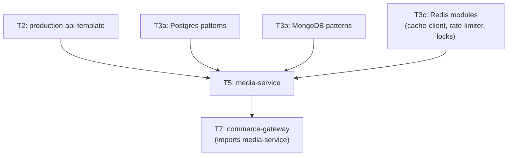

# Tier 5 — Async Work & Reliability

> Move work off the request path; survive dependency failure. This tier produces the `media-service` that T7 composes.

---

## Purpose

By the end of T5, you can:

- Decide what work belongs on the request path vs in a background job
- Build robust background jobs with BullMQ (retries, backoff, priorities, DLQ)
- Implement caching layers that survive stampedes and hot keys
- Retry, time out, circuit-break, and bulkhead calls to flaky dependencies
- Handle file uploads at scale (multipart, presigned URLs, MinIO)
- Send emails, notifications, and integrate with external services
- Do all of this with graceful shutdown and health checks in place

T5 is where "my service works when everything is healthy" becomes "my service survives when nothing is."

---

## Anchored Project

**T5: `media-service`**

A media handling service built on the T2 template, using T3a's Postgres, T3b's MongoDB for metadata, and T3c's Redis modules.

**What it includes:**
1. Direct-to-MinIO uploads via presigned URLs (no server memory bottleneck)
2. Multipart chunked upload for large files with chunk assembly
3. Metadata DB in Postgres (UUID, S3 key, ETag, size, checksum, status state machine)
4. Background jobs with BullMQ: thumbnail generation, virus scan (mock), notification email
5. Cache layer with `cache-client` (metadata lookups)
6. Idempotency on uploads (client-provided key)
7. Circuit breaker around the virus scanner (flaky mock external service)
8. Rate limiting on upload endpoints (T3c)
9. Graceful shutdown that drains in-flight uploads and finishes in-flight jobs
10. Health checks: `/health/live`, `/health/ready` (ready includes DB + Redis + MinIO)
11. Integration tests with Testcontainers (Postgres + Redis + MinIO)
12. Metrics: upload throughput, job queue depth, job failure rate

**What it proves**: you can build a service that handles long-running work, external dependencies, and scale — without dropping requests.

**Deliverables:**
- `projects/t5-media-service/` — full repo
- `docker-compose.yml` with Postgres, Redis, MinIO, and the service
- Benchmark: upload throughput + job processing throughput
- README with architecture diagram and failure-mode notes

---

## How T5 Fits the Architecture

**What it produces**: `media-service` — imported by T7 as the media handling component.

---

## Topics (Linear Spine)

### T5.1 — Sync vs Async Decision Making

- **What belongs on the request path**: fast, bounded, deterministic work
  `KNOW` · `Anchor: T5` · `Deps: T4` · `Fails: slow requests block connections; client timeouts` · `Interview: Y` · `Artifact: —` · `Mistake: doing everything synchronously "because it works locally"` · `Ref: T5.2` · `Theory 60/Practice 40` · `Local`

- **What belongs in the background**: slow, retryable, non-blocking work
  `KNOW` · `Anchor: T5` · `Deps: T5.1 sync-vs-async` · `Fails: request handlers hang on external services` · `Interview: Y` · `Artifact: —` · `Mistake: backgrounding work that needs synchronous feedback` · `Ref: T5.2` · `Theory 60/Practice 40` · `Local`

- **The 202 Accepted pattern**: accept, return job ID, notify via webhook/polling/WS
  `BUILD` · `Anchor: T5` · `Deps: T2.1 HTTP` · `Fails: clients wait for slow operations; connection timeouts` · `Interview: Y` · `Artifact: async-endpoint.ts` · `Mistake: returning 200 with a "processing" body` · `Ref: T7` · `Theory 40/Practice 60` · `Local`

- **Job ID as first-class resource**: client polls `/jobs/:id` for status
  `BUILD` · `Anchor: T5` · `Deps: T5.1 202` · `Fails: no way to track job progress` · `Interview: S` · `Artifact: job-status.ts` · `Mistake: not persisting job state` · `Ref: T7` · `Theory 30/Practice 70` · `Local`

- **Idempotency for async operations**: client-provided key, cached job result
  `BUILD` · `Anchor: T5` · `Deps: T4.7 idempotency` · `Fails: duplicate jobs on retry` · `Interview: Y` · `Artifact: idempotent-jobs.ts` · `Mistake: no key or no key expiry` · `Ref: T7` · `Theory 40/Practice 60` · `Local`

- **When NOT to background**: operations that must complete before response
  `KNOW` · `Anchor: T5` · `Deps: T5.1 sync-vs-async` · `Fails: eventual consistency surprises for callers` · `Interview: S` · `Artifact: —` · `Mistake: backgrounding auth checks (must be synchronous)` · `Ref: T7` · `Theory 70/Practice 30` · `Local`

**Deep-dive candidates**: 202 pattern end-to-end, idempotent job submission — generate on demand.

---

### T5.2 — BullMQ & Background Jobs

- **BullMQ fundamentals**: `Queue`, `Worker`, `Job`; add, process, complete, fail
  `BUILD` · `Anchor: T5` · `Deps: T3c.2 Redis` · `Fails: reinventing job queues (buggy, no retries)` · `Interview: Y` · `Artifact: queue.ts` · `Mistake: no error handling in processors (jobs hang)` · `Ref: T5.2 retries` · `Theory 30/Practice 70` · `Local`

- **Job lifecycle**: waiting → active → completed / failed
  `KNOW` · `Anchor: T5` · `Deps: T5.2 basics` · `Fails: no visibility into stuck jobs` · `Interview: S` · `Artifact: —` · `Mistake: no monitoring on queue depth` · `Ref: T6` · `Theory 60/Practice 40` · `Local`

- **Retries with exponential backoff + jitter**: `attempts`, `backoff: { type: 'exponential', delay }`
  `BUILD` · `Anchor: T5` · `Deps: T5.2 basics` · `Fails: retry storms; thundering herd on recovery` · `Interview: Y` · `Artifact: retries.ts` · `Mistake: fixed backoff (all retries at once)` · `Ref: T5.4 retries` · `Theory 30/Practice 70` · `Local`

- **Priorities**: high-priority jobs processed first
  `BUILD` · `Anchor: T5` · `Deps: T5.2 basics` · `Fails: OTP emails wait behind batch reports` · `Interview: S` · `Artifact: priorities.ts` · `Mistake: too many priority levels (complexity)` · `Ref: T7` · `Theory 30/Practice 70` · `Local`

- **Delayed jobs**: `delay` option for scheduled execution
  `BUILD` · `Anchor: T5` · `Deps: T5.2 basics` · `Fails: no way to schedule future work` · `Interview: S` · `Artifact: delayed.ts` · `Mistake: using `setTimeout` (lost on restart)` · `Ref: T5.3` · `Theory 30/Practice 70` · `Local`

- **Repeatable jobs (cron)**: `repeat: { pattern: '0 9 * * *' }`
  `BUILD` · `Anchor: T5` · `Deps: T5.2 basics` · `Fails: manual cron setups outside the codebase` · `Interview: Y` · `Artifact: cron.ts` · `Mistake: no distributed lock (multiple instances run same job)` · `Ref: T5.3 locks` · `Theory 30/Practice 70` · `Local`

- **Dead Letter Queue (DLQ)**: move failed jobs to separate queue after max retries
  `BUILD` · `Anchor: T5` · `Deps: T5.2 retries` · `Fails: failed jobs lost silently` · `Interview: Y` · `Artifact: dlq.ts` · `Mistake: no DLQ (jobs vanish after final retry)` · `Ref: T6` · `Theory 40/Practice 60` · `Local`

- **Job progress reporting**: `job.updateProgress()` for long jobs
  `BUILD` · `Anchor: T5` · `Deps: T5.2 basics` · `Fails: no visibility into long-running jobs` · `Interview: N` · `Artifact: progress.ts` · `Mistake: excessive progress updates (Redis load)` · `Ref: T7` · `Theory 30/Practice 70` · `Local`

- **Concurrency configuration**: worker concurrency, global vs per-queue
  `BUILD` · `Anchor: T5` · `Deps: T5.2 basics` · `Fails: too many concurrent jobs overwhelm DB or external services` · `Interview: S` · `Artifact: concurrency.ts` · `Mistake: default concurrency ignoring downstream limits` · `Ref: T5.4 bulkhead` · `Theory 30/Practice 70` · `Local`

- **Queue events & monitoring**: `QueueEvents` for job lifecycle events
  `USE` · `Anchor: T5` · `Deps: T5.2 basics` · `Fails: no real-time queue visibility` · `Interview: N` · `Artifact: queue-events.ts` · `Mistake: polling queue state manually` · `Ref: T6` · `Theory 30/Practice 70` · `Local`

- **BullMQ Lua scripts internals**: atomic job state transitions
  `KNOW` · `Anchor: T5` · `Deps: T3c.3 Lua` · `Fails: unaware of why BullMQ is atomic (and why your custom queue isn't)` · `Interview: N` · `Artifact: —` · `Mistake: writing a custom Redis queue without atomic operations` · `Ref: T6` · `Theory 70/Practice 30` · `Local`

**Deep-dive candidates**: BullMQ retry strategy, DLQ design — generate on demand.

---

### T5.3 — Distributed Cron & Scheduling

- **Cron vs interval vs one-shot**: when each is correct
  `KNOW` · `Anchor: T5` · `Deps: T5.2 repeatable` · `Fails: drift, duplicate runs, missed executions` · `Interview: S` · `Artifact: —` · `Mistake: `setInterval` for periodic work (drifts, lost on restart)` · `Ref: T5.3 locks` · `Theory 60/Practice 40` · `Local`

- **Timezone-aware scheduling**: "9am in user's local timezone"
  `BUILD` · `Anchor: T5` · `Deps: T3a.9 timezones` · `Fails: notifications sent at wrong local times` · `Interview: S` · `Artifact: tz-schedule.ts` · `Mistake: assuming UTC = local time` · `Ref: T7` · `Theory 40/Practice 60` · `Local`

- **DST edge cases**: skipped and repeated hours during clock transitions
  `BUILD` · `Anchor: T5` · `Deps: T5.3 tz-aware` · `Fails: jobs run twice or not at all on DST days` · `Interview: N` · `Artifact: dst-handling.ts` · `Mistake: scheduling by offset instead of IANA tz` · `Ref: T6` · `Theory 60/Practice 40` · `Local`

- **Distributed lock for cron single-execution**: Redis `SET NX EX` with TTL
  `BUILD` · `Anchor: T5` · `Deps: T3c.3 locks` · `Fails: every instance runs the same cron job` · `Interview: Y` · `Artifact: cron-lock.ts` · `Mistake: TTL too short (job overruns); too long (blocked after crash)` · `Ref: T5.3 overlap` · `Theory 40/Practice 60` · `Local`

- **Skip-if-running concurrency controls**: job doesn't start if previous run is still active
  `BUILD` · `Anchor: T5` · `Deps: T5.3 cron-lock` · `Fails: jobs pile up; resource exhaustion` · `Interview: S` · `Artifact: skip-if-running.ts` · `Mistake: overlapping jobs without awareness` · `Ref: T6` · `Theory 30/Practice 70` · `Local`

- **Job execution observability**: last run, next run, duration, failure rate
  `BUILD` · `Anchor: T5` · `Deps: T5.2 queue-events` · `Fails: silent failures of scheduled jobs` · `Interview: S` · `Artifact: cron-observability.ts` · `Mistake: no alerting on missed runs` · `Ref: T6` · `Theory 40/Practice 60` · `Local`

**Deep-dive candidates**: DST handling in schedulers, distributed cron patterns — generate on demand.

---

### T5.4 — Reliability Patterns

- **Retry with exponential backoff + jitter**: `delay * 2^n` with random jitter
  `BUILD` · `Anchor: T5` · `Deps: T5.2 retries` · `Fails: retry storms synchronize and overwhelm downstream` · `Interview: Y` · `Artifact: retry.ts` · `Mistake: fixed delay or no jitter` · `Ref: T5.4 circuit-breaker` · `Theory 30/Practice 70` · `Local`

- **Timeout discipline**: every external call has a timeout; `AbortSignal` propagation
  `BUILD` · `Anchor: T5` · `Deps: T1.2 AbortController` · `Fails: hanging requests hold connections and memory forever` · `Interview: Y` · `Artifact: timeouts.ts` · `Mistake: no timeout (default = infinite)` · `Ref: T6` · `Theory 30/Practice 70` · `Local`

- **Circuit breaker**: closed → open → half-open; stop hammering a dead service
  `BUILD` · `Anchor: T5` · `Deps: T5.4 timeouts` · `Fails: cascading failures; requests pile up against a dead dependency` · `Interview: Y` · `Artifact: circuit-breaker.ts` · `Mistake: no half-open state (breaker stays open forever)` · `Ref: T6` · `Theory 50/Practice 50` · `Local`

- **Bulkhead isolation**: separate pools for different dependencies
  `BUILD` · `Anchor: T5` · `Deps: T5.4 circuit-breaker` · `Fails: one slow dependency exhausts the whole service's resources` · `Interview: S` · `Artifact: bulkhead.ts` · `Mistake: shared connection pool across dependencies` · `Ref: T6` · `Theory 50/Practice 50` · `Local`

- **Fallback responses**: cached data, default values, degraded mode
  `BUILD` · `Anchor: T5` · `Deps: T5.4 circuit-breaker` · `Fails: service returns errors when it could serve stale data` · `Interview: S` · `Artifact: fallback.ts` · `Mistake: falling back to nothing (better to serve stale than fail)` · `Ref: T6` · `Theory 40/Practice 60` · `Local`

- **Retry budgeting**: cap total retries at ~10% of traffic
  `KNOW` · `Anchor: T5` · `Deps: T5.4 retries` · `Fails: retries amplify load on a struggling service` · `Interview: S` · `Artifact: —` · `Mistake: unlimited retries during incidents` · `Ref: T6` · `Theory 70/Practice 30` · `Local`

- **Retry amplification prevention**: only retry at one layer
  `KNOW` · `Anchor: T5` · `Deps: T5.4 retry-budget` · `Fails: retries at every layer multiply (client × gateway × service × DB)` · `Interview: S` · `Artifact: —` · `Mistake: retrying everywhere` · `Ref: T6` · `Theory 70/Practice 30` · `Local`

- **Hedged requests**: parallel backup requests after p99 threshold
  `KNOW` · `Anchor: T5` · `Deps: T5.4 timeouts` · `Fails: tail latency spikes affect user experience` · `Interview: N` · `Artifact: —` · `Mistake: hedging everything (doubles load)` · `Ref: T6` · `Theory 70/Practice 30` · `Local`

**Deep-dive candidates**: circuit breaker state machine, bulkhead isolation patterns — generate on demand.

---

### T5.5 — Caching in Production

- **Cache-aside with `cache-client`**: read from cache, fallback to DB, invalidate on write
  `BUILD` · `Anchor: T5` · `Deps: T3c.6 cache-aside` · `Fails: stale data after writes` · `Interview: Y` · `Artifact: cache-usage.ts` · `Mistake: forgetting invalidation on update` · `Ref: T6` · `Theory 30/Practice 70` · `Local`

- **Cache stampede prevention**: single-flight mutex (from T3c)
  `BUILD` · `Anchor: T5` · `Deps: T3c.6 single-flight` · `Fails: DB overload after cache expiry` · `Interview: Y` · `Artifact: stampede.ts` · `Mistake: no mutex on cache miss` · `Ref: T6` · `Theory 30/Practice 70` · `Local`

- **TTL jitter for cache keys**: prevent synchronized expiry
  `BUILD` · `Anchor: T5` · `Deps: T3c.6 ttl-jitter` · `Fails: avalanche when many keys expire together` · `Interview: Y` · `Artifact: jitter.ts` · `Mistake: fixed TTLs across keys` · `Ref: T6` · `Theory 30/Practice 70` · `Local`

- **Negative caching**: cache "not found" results with shorter TTL
  `BUILD` · `Anchor: T5` · `Deps: T3c.6 negative-cache` · `Fails: repeated lookups for non-existent keys hit DB` · `Interview: S` · `Artifact: negative-cache.ts` · `Mistake: long TTL on negatives (stale on creation)` · `Ref: T6` · `Theory 30/Practice 70` · `Local`

- **Hot-key mitigation**: shard hot keys, use L1 in-process cache
  `BUILD` · `Anchor: T5` · `Deps: T3c.6 caching` · `Fails: single hot key saturates one Redis instance` · `Interview: S` · `Artifact: hot-key.ts` · `Mistake: sharding every key (unnecessary complexity)` · `Ref: T6` · `Theory 40/Practice 60` · `Local`

- **L1 (in-process) + L2 (Redis) cache**: fast local cache with invalidation complexity
  `BUILD` · `Anchor: T5` · `Deps: T3c.6 caching` · `Fails: L1 serves stale data after L2 update` · `Interview: S` · `Artifact: two-level-cache.ts` · `Mistake: L1 with no TTL (persists forever)` · `Ref: T6` · `Theory 50/Practice 50` · `Local`

- **HTTP caching semantics with `Cache-Control`**: `max-age`, `s-maxage`, `stale-while-revalidate`
  `BUILD` · `Anchor: T5` · `Deps: T2.1 headers` · `Fails: clients and CDN cache stale data` · `Interview: S` · `Artifact: cache-control.ts` · `Mistake: `no-store` on everything (defeats caching)` · `Ref: T7` · `Theory 40/Practice 60` · `Local`

- **Cache warming**: pre-populate hot keys after deploy
  `KNOW` · `Anchor: T5` · `Deps: T5.5 cache-aside` · `Fails: cold-start latency spikes after deploy` · `Interview: N` · `Artifact: —` · `Mistake: warming too many keys (wasted memory)` · `Ref: T6` · `Theory 60/Practice 40` · `Local`

- **Cache metrics**: hit rate, miss rate, eviction rate, memory usage
  `BUILD` · `Anchor: T5` · `Deps: T3c.7 monitoring` · `Fails: no visibility into cache effectiveness` · `Interview: S` · `Artifact: cache-metrics.ts` · `Mistake: no alerting on hit-rate drop` · `Ref: T6` · `Theory 40/Practice 60` · `Local`

**Deep-dive candidates**: two-level caching, hot-key mitigation — generate on demand.

---

### T5.6 — File Uploads & Object Storage

- **Direct-to-storage presigned URLs**: client uploads to MinIO/S3 directly
  `BUILD` · `Anchor: T5` · `Deps: T4.7 secrets` · `Fails: server memory exhausted by large uploads` · `Interview: Y` · `Artifact: presigned.ts` · `Mistake: uploading through the API server` · `Ref: T7` · `Theory 40/Practice 60` · `Local`

- **MinIO setup with Docker Compose**: S3-compatible local storage
  `BUILD` · `Anchor: T5` · `Deps: —` · `Fails: no local way to test S3-style code` · `Interview: N` · `Artifact: docker-compose.yml` · `Mistake: using real S3 in dev (costs money)` · `Ref: T6` · `Theory 20/Practice 80` · `Local`

- **Multipart chunked uploads**: parallel chunks, ETag assembly
  `BUILD` · `Anchor: T5` · `Deps: T5.6 presigned` · `Fails: large files fail on flaky connections` · `Interview: S` · `Artifact: multipart.ts` · `Mistake: no chunk size tuning (too small = overhead, too large = retry cost)` · `Ref: T7` · `Theory 40/Practice 60` · `Local`

- **File metadata DB lifecycle**: `PENDING_UPLOAD → UPLOADED → FAILED`, orphan cleanup
  `BUILD` · `Anchor: T5` · `Deps: T3a.3 transactions` · `Fails: orphaned files in S3 with no DB record (cost) or vice versa` · `Interview: Y` · `Artifact: file-lifecycle.ts` · `Mistake: no cleanup for failed uploads` · `Ref: T6` · `Theory 40/Practice 60` · `Local`

- **MIME validation & security scan gate**: verify content type, scan for malware
  `BUILD` · `Anchor: T5` · `Deps: T5.2 jobs` · `Fails: malicious uploads reach users; XSS via SVG` · `Interview: Y` · `Artifact: validation.ts` · `Mistake: trusting client-provided Content-Type` · `Ref: T6` · `Theory 40/Practice 60` · `Local`

- **Storage driver abstraction**: swap S3, MinIO, local disk behind an interface
  `BUILD` · `Anchor: T5` · `Deps: T2.2 DI` · `Fails: vendor lock-in; hard to test` · `Interview: S` · `Artifact: storage-driver.ts` · `Mistake: calling S3 SDK directly across the codebase` · `Ref: T7` · `Theory 30/Practice 70` · `Local`

- **Orphan file garbage collection**: cron job to clean up unreferenced files
  `BUILD` · `Anchor: T5` · `Deps: T5.3 cron` · `Fails: storage costs grow unbounded` · `Interview: S` · `Artifact: gc.ts` · `Mistake: no GC, storage bill grows` · `Ref: T6` · `Theory 30/Practice 70` · `Local`

- **CDN awareness**: edge caching for downloads, `Cache-Control` headers
  `KNOW` · `Anchor: T5` · `Deps: T5.6 storage` · `Fails: origin bandwidth costs; slow global access` · `Interview: N` · `Artifact: —` · `Mistake: caching authenticated downloads publicly` · `Ref: T7` · `Theory 70/Practice 30` · `Local`

**Deep-dive candidates**: presigned URL security, multipart upload orchestration — generate on demand.

---

### T5.7 — Message Queues Beyond BullMQ

- **BullMQ vs RabbitMQ vs Kafka**: when each is correct
  `KNOW` · `Anchor: T5` · `Deps: T5.2 BullMQ` · `Fails: choosing wrong queue for the workload` · `Interview: Y` · `Artifact: —` · `Mistake: using Kafka for everything (overkill)` · `Ref: T7` · `Theory 70/Practice 30` · `Local`

- **RabbitMQ exchanges & routing**: direct, topic, fanout, headers
  `KNOW` · `Anchor: T5` · `Deps: T5.7 comparison` · `Fails: no routing flexibility when BullMQ doesn't fit` · `Interview: S` · `Artifact: —` · `Mistake: using RabbitMQ when BullMQ is simpler` · `Ref: T7` · `Theory 70/Practice 30` · `Local`

- **Kafka topics & partitions (usage-level)**: producer, consumer, consumer group
  `KNOW` · `Anchor: T5` · `Deps: T5.7 comparison` · `Fails: no durable event log; can't replay` · `Interview: S` · `Artifact: —` · `Mistake: Kafka for simple jobs (BullMQ better)` · `Ref: T7` · `Theory 70/Practice 30` · `Local`

- **At-least-once vs at-most-once vs exactly-once**: delivery semantics
  `KNOW` · `Anchor: T5` · `Deps: T5.7 comparison` · `Fails: duplicate side effects (email sent twice)` · `Interview: Y` · `Artifact: —` · `Mistake: assuming "exactly once" is free` · `Ref: T7` · `Theory 70/Practice 30` · `Local`

- **Idempotent consumers**: dedup by message ID, atomic DB upserts
  `BUILD` · `Anchor: T5` · `Deps: T3a.7 idempotency` · `Fails: duplicate effects from retried messages` · `Interview: Y` · `Artifact: idempotent-consumer.ts` · `Mistake: no dedup table for processed message IDs` · `Ref: T7` · `Theory 40/Practice 60` · `Local`

- **Dead-letter queues for consumers**: failed messages don't vanish
  `BUILD` · `Anchor: T5` · `Deps: T5.2 dlq` · `Fails: poison messages block the queue` · `Interview: S` · `Artifact: consumer-dlq.ts` · `Mistake: no DLQ (infinite retry loop)` · `Ref: T6` · `Theory 40/Practice 60` · `Local`

- **Message ordering guarantees**: per-partition ordering, keys, sequence numbers
  `KNOW` · `Anchor: T5` · `Deps: T5.7 kafka` · `Fails: out-of-order events cause state corruption` · `Interview: S` · `Artifact: —` · `Mistake: assuming global ordering across partitions` · `Ref: T7` · `Theory 70/Practice 30` · `Local`

- **Event vs command vs query**: message intent matters
  `KNOW` · `Anchor: T5` · `Deps: T5.7 comparison` · `Fails: conflating "what happened" with "do this"` · `Interview: S` · `Artifact: —` · `Mistake: sending commands disguised as events` · `Ref: T7` · `Theory 70/Practice 30` · `Local`

**Deep-dive candidates**: BullMQ vs RabbitMQ decision matrix, idempotent consumer patterns — generate on demand.

---

### T5.8 — Email, Notifications & External Services

- **Email provider integration**: Resend / Brevo free tier, API key management
  `USE` · `Anchor: T5` · `Deps: T4.4 email-provider` · `Fails: emails go to spam; no delivery tracking` · `Interview: N` · `Artifact: email-client.ts` · `Mistake: SMTP directly instead of transactional provider` · `Ref: T7` · `Theory 20/Practice 80` · `Local`

- **Transactional email templating**: HTML + text versions, variable substitution
  `BUILD` · `Anchor: T5` · `Deps: T5.8 provider` · `Fails: broken HTML emails; no plaintext fallback` · `Interview: N` · `Artifact: templates/` · `Mistake: inline HTML strings (unmaintainable)` · `Ref: T7` · `Theory 20/Practice 80` · `Local`

- **Bounce handling & suppressions**: track bounces, unsubscribes, complaints
  `BUILD` · `Anchor: T5` · `Deps: T5.8 provider` · `Fails: sending to bounced addresses hurts sender reputation` · `Interview: N` · `Artifact: bounces.ts` · `Mistake: ignoring webhook events from provider` · `Ref: T7` · `Theory 30/Practice 70` · `Local`

- **Retry strategy for email**: exponential backoff on 5xx, no retry on 4xx (permanent)
  `BUILD` · `Anchor: T5` · `Deps: T5.2 retries` · `Fails: retrying invalid addresses; giving up on transient errors` · `Interview: S` · `Artifact: email-retries.ts` · `Mistake: retrying all failures` · `Ref: T6` · `Theory 30/Practice 70` · `Local`

- **Notification channels**: email, SMS, push, in-app — unified dispatcher
  `KNOW` · `Anchor: T5` · `Deps: T5.8 email` · `Fails: per-channel code duplicated` · `Interview: N` · `Artifact: —` · `Mistake: no user preference for channel` · `Ref: T7` · `Theory 60/Practice 40` · `Local`

- **Rate limiting outbound calls**: respect provider quotas
  `BUILD` · `Anchor: T5` · `Deps: T3c.5 rate-limit` · `Fails: provider bans the API key` · `Interview: S` · `Artifact: outbound-limit.ts` · `Mistake: no rate limit (bursts trigger bans)` · `Ref: T6` · `Theory 30/Practice 70` · `Local`

**Deep-dive candidates**: email deliverability basics, notification dispatcher patterns — generate on demand.

---

### T5.9 — Graceful Shutdown & Health Checks

- **Graceful shutdown orchestration**: SIGTERM → stop accepting → drain → close resources → exit
  `BUILD` · `Anchor: T5` · `Deps: T2.8 shutdown` · `Fails: in-flight requests killed mid-flight on deploy` · `Interview: Y` · `Artifact: graceful-shutdown.ts` · `Mistake: `process.exit()` too early` · `Ref: T6` · `Theory 30/Practice 70` · `Local`

- **Drain in-flight HTTP requests**: `server.close()`, wait for active connections
  `BUILD` · `Anchor: T5` · `Deps: T5.9 shutdown` · `Fails: 502 errors during rolling deploys` · `Interview: Y` · `Artifact: drain.ts` · `Mistake: no drain timeout (hangs forever)` · `Ref: T6` · `Theory 30/Practice 70` · `Local`

- **Finish in-flight BullMQ jobs**: don't kill workers mid-job
  `BUILD` · `Anchor: T5` · `Deps: T5.2 BullMQ` · `Fails: jobs fail; retried wastefully` · `Interview: S` · `Artifact: worker-shutdown.ts` · `Mistake: `worker.close()` without awaiting in-flight jobs` · `Ref: T6` · `Theory 30/Practice 70` · `Local`

- **Close DB pools and Redis clients cleanly**
  `BUILD` · `Anchor: T5` · `Deps: T3a.8 pooling, T3c.4 client` · `Fails: connections stay open; DB sees long-lived zombies` · `Interview: S` · `Artifact: resource-close.ts` · `Mistake: forgetting non-HTTP resources` · `Ref: T6` · `Theory 30/Practice 70` · `Local`

- **Health checks: liveness vs readiness**: distinguish "process alive" from "can serve traffic"
  `BUILD` · `Anchor: T5` · `Deps: T2.8 health` · `Fails: K8s routes traffic to unready pods; restarts healthy pods` · `Interview: Y` · `Artifact: health.ts` · `Mistake: doing expensive checks in liveness (causes restarts)` · `Ref: T6` · `Theory 30/Practice 70` · `Local`

- **Readiness includes dependencies**: DB, Redis, MinIO reachable
  `BUILD` · `Anchor: T5` · `Deps: T5.9 health` · `Fails: pod marked ready before it can actually serve` · `Interview: S` · `Artifact: readiness.ts` · `Mistake: no timeout on dependency checks` · `Ref: T6` · `Theory 30/Practice 70` · `Local`

- **K8s `preStop` hook awareness**: delay SIGTERM until endpoints update
  `KNOW` · `Anchor: T5` · `Deps: T5.9 shutdown` · `Fails: requests routed to pods that already exited` · `Interview: N` · `Artifact: —` · `Mistake: no `preStop` delay (SIGTERM races the endpoints update)` · `Ref: T6` · `Theory 70/Practice 30` · `Local`

- **Draining long-lived connections**: WebSocket reconnect frames, gRPC `GOAWAY`
  `KNOW` · `Anchor: T5` · `Deps: T5.9 shutdown` · `Fails: WebSocket clients see broken connections on deploy` · `Interview: N` · `Artifact: —` · `Mistake: killing WebSockets abruptly` · `Ref: T7` · `Theory 70/Practice 30` · `Local`

**Deep-dive candidates**: graceful shutdown orchestration, readiness vs liveness semantics — generate on demand.

---

### T5.10 — Integration: The media-service Project

- **Wiring template + Postgres + Redis + MinIO**: assemble T2 + T3a + T3b + T3c
  `BUILD` · `Anchor: T5` · `Deps: all previous tiers` · `Fails: works locally, fails integrated` · `Interview: Y` · `Artifact: media-service/` · `Mistake: rebuilding template components` · `Ref: T7` · `Theory 20/Practice 80` · `Local`

- **Direct-to-MinIO upload flow**: presigned URL → client upload → server webhook/callback
  `BUILD` · `Anchor: T5` · `Deps: T5.6 presigned` · `Fails: server bottleneck on uploads` · `Interview: Y` · `Artifact: upload-flow.ts` · `Mistake: no callback to confirm upload completion` · `Ref: T7` · `Theory 30/Practice 70` · `Local`

- **Background job pipeline**: upload → scan → thumbnail → notify
  `BUILD` · `Anchor: T5` · `Deps: T5.2 BullMQ` · `Fails: sequential processing at request time` · `Interview: Y` · `Artifact: pipeline.ts` · `Mistake: synchronous chaining (no fault tolerance)` · `Ref: T7` · `Theory 30/Practice 70` · `Local`

- **Circuit breaker for external services**: wrap the virus scanner
  `BUILD` · `Anchor: T5` · `Deps: T5.4 circuit-breaker` · `Fails: dead scanner blocks all uploads` · `Interview: Y` · `Artifact: scanner-breaker.ts` · `Mistake: no fallback (fail open vs fail closed)` · `Ref: T7` · `Theory 30/Practice 70` · `Local`

- **Graceful shutdown covering uploads + jobs**
  `BUILD` · `Anchor: T5` · `Deps: T5.9 shutdown` · `Fails: deploy drops uploads, kills jobs` · `Interview: Y` · `Artifact: shutdown.ts` · `Mistake: only handling HTTP shutdown` · `Ref: T6` · `Theory 30/Practice 70` · `Local`

- **Benchmark upload + job throughput under load**
  `USE` · `Anchor: T5` · `Deps: T6` · `Fails: no data on how the service behaves at scale` · `Interview: N` · `Artifact: benchmark.md` · `Mistake: benchmarking only happy path` · `Ref: T6` · `Theory 20/Practice 80` · `Local`

- **README with failure-mode notes**: what happens when MinIO is down, scanner fails, Redis is unreachable
  `BUILD` · `Anchor: T5` · `Deps: all T5` · `Fails: no operational clarity during incidents` · `Interview: S` · `Artifact: README.md` · `Mistake: documenting happy path only` · `Ref: T6` · `Theory 30/Practice 70` · `Local`

---

## Exit Criteria

You've completed T5 when you can:

- Decide what work belongs on the request path vs in a background job
- Build a BullMQ pipeline with retries, backoff, DLQ, and priorities
- Schedule distributed cron jobs without duplicate execution
- Implement retry, timeout, circuit breaker, and bulkhead patterns
- Handle file uploads at scale with presigned URLs and multipart
- Use caching with stampede protection, TTL jitter, and negative caching
- Gracefully shut down a service without dropping in-flight work
- Write a service README that documents failure modes

---

## Cross-Tier References

**Depends on**: T1 (async, cancellation, streams), T2 (template), T3a (metadata DB), T3b (optional metadata store), T3c (cache, rate limiter, locks), T4 (idempotency keys, secrets).

**Depended on by**:
- T6 — production ops (worker scaling, queue monitoring)
- T7 — `media-service` is imported into `commerce-gateway`

---

## Common Failure Modes for the Tier as a Whole

- **Synchronous external calls on the request path**: timeouts, client errors, blocked connections.
- **No timeout on external calls**: requests hang forever, resources leak.
- **Retry without jitter**: synchronized retries hammer downstream services.
- **Retry at every layer**: amplification multiplies load by 10–100x during incidents.
- **No circuit breaker**: dead dependency takes down the service.
- **Shared connection pool across dependencies**: one slow dependency starves others (no bulkhead).
- **Cache without stampede protection**: DB overload after hot-key expiry.
- **No DLQ**: failed jobs vanish silently. You never know what was lost.
- **Cron without distributed lock**: every instance runs the job. Duplicate side effects.
- **Synchronous upload through the API server**: OOM on large files. Use presigned URLs.
- **No orphan cleanup**: S3 storage costs grow unbounded.
- **Shutdown that doesn't drain**: rolling deploys drop requests; in-flight jobs fail.

---

## Case Studies & Papers

See `13-case-studies.md § T5` and `14-papers.md § T5`.