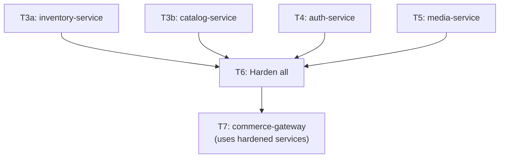

# Tier 6 — Production Operations

> Test, containerize, deploy, observe, and debug under load. This tier does not produce a new service — it hardens everything you've built.

---

## Purpose

By the end of T6, you can:

- Write unit, integration, and contract tests with real infrastructure (Testcontainers)
- Containerize services with multi-stage Dockerfiles and orchestrate with Docker Compose
- Set up CI/CD with GitHub Actions, migrations, and rollback
- Deploy to Kubernetes at a developer level (pods, probes, HPA, resource limits)
- Instrument services with structured logs, metrics, and traces (OpenTelemetry)
- Diagnose memory leaks, pool exhaustion, and event-loop blocking in production
- Write runbooks and respond to incidents
- Run load tests and interpret the results

T6 is where "it works on my laptop" becomes "it runs reliably in production at 3am when something breaks."

---

## Anchored Project

**T6: Harden T3a–T5 services**

No new service. Instead, you take `inventory-service`, `catalog-service`, `auth-service`, and `media-service` and harden them:

**What it includes:**

1. Unit tests for pure logic; integration tests with Testcontainers; contract tests for external APIs (MSW)
2. Multi-stage Dockerfiles for each service; `docker-compose.yml` orchestrating all of them
3. GitHub Actions CI: lint → type-check → test → build → migrate → deploy
4. Kubernetes manifests: Deployments, Services, ConfigMaps, Secrets, HPA, probes, `preStop` hooks
5. Structured logging shipped to Loki (or file-based aggregation)
6. Prometheus metrics on `/metrics`; Grafana dashboards for p95/p99 latency, RPS, error rate
7. OpenTelemetry tracing with trace context propagated across services and queues
8. Sentry (or self-hosted GlitchTip) for error aggregation
9. Load tests with `k6` or `autocannon`; results documented
10. A runbook for the top 3 failure modes (e.g., pool exhaustion, queue depth spike, primary DB failover)
11. Graceful shutdown verified end-to-end under load

**What it proves**: you can operate a real backend system, not just build one.

**Deliverables:**

- Each service repo: Dockerfile, GitHub Actions workflow, tests, instrumentation
- Root `docker-compose.yml` orchestrating all services
- K8s manifests (or Helm chart)
- Runbook: `RUNBOOK.md`
- Benchmark report: `BENCHMARKS.md`

---

## How T6 Fits the Architecture

**What it produces**: hardened, containerized, observable versions of every service — ready for T7 to compose.

---

## Topics (Linear Spine)

### T6.1 — Testing Strategy & Infrastructure

- **The test pyramid**: unit (pure logic), integration (real infra), e2e (full system)
  `KNOW` · `Anchor: T6` · `Deps: T2` · `Fails: either all-unit (mocks hide bugs) or all-e2e (slow, flaky)` · `Interview: Y` · `Artifact: —` · `Mistake: writing 90% integration tests (slow CI)` · `Ref: T6.1 testcontainers` · `Theory 60/Practice 40` · `Local`

- **Unit tests with Vitest**: pure functions, services with injected deps, edge cases
  `BUILD` · `Anchor: T6` · `Deps: T1.8 vitest` · `Fails: untested logic; regressions ship silently` · `Interview: Y` · `Artifact: *.test.ts` · `Mistake: testing implementation details (brittle tests)` · `Ref: T6.1 integration` · `Theory 20/Practice 80` · `Local`

- **Testcontainers for integration**: real Postgres, Redis, MinIO, MongoDB in Docker
  `BUILD` · `Anchor: T6` · `Deps: T3a, T3c, T5` · `Fails: mocked DB tests pass; production queries fail` · `Interview: Y` · `Artifact: testcontainers-setup.ts` · `Mistake: sharing containers across test files (state leaks)` · `Ref: T6.1 msw` · `Theory 30/Practice 70` · `Local`

- **Test lifecycle isolation**: fresh DB per test file, transaction rollback per test
  `BUILD` · `Anchor: T6` · `Deps: T6.1 testcontainers` · `Fails: tests fail depending on execution order` · `Interview: S` · `Artifact: test-lifecycle.ts` · `Mistake: shared state across tests` · `Ref: T6.1 msw` · `Theory 30/Practice 70` · `Local`

- **MSW (Mock Service Worker)**: intercept outbound HTTP for external APIs
  `BUILD` · `Anchor: T6` · `Deps: T6.1 unit` · `Fails: flaky tests hitting real external services` · `Interview: S` · `Artifact: msw-handlers.ts` · `Mistake: mocking too much (test asserts mocks, not behavior)` · `Ref: T6.1 factories` · `Theory 30/Practice 70` · `Local`

- **Nock for HTTP interception** (alternative to MSW): simpler for Node-only tests
  `USE` · `Anchor: T6` · `Deps: T6.1 msw` · `Fails: same as MSW, different API` · `Interview: N` · `Artifact: nock-setup.ts` · `Mistake: using both MSW and Nock in same project (pick one)` · `Ref: T6.1 factories` · `Theory 20/Practice 80` · `Local`

- **Test fixtures & factories**: `@faker-js/faker` + factory builders for deterministic test data
  `BUILD` · `Anchor: T6` · `Deps: T3a` · `Fails: hand-written fixtures drift; test data looks unrealistic` · `Interview: N` · `Artifact: factories/` · `Mistake: factories with too many optional overrides (hard to read)` · `Ref: T6.1 msw` · `Theory 20/Practice 80` · `Local`

- **Contract tests for external APIs**: verify the shape of external responses matches expectations
  `KNOW` · `Anchor: T6` · `Deps: T6.1 msw` · `Fails: external API changes break the service silently` · `Interview: S` · `Artifact: —` · `Mistake: contract tests that don't run in CI` · `Ref: T7` · `Theory 60/Practice 40` · `Local`

- **Test coverage discipline**: what to measure, what to ignore
  `KNOW` · `Anchor: T6` · `Deps: T6.1 unit` · `Fails: chasing 100% coverage; ignoring critical paths` · `Interview: S` · `Artifact: —` · `Mistake: 100% line coverage with 0% behavior coverage` · `Ref: T6.3 ci` · `Theory 70/Practice 30` · `Local`

**Deep-dive candidates**: Testcontainers patterns, MSW vs Nock decision — generate on demand.

---

### T6.2 — Docker & Containerization

- **Dockerfile fundamentals**: base image, layers, `COPY`, `RUN`, `CMD`, `ENTRYPOINT`
  `BUILD` · `Anchor: T6` · `Deps: —` · `Fails: bloated images; slow builds; layer cache misses` · `Interview: Y` · `Artifact: Dockerfile` · `Mistake: `COPY . .`before`npm install` (cache invalidation)` · `Ref: T6.2 multi-stage` · `Theory 30/Practice 70` · `Local`

- **Multi-stage builds**: build stage (with dev deps) → runtime stage (minimal)
  `BUILD` · `Anchor: T6` · `Deps: T6.2 Dockerfile` · `Fails: production images include dev dependencies (bloat, CVEs)` · `Interview: Y` · `Artifact: Dockerfile` · `Mistake: single-stage build for TypeScript projects` · `Ref: T6.2 optimization` · `Theory 30/Practice 70` · `Local`

- **`.dockerignore`**: exclude node_modules, .git, tests, etc.
  `BUILD` · `Anchor: T6` · `Deps: T6.2 Dockerfile` · `Fails: huge build context; slow builds` · `Interview: N` · `Artifact: .dockerignore` · `Mistake: no `.dockerignore` (context includes everything)` · `Ref: T6.2 optimization` · `Theory 20/Practice 80` · `Local`

- **Image size optimization**: distroless, Alpine, `node:slim`, layer deduplication
  `BUILD` · `Anchor: T6` · `Deps: T6.2 multi-stage` · `Fails: slow pulls, larger attack surface` · `Interview: S` · `Artifact: Dockerfile` · `Mistake: Alpine (musl) breaks native modules unexpectedly` · `Ref: T6.2 multi-stage` · `Theory 40/Practice 60` · `Local`

- **Non-root user in container**: `USER node` after setup
  `BUILD` · `Anchor: T6` · `Deps: T6.2 Dockerfile` · `Fails: container escape = root on host` · `Interview: S` · `Artifact: Dockerfile` · `Mistake: running as root by default` · `Ref: T6.4 k8s` · `Theory 30/Practice 70` · `Local`

- **Health check in Dockerfile**: `HEALTHCHECK` or K8s probe
  `BUILD` · `Anchor: T6` · `Deps: T2.8 health` · `Fails: orchestrators can't detect unhealthy containers` · `Interview: S` · `Artifact: Dockerfile` · `Mistake: health check that hits an expensive endpoint` · `Ref: T6.4 k8s` · `Theory 30/Practice 70` · `Local`

- **Docker Compose for local dev**: services, networks, volumes, env files
  `BUILD` · `Anchor: T6` · `Deps: T3a, T3c, T5` · `Fails: devs install services on their host (drift, complexity)` · `Interview: S` · `Artifact: docker-compose.yml` · `Mistake: no healthcheck in compose (deps not ready when app starts)` · `Ref: T6.4 k8s` · `Theory 30/Practice 70` · `Local`

- **Compose `depends_on` with healthcheck**: wait for deps to be ready before starting app
  `BUILD` · `Anchor: T6` · `Deps: T6.2 compose` · `Fails: app starts before DB is ready; crashes on boot` · `Interview: S` · `Artifact: docker-compose.yml` · `Mistake: `depends_on`without`condition: service_healthy``·`Ref: T6.4 k8s`·`Theory 30/Practice 70`·`Local`

- **Environment parity discipline**: same image runs in dev, staging, prod
  `KNOW` · `Anchor: T6` · `Deps: T6.2 compose` · `Fails: "works in dev, fails in prod"` · `Interview: S` · `Artifact: —` · `Mistake: different base images per environment` · `Ref: T6.5 release` · `Theory 60/Practice 40` · `Local`

- **Dev containers**: `.devcontainer/` for consistent dev environments
  `KNOW` · `Anchor: T6` · `Deps: T6.2 compose` · `Fails: team dev environments diverge` · `Interview: N` · `Artifact: —` · `Mistake: forcing dev containers on everyone` · `Ref: T6.3 ci` · `Theory 60/Practice 40` · `Local`

**Deep-dive candidates**: multi-stage build patterns, image size optimization — generate on demand.

---

### T6.3 — CI/CD with GitHub Actions

- **GitHub Actions fundamentals**: workflows, jobs, steps, runners
  `BUILD` · `Anchor: T6` · `Deps: —` · `Fails: manual deploys; inconsistent process` · `Interview: S` · `Artifact: .github/workflows/` · `Mistake: one giant workflow (hard to debug)` · `Ref: T6.3 pipeline` · `Theory 30/Practice 70` · `Local`

- **Lint → type-check → test → build pipeline**: fail fast on cheapest checks
  `BUILD` · `Anchor: T6` · `Deps: T6.3 fundamentals` · `Fails: slow feedback; broken code reaches main` · `Interview: Y` · `Artifact: ci.yml` · `Mistake: running slow tests before fast lint` · `Ref: T6.3 cache` · `Theory 30/Practice 70` · `Local`

- **Caching dependencies in CI**: `actions/cache`, `actions/setup-node` cache
  `BUILD` · `Anchor: T6` · `Deps: T6.3 pipeline` · `Fails: slow CI (5–10 min per run)` · `Interview: N` · `Artifact: ci.yml` · `Mistake: no cache key (cache never hits)` · `Ref: T6.3 pipeline` · `Theory 20/Practice 80` · `Local`

- **Matrix builds**: test across Node versions, OSes
  `KNOW` · `Anchor: T6` · `Deps: T6.3 pipeline` · `Fails: no coverage across runtime versions` · `Interview: N` · `Artifact: —` · `Mistake: unnecessary matrices (slow CI)` · `Ref: T6.3 pipeline` · `Theory 60/Practice 40` · `Local`

- **Build & push Docker image to registry**: GHCR or Docker Hub
  `BUILD` · `Anchor: T6` · `Deps: T6.2 Dockerfile` · `Fails: manual image builds; drift` · `Interview: Y` · `Artifact: build.yml` · `Mistake: pushing mutable tags (`latest`) to prod` · `Ref: T6.5 release` · `Theory 30/Practice 70` · `Local`

- **Migrations in deploy pipeline**: run before new app version rolls out
  `BUILD` · `Anchor: T6` · `Deps: T3a.6 migrations` · `Fails: app code references columns that don't exist yet` · `Interview: Y` · `Artifact: deploy.yml` · `Mistake: running migrations after app deploy` · `Ref: T6.4 k8s` · `Theory 40/Practice 60` · `Local`

- **Secrets in GitHub Actions**: repository secrets, environment-scoped secrets
  `BUILD` · `Anchor: T6` · `Deps: T4.7 secrets` · `Fails: secrets in workflow files (leaked in git)` · `Interview: S` · `Artifact: deploy.yml` · `Mistake: echoing secrets to logs` · `Ref: T6.4 k8s` · `Theory 30/Practice 70` · `Local`

- **Rollback strategy**: previous image tag, re-run previous workflow
  `BUILD` · `Anchor: T6` · `Deps: T6.3 build-push` · `Fails: no way to undo a bad deploy` · `Interview: Y` · `Artifact: rollback.yml` · `Mistake: rollback without rollback of migration` · `Ref: T6.5 release` · `Theory 40/Practice 60` · `Local`

- **Branch protection rules**: require PR review, require CI green, forbid force push
  `KNOW` · `Anchor: T6` · `Deps: T6.3 fundamentals` · `Fails: broken code reaches main` · `Interview: N` · `Artifact: —` · `Mistake: no required checks` · `Ref: T6.5 release` · `Theory 60/Practice 40` · `Local`

**Deep-dive candidates**: GitHub Actions caching, migration-in-CI patterns — generate on demand.

---

### T6.4 — Kubernetes at Developer Level

- **K8s core objects**: Pod, Deployment, Service, Ingress
  `KNOW` · `Anchor: T6` · `Deps: T6.2 Docker` · `Fails: no way to deploy containers at scale` · `Interview: Y` · `Artifact: —` · `Mistake: using Pods directly instead of Deployments` · `Ref: T6.4 manifests` · `Theory 60/Practice 40` · `Local`

- **Deployment manifests**: replicas, image, selector, template
  `BUILD` · `Anchor: T6` · `Deps: T6.4 core` · `Fails: manual pod management` · `Interview: Y` · `Artifact: deployment.yaml` · `Mistake: image tag `latest` (no rollback)` · `Ref: T6.4 probes` · `Theory 30/Practice 70` · `Local`

- **Service types**: ClusterIP, NodePort, LoadBalancer
  `BUILD` · `Anchor: T6` · `Deps: T6.4 deployment` · `Fails: pods unreachable from other pods / internet` · `Interview: S` · `Artifact: service.yaml` · `Mistake: LoadBalancer for internal services (cost, exposure)` · `Ref: T7` · `Theory 30/Practice 70` · `Local`

- **Ingress + Ingress controller**: route external traffic to services
  `BUILD` · `Anchor: T6` · `Deps: T6.4 service` · `Fails: no way to expose HTTP services cleanly` · `Interview: S` · `Artifact: ingress.yaml` · `Mistake: no TLS on ingress` · `Ref: T7` · `Theory 40/Practice 60` · `Local`

- **ConfigMaps and Secrets**: externalize config and secrets
  `BUILD` · `Anchor: T6` · `Deps: T2.4 config` · `Fails: config baked into images` · `Interview: S` · `Artifact: configmap.yaml` · `Mistake: base64-encoded secrets in git (not encrypted)` · `Ref: T6.4 probes` · `Theory 30/Practice 70` · `Local`

- **Liveness, readiness, startup probes**: correct probe semantics
  `BUILD` · `Anchor: T6` · `Deps: T2.8 health` · `Fails: K8s restarts healthy pods; routes traffic to unready pods` · `Interview: Y` · `Artifact: deployment.yaml` · `Mistake: same endpoint for all three probes` · `Ref: T6.4 hooks` · `Theory 40/Practice 60` · `Local`

- **`preStop` lifecycle hook**: delay SIGTERM until endpoints update
  `BUILD` · `Anchor: T6` · `Deps: T5.9 shutdown` · `Fails: requests routed to pods that are already shutting down` · `Interview: S` · `Artifact: deployment.yaml` · `Mistake: no `preStop` delay (race condition)` · `Ref: T6.4 hooks` · `Theory 30/Practice 70` · `Local`

- **Resource requests and limits**: CPU, memory
  `BUILD` · `Anchor: T6` · `Deps: T6.4 deployment` · `Fails: pods OOMKilled; nodes overcommitted` · `Interview: Y` · `Artifact: deployment.yaml` · `Mistake: no `requests` (scheduler can't place pods)` · `Ref: T6.6 tuning` · `Theory 40/Practice 60` · `Local`

- **Horizontal Pod Autoscaler (HPA)**: scale on CPU / custom metrics
  `BUILD` · `Anchor: T6` · `Deps: T6.4 resources` · `Fails: fixed replicas can't handle traffic spikes` · `Interview: S` · `Artifact: hpa.yaml` · `Mistake: HPA without `requests` set (undefined behavior)` · `Ref: T6.6 tuning` · `Theory 40/Practice 60` · `Local`

- **Rolling updates**: `RollingUpdate` strategy, `maxSurge`, `maxUnavailable`
  `KNOW` · `Anchor: T6` · `Deps: T6.4 deployment` · `Fails: downtime during deploys` · `Interview: S` · `Artifact: —` · `Mistake: no readiness probe (traffic to unready pods)` · `Ref: T6.5 release` · `Theory 60/Practice 40` · `Local`

- **Namespace discipline**: dev / staging / prod isolation
  `KNOW` · `Anchor: T6` · `Deps: T6.4 core` · `Fails: prod deployed to dev by mistake` · `Interview: N` · `Artifact: —` · `Mistake: everything in `default``·`Ref: T6.5 release`·`Theory 60/Practice 40`·`Local`

**Deep-dive candidates**: probe semantics, HPA tuning — generate on demand.

---

### T6.5 — Feature Flags, Releases & Rollback

- **Feature flags fundamentals**: decouple deploy from release
  `KNOW` · `Anchor: T6` · `Deps: T6.3 ci` · `Fails: every change requires a deploy` · `Interview: S` · `Artifact: —` · `Mistake: flags with no cleanup plan (flag debt)` · `Ref: T6.5 canary` · `Theory 60/Practice 40` · `Local`

- **Rollout strategies: rolling, blue-green, canary**
  `KNOW` · `Anchor: T6` · `Deps: T6.4 rolling` · `Fails: no safe way to release risky changes` · `Interview: Y` · `Artifact: —` · `Mistake: choosing blue-green for stateful services (migration complexity)` · `Ref: T6.5 flag` · `Theory 60/Practice 40` · `Local`

- **Semantic versioning**: MAJOR.MINOR.PATCH; when to bump
  `KNOW` · `Anchor: T6` · `Deps: T6.3 build-push` · `Fails: versioning is ad-hoc; consumers can't track changes` · `Interview: S` · `Artifact: —` · `Mistake: `0.x` versions for production-ready packages` · `Ref: T7` · `Theory 60/Practice 40` · `Local`

- **Changelog discipline**: `CHANGELOG.md`, "Keep a Changelog" format
  `KNOW` · `Anchor: T6` · `Deps: T6.5 semver` · `Fails: consumers don't know what changed` · `Interview: N` · `Artifact: —` · `Mistake: changelog generated from commits (noise)` · `Ref: T7` · `Theory 60/Practice 40` · `Local`

- **Deployment sequencing with migrations**: migrate → deploy code → verify
  `BUILD` · `Anchor: T6` · `Deps: T3a.6 expand-contract` · `Fails: code expecting new schema runs before migration` · `Interview: Y` · `Artifact: deploy.md` · `Mistake: same pipeline step for migration and deploy` · `Ref: T6.4 hooks` · `Theory 40/Practice 60` · `Local`

- **Rollback strategy**: previous image, previous migration, feature flag kill switch
  `BUILD` · `Anchor: T6` · `Deps: T6.3 rollback` · `Fails: no way to undo a bad deploy in <5 min` · `Interview: Y` · `Artifact: rollback.md` · `Mistake: rollback without considering non-reversible migrations` · `Ref: T6.6 incidents` · `Theory 40/Practice 60` · `Local`

- **Zero-downtime deploy verification**: monitor error rate during rollout
  `BUILD` · `Anchor: T6` · `Deps: T6.5 deployment-sequencing` · `Fails: deploys cause silent errors` · `Interview: S` · `Artifact: deploy-verification.md` · `Mistake: no automatic rollback on error spike` · `Ref: T6.6 incidents` · `Theory 30/Practice 70` · `Local`

**Deep-dive candidates**: canary deploys, zero-downtime migration sequencing — generate on demand.

---

### T6.6 — Observability: Logs, Metrics, Traces

- **Structured logging → Loki** (or file-based aggregation): Pino logs, labels, queries
  `BUILD` · `Anchor: T6` · `Deps: T2.5 logging` · `Fails: `grep` across SSH sessions during incidents` · `Interview: S` · `Artifact: loki-config/` · `Mistake: high-cardinality labels (explodes index)` · `Ref: T6.6 tracing` · `Theory 40/Practice 60` · `Local`

- **Correlation IDs across services**: propagate `X-Request-ID` in headers
  `BUILD` · `Anchor: T6` · `Deps: T2.5 correlation` · `Fails: can't trace a request across services` · `Interview: Y` · `Artifact: correlation-propagation.ts` · `Mistake: generating new ID per service` · `Ref: T6.6 tracing` · `Theory 30/Practice 70` · `Local`

- **Prometheus metrics**: counters, gauges, histograms
  `BUILD` · `Anchor: T6` · `Deps: T2.5 logging` · `Fails: no quantitative visibility into service behavior` · `Interview: Y` · `Artifact: metrics.ts` · `Mistake: high-cardinality labels (`userId` on a counter)` · `Ref: T6.6 dashboards` · `Theory 40/Practice 60` · `Local`

- **Metrics that matter**: RPS, p50/p95/p99 latency, error rate, saturation
  `BUILD` · `Anchor: T6` · `Deps: T6.6 prometheus` · `Fails: dashboards full of vanity metrics` · `Interview: Y` · `Artifact: metrics.md` · `Mistake: average latency (hides tail)` · `Ref: T6.6 alerts` · `Theory 40/Practice 60` · `Local`

- **Histogram buckets**: choosing bucket boundaries
  `BUILD` · `Anchor: T6` · `Deps: T6.6 metrics` · `Fails: uninformative histograms (too few or too many buckets)` · `Interview: S` · `Artifact: histograms.ts` · `Mistake: default buckets for a service with 100ms p99` · `Ref: T6.6 alerts` · `Theory 40/Practice 60` · `Local`

- **Grafana dashboards**: latency, throughput, errors, saturation (RED + USE)
  `BUILD` · `Anchor: T6` · `Deps: T6.6 prometheus` · `Fails: no single pane of glass during incidents` · `Interview: S` · `Artifact: dashboards/` · `Mistake: 20 panels per dashboard (overwhelming)` · `Ref: T6.6 alerts` · `Theory 30/Practice 70` · `Local`

- **OpenTelemetry tracing**: spans, parent-child relationships, attributes
  `BUILD` · `Anchor: T6` · `Deps: T6.6 correlation-ids` · `Fails: can't see which span is slow` · `Interview: Y` · `Artifact: otel-setup.ts` · `Mistake: no propagation across service boundaries` · `Ref: T6.6 jaeger` · `Theory 40/Practice 60` · `Local`

- **Trace context propagation**: W3C `traceparent` header, `tracestate`
  `BUILD` · `Anchor: T6` · `Deps: T6.6 otel` · `Fails: traces stop at the first service boundary` · `Interview: S` · `Artifact: trace-propagation.ts` · `Mistake: custom context format (breaks tooling)` · `Ref: T6.6 tracing` · `Theory 40/Practice 60` · `Local`

- **Jaeger or Tempo for trace storage**: query traces by trace ID, service, tag
  `BUILD` · `Anchor: T6` · `Deps: T6.6 otel` · `Fails: no way to inspect traces` · `Interview: N` · `Artifact: jaeger-config/` · `Mistake: no sampling policy (store everything = expensive)` · `Ref: T6.6 sampling` · `Theory 30/Practice 70` · `Local`

- **Log-trace correlation**: include `traceId` in every log line
  `BUILD` · `Anchor: T6` · `Deps: T6.6 otel, T2.5 logging` · `Fails: can't jump from logs to traces` · `Interview: S` · `Artifact: log-trace.ts` · `Mistake: forgetting to propagate `traceId` to log context` · `Ref: T6.6 tracing` · `Theory 30/Practice 70` · `Local`

- **Sampling strategies**: head-based vs tail-based, sample rates
  `KNOW` · `Anchor: T6` · `Deps: T6.6 otel` · `Fails: either too much data (cost) or too little (blind)` · `Interview: S` · `Artifact: —` · `Mistake: 100% sampling in prod (expensive)` · `Ref: T6.6 tracing` · `Theory 70/Practice 30` · `Local`

- **Sentry or self-hosted GlitchTip**: error aggregation, grouping, stack traces
  `BUILD` · `Anchor: T6` · `Deps: T2.6 errors` · `Fails: 1000 duplicate errors reported as 1000 incidents` · `Interview: S` · `Artifact: sentry-setup.ts` · `Mistake: no fingerprinting (grouping breaks)` · `Ref: T6.7 runbook` · `Theory 30/Practice 70` · `Local`

- **Log volume control**: sample high-volume success logs, keep 100% of 5xx
  `KNOW` · `Anchor: T6` · `Deps: T6.6 logging` · `Fails: log storage costs exceed compute costs` · `Interview: N` · `Artifact: —` · `Mistake: DEBUG logs in prod` · `Ref: T6.6 sampling` · `Theory 60/Practice 40` · `Local`

**Deep-dive candidates**: OpenTelemetry setup end-to-end, high-cardinality metrics pitfalls — generate on demand.

---

### T6.7 — Incidents, Runbooks & Debugging

- **Alert design**: alert on symptoms (latency, error rate) not causes (CPU)
  `KNOW` · `Anchor: T6` · `Deps: T6.6 metrics` · `Fails: alert fatigue; missed real incidents` · `Interview: Y` · `Artifact: —` · `Mistake: alerting on every metric spike` · `Ref: T6.7 runbook` · `Theory 60/Practice 40` · `Local`

- **Multi-window burn-rate alerts**: page on fast burn, warn on slow burn
  `KNOW` · `Anchor: T6` · `Deps: T6.7 alerts` · `Fails: either too many pages or missed slow degradation` · `Interview: S` · `Artifact: —` · `Mistake: single-window alerts (miss either fast or slow)` · `Ref: T6.7 runbook` · `Theory 70/Practice 30` · `Local`

- **Runbook structure**: trigger, diagnostic commands, mitigation, rollback
  `BUILD` · `Anchor: T6` · `Deps: T6.6 alerts` · `Fails: on-call engineer doesn't know what to do at 3am` · `Interview: S` · `Artifact: RUNBOOK.md` · `Mistake: runbooks that describe symptoms, not actions` · `Ref: T6.7 incident` · `Theory 30/Practice 70` · `Local`

- **Top failure modes documented**: pool exhaustion, queue depth spike, primary DB failover, Redis OOM
  `BUILD` · `Anchor: T6` · `Deps: T6.7 runbook` · `Fails: same incident repeats; no institutional learning` · `Interview: S` · `Artifact: RUNBOOK.md` · `Mistake: no runbook until after the third incident` · `Ref: T6.7 incident` · `Theory 30/Practice 70` · `Local`

- **Incident response roles**: incident commander, tech lead, comms lead
  `KNOW` · `Anchor: T6` · `Deps: T6.7 runbook` · `Fails: chaotic incident response; no clear owner` · `Interview: N` · `Artifact: —` · `Mistake: same person doing everything` · `Ref: T6.7 postmortem` · `Theory 70/Practice 30` · `Local`

- **Blameless postmortems**: 5 whys, timeline, action items with owners
  `KNOW` · `Anchor: T6` · `Deps: T6.7 incident` · `Fails: recurring incidents; blame culture suppresses reporting` · `Interview: S` · `Artifact: POSTMORTEM.md` · `Mistake: postmortems without action items` · `Ref: T6.7 runbook` · `Theory 60/Practice 40` · `Local`

- **Memory leak diagnosis**: heap snapshots, `clinic.js doctor`, retaining path analysis
  `BUILD` · `Anchor: T6` · `Deps: T1.4 heap` · `Fails: gradual memory growth → OOMKill under load` · `Interview: Y` · `Artifact: heap-analysis.md` · `Mistake: taking heap snapshot too late` · `Ref: T6.7 profiling` · `Theory 40/Practice 60` · `Local`

- **CPU profiling with flamegraphs**: `clinic.js flame`, `0x`, `node --prof`
  `BUILD` · `Anchor: T6` · `Deps: T6.7 memory` · `Fails: can't identify CPU hot spots` · `Interview: S` · `Artifact: profile-flame.md` · `Mistake: profiling in dev with different load` · `Ref: T6.7 profiling` · `Theory 40/Practice 60` · `Local`

- **`autocannon` / `k6` load testing**: interpret RPS, latency, error rate
  `BUILD` · `Anchor: T6` · `Deps: T6.6 metrics` · `Fails: no idea how the service behaves under load` · `Interview: Y` · `Artifact: load-test.js` · `Mistake: load testing without metric collection` · `Ref: T6.7 chaos` · `Theory 30/Practice 70` · `Local`

- **Linux debugging basics**: `ps`, `top`, `lsof`, `netstat`, `ss`, `strace`
  `USE` · `Anchor: T6` · `Deps: —` · `Fails: can't diagnose OS-level issues` · `Interview: S` · `Artifact: linux-cheatsheet.md` · `Mistake: restarting the container to "fix" it` · `Ref: T6.7 profiling` · `Theory 40/Practice 60` · `Local`

- **File descriptor exhaustion**: `ulimit -n`, socket leaks
  `KNOW` · `Anchor: T6` · `Deps: T6.7 linux` · `Fails: `EMFILE: too many open files` under load` · `Interview: S` · `Artifact: —` · `Mistake: no `ulimit` tuning in Docker/K8s` · `Ref: T6.4 k8s` · `Theory 60/Practice 40` · `Local`

- **Chaos engineering awareness**: inject failures in staging, verify fallbacks
  `KNOW` · `Anchor: T6` · `Deps: T6.7 runbook` · `Fails: no confidence that failures are handled correctly` · `Interview: N` · `Artifact: —` · `Mistake: chaos in prod without blast radius control` · `Ref: T6.7 incident` · `Theory 70/Practice 30` · `Local`

**Deep-dive candidates**: heap snapshot analysis, runbook structure — generate on demand.

---

### T6.8 — Debugging Fundamentals

> Consolidated debugging toolkit. Currently scattered across T1.4, T6.6, T6.7 — this subsection gives it a single home.

- **Node Inspector**: `--inspect`, `node --inspect-brk`, attaching VS Code / Chrome DevTools
  `USE` · `Anchor: T6` · `Deps: T1.7 inspector` · `Fails: debugging via `console.log` in production is slow and lossy` · `Interview: S` · `Artifact: debug-session.md` · `Mistake: not knowing how to attach a debugger to a running process` · `Ref: T6.7` · `Theory 20/Practice 80` · `Local`

- **VS Code debugger for Node**: launch.json, breakpoints, conditional breakpoints, logpoints, watch expressions
  `USE` · `Anchor: T6` · `Deps: T6.8 node-inspector` · `Fails: losing time to print-statement debugging` · `Interview: N` · `Artifact: launch.json` · `Mistake: never learning conditional breakpoints (essential for hot loops)` · `Ref: T6.7` · `Theory 20/Practice 80` · `Local`

- **Source maps in debugging**: debugging TS directly via source maps
  `USE` · `Anchor: T6` · `Deps: T6.8 vscode-debugger` · `Fails: debugging transpiled JS (unreadable)` · `Interview: N` · `Artifact: source-map-config` · `Mistake: forgetting `--enable-source-maps` in production` · `Ref: T6.7` · `Theory 30/Practice 70` · `Local`

- **Heap snapshots and memory profiling**: `v8.getHeapSnapshot()`, Chrome DevTools memory tab, retained size, retaining paths
  `USE` · `Anchor: T6` · `Deps: T1.4 heap` · `Fails: OOMKills in production with no idea which object leaked` · `Interview: Y` · `Artifact: heap-analysis.md` · `Mistake: taking snapshots too late (GC collapsed the leak)` · `Ref: T6.7` · `Theory 40/Practice 60` · `Local`

- **CPU profiling and flamegraphs**: `--cpu-prof`, `clinic.js flame`, `0x`, flamegraph reading
  `USE` · `Anchor: T6` · `Deps: T6.8 inspector` · `Fails: no idea which function is burning CPU under load` · `Interview: Y` · `Artifact: flamegraph-report.md` · `Mistake: profiling in dev with different load profile` · `Ref: T6.7` · `Theory 30/Practice 70` · `Local`

- **`clinic.js` suite**: `clinic doctor` (event loop + memory), `clinic bubbleprof` (async), `clinic flame` (CPU)
  `USE` · `Anchor: T6` · `Deps: T6.8 cpu-profiling` · `Fails: slow diagnosis of performance issues across layers` · `Interview: N` · `Artifact: clinic-reports/` · `Mistake: running clinic on a service not under realistic load` · `Ref: T6.7` · `Theory 20/Practice 80` · `Local`

- **`strace` and `lsof` basics**: syscall tracing, open file descriptor inspection
  `USE` · `Anchor: T6` · `Deps: T6.8 cpu-profiling` · `Fails: can't diagnose `EMFILE` or unexpected syscall patterns` · `Interview: N` · `Artifact: strace-notes.md` · `Mistake: running `strace` in prod without a filter (floods output)` · `Ref: T6.7` · `Theory 40/Practice 60` · `Local`

- **`tcpdump` and network debugging basics (awareness)**: packet capture, filtering, `ss` for socket inspection
  `KNOW` · `Anchor: T6` · `Deps: T6.8 strace` · `Fails: no way to debug network-layer issues` · `Interview: N` · `Artifact: —` · `Mistake: tcpdump without a filter on a busy host` · `Ref: T6.7` · `Theory 70/Practice 30` · `Local`

- **`perf` and system profiling (awareness)**: Linux `perf` for CPU profiling at the OS level
  `KNOW` · `Anchor: T6` · `Deps: T6.8 tcpdump` · `Fails: can't see what's happening below the runtime` · `Interview: N` · `Artifact: —` · `Mistake: `perf` without kernel symbols configured` · `Ref: T6.7` · `Theory 70/Practice 30` · `Local`

- **Debugging in production without breaking it**: `--inspect` on a sidecar port, breakpoint-less profiling, `SIGUSR1` to open inspector
  `USE` · `Anchor: T6` · `Deps: T6.8 heap-snapshots` · `Fails: can't diagnose production-only bugs` · `Interview: S` · `Artifact: prod-debugging.md` · `Mistake: pausing the process with a breakpoint in prod (blocks all requests)` · `Ref: T6.7` · `Theory 40/Practice 60` · `Local`

- **`core dump` basics (awareness)**: enabling core dumps, `gdb` for reading them
  `KNOW` · `Anchor: T6` · `Deps: T6.8 perf` · `Fails: no postmortem analysis after a hard crash` · `Interview: N` · `Artifact: —` · `Mistake: no `ulimit -c unlimited` when you needed it` · `Ref: T6.7` · `Theory 80/Practice 20` · `Local`

---

### T6.8 — Production-Readiness Review

- **Production readiness checklist**: enumerate criteria for shipping
  `BUILD` · `Anchor: T6` · `Deps: all T6` · `Fails: services ship with gaps (no health check, no alerts)` · `Interview: S` · `Artifact: PRODUCTION_READY.md` · `Mistake: checklist as a formality, not a gate` · `Ref: T6.8 review` · `Theory 30/Practice 70` · `Local`

- **Pre-launch review: metrics, alerts, runbook, on-call, rollback**
  `BUILD` · `Anchor: T6` · `Deps: T6.8 checklist` · `Fails: launch then discover gaps during incident` · `Interview: S` · `Artifact: launch-review.md` · `Mistake: no on-call rotation defined` · `Ref: T6.7 incident` · `Theory 30/Practice 70` · `Local`

- **Security review items**: secrets, auth, rate limits, input validation, dependencies
  `BUILD` · `Anchor: T6` · `Deps: T4.7 secrets` · `Fails: security gaps discovered post-launch` · `Interview: S` · `Artifact: security-review.md` · `Mistake: skipping review "because it's internal"` · `Ref: T4.6 hardening` · `Theory 40/Practice 60` · `Local`

- **Dependency vulnerability scanning**: `npm audit`, Snyk, Trivy for images
  `USE` · `Anchor: T6` · `Deps: T6.2 Dockerfile` · `Fails: known CVEs in production` · `Interview: N` · `Artifact: scan-results.md` · `Mistake: ignoring audit findings` · `Ref: T6.3 ci` · `Theory 30/Practice 70` · `Local`

- **Capacity planning awareness**: know your limits before you hit them
  `KNOW` · `Anchor: T6` · `Deps: T6.7 load-testing` · `Fails: scaling surprises at 2x current traffic` · `Interview: S` · `Artifact: —` · `Mistake: no baseline benchmark` · `Ref: T6.6 alerts` · `Theory 70/Practice 30` · `Local`

**Deep-dive candidates**: production readiness checklist template — generate on demand.

---

## Why Not?

### Why Docker Compose Over Kubernetes for This Curriculum?

- **Kubernetes** — production-grade orchestration, autoscaling, service mesh, rolling updates. But heavy for a single-developer learning setup. Local K8s (kind, minikube, k3d) adds complexity that distracts from the service being built.
- **Docker Compose** — one YAML file, `docker compose up`, done. Works locally, mirrors production topology enough for teaching, runs on any dev laptop.
- **In this curriculum**: Compose for local dev and the T7 composition. K8s manifests covered at developer level (pods, deployments, probes, HPA, preStop) so you understand production deployments — but you don't need a running cluster to learn.
- **In real jobs**: you'll use K8s or a PaaS. The concepts transfer; only the YAML changes.

### Why Vitest Over Jest?

- **Jest** — mature, huge ecosystem, works. But slower, heavier, more config, and its ESM support has been awkward.
- **Vitest** — Vite-native, extremely fast, first-class ESM, TypeScript out of the box, Jest-compatible API. The current pragmatic default for new projects.
- **Migration cost**: low — Vitest's API mirrors Jest's.

### Why Testcontainers Over Docker Compose for Tests?

- **Docker Compose for tests** — shared containers across test runs. State leaks between tests. Test order dependencies. "Passes locally, fails in CI" bugs.
- **Testcontainers** — spin up ephemeral containers per test suite. Fresh DB per run. Isolated, deterministic, no state leaks.
- **Cost**: slightly slower per test run (container startup ~2–5s). Worth it for the reliability.

### Why MSW Over Nock?

- **Nock** — intercepts `http`/`https` module calls. Node-only. Works, but doesn't catch `fetch` in newer runtimes unless polyfilled.
- **MSW (Mock Service Worker)** — intercepts at the network layer, works with `fetch`, `axios`, and any HTTP client. Same mocks work in Node tests and in the browser.
- **Choose MSW** unless you have a reason not to. Pick one, not both.

### Why Trivy / Snyk Over `npm audit` Alone?

- **`npm audit`** — finds known vulnerabilities in your dependency tree. But: no container image scanning, no OS package CVEs, no SBOM generation.
- **Trivy** — scans container images, filesystems, git repos. Finds CVEs in OS packages, language packages, and IaC. Free and open-source.
- **Snyk** — similar, with a hosted dashboard. Free tier limited.
- **Rule**: `npm audit` in CI (fast, dependency-level). Trivy on the built image before push (image-level). Both, not either.

### Why Prometheus + Grafana Over Datadog / New Relic?

- **Datadog / New Relic** — excellent products, but expensive at scale and not self-hostable.
- **Prometheus + Grafana** — open-source, self-hostable, industry standard. Prometheus scrapes metrics, Grafana visualizes. Add Loki for logs, Tempo/Jaeger for traces.
- **When the paid tools make sense**: an org with budget and no SRE team. For learning and small teams, OSS wins.

### Why OpenTelemetry Over a Vendor-Specific SDK?

- **Vendor SDK** (Datadog, New Relic) — locked into that vendor. Switching means rewriting instrumentation.
- **OpenTelemetry** — vendor-neutral standard. Instrument once, export to any backend (Jaeger, Tempo, Datadog, Honeycomb, Grafana Cloud). The industry is consolidating on it.
- **Rule**: instrument with OTel. Choose a backend later.

### Why OTel Tracing Over Just Logs?

- **Logs alone** — discrete events. You can correlate via request ID, but reconstructing a request across 5 services from logs is painful.
- **Tracing** — the request's full journey as a tree of spans, with durations and parent-child relationships. You see exactly which call was slow.
- **Logs answer "what happened?"** Tracing answers "where was the time spent?" Both matter.

### Why Sampled Tracing (Tail-Based) Over Full Tracing?

- **Full tracing** — every request, every span. Storage costs explode. Sampling becomes an economic problem.
- **Head-based sampling** — decide at request start. Simple, but you miss rare error traces (they're randomly dropped).
- **Tail-based sampling** — decide after the request completes. Keep all errors + slow requests, sample success. Costs are bounded, valuable traces kept.

### Why Alerts on Symptoms (Latency, Error Rate) Over Causes (CPU, Memory)?

- **Cause-based alerts** (CPU > 80%, memory > 90%) — fire on states that may not affect users. Alert fatigue.
- **Symptom-based alerts** (p99 latency > 500ms, error rate > 1%) — fire when users are affected. Actionable.
- **Rule**: alert on SLOs, not on resource usage. Investigate causes when symptoms fire.

### Why Multi-Window Burn-Rate Alerts Over Single-Window?

- **Single window** (e.g., "error rate > 5% for 5 min") — either too sensitive (fires on blips) or too slow (misses slow burns).
- **Multi-window** — fast burn (2% budget in 1h → page) plus slow burn (5% budget in 6h → ticket). Catches both acute and chronic issues.
- **This is the Google SRE approach**. It's the state of the art.

### Why Runbooks Over Hero Culture?

- **Hero culture** — one engineer who knows how to fix everything. Unsustainable, and they burn out.
- **Runbooks** — step-by-step diagnostic + mitigation for each known failure mode. Any on-call engineer can execute. Institutional knowledge lives in the runbook, not in someone's head.
- **Rule**: every alert that can page links to a runbook.

---

## Exit Criteria

You've completed T6 when you can:

- Write unit, integration, and contract tests with real infrastructure via Testcontainers
- Build multi-stage Dockerfiles and orchestrate multi-service Docker Compose
- Set up CI/CD with migration sequencing and rollback
- Deploy services to Kubernetes with proper probes, resources, and HPA
- Instrument services with structured logs, Prometheus metrics, and OpenTelemetry traces
- Diagnose memory leaks, CPU hot spots, and pool exhaustion
- Write a runbook for the top failure modes
- Load-test a service and interpret the results

---

## Cross-Tier References

**Depends on**: all previous tiers.

**Depended on by**:

- T7 — uses hardened services behind the gateway
- Mastery Phase — every project reuses the hardened template + observability stack

---

## Common Failure Modes for the Tier as a Whole

- **Mocked infrastructure tests**: they pass; real DB queries fail in prod.
- **Single-stage Dockerfile**: bloated images, dev deps in prod, larger attack surface.
- **No resource limits in K8s**: pods compete for CPU/memory; one misbehaving pod takes the node down.
- **Same endpoint for liveness and readiness**: K8s restarts healthy pods during startup.
- **No `preStop` hook**: rolling deploys drop requests.
- **High-cardinality metrics**: Prometheus index explodes; cardinality becomes the outage.
- **No trace propagation**: distributed tracing stops at the first service boundary.
- **DEBUG logs in prod**: log storage costs exceed compute costs.
- **No runbook**: on-call engineer reinvents diagnostics during each incident.
- **Load testing without metrics**: you learn nothing from the test.
- **No rollback plan**: bad deploy becomes a multi-hour outage.

---

## Case Studies & Papers

See `13-case-studies.md § T6` and `14-papers.md § T6`.
