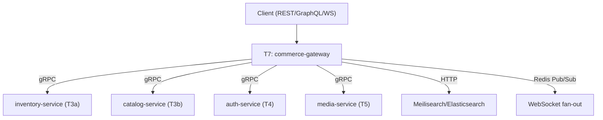

# Tier 7 — Enterprise & Multi-Protocol Surfaces

> Expose services over gRPC, GraphQL, and WebSockets; add search, multi-tenancy, i18n, and API versioning. This tier produces the `commerce-gateway` that composes everything.

---

## Purpose

By the end of T7, you can:

- Expose HTTP, gRPC, GraphQL, and WebSocket APIs from the same backend
- Add a search engine (Meilisearch or Elasticsearch) with CDC-style sync
- Handle multi-tenant isolation correctly
- Ship internationalized services (locale, currency, timezone, Unicode)
- Version APIs with deprecation, sunset, and migration paths
- Compose multiple services behind a gateway

T7 is where "I built a service" becomes "I built a platform other teams can build on."

---

## Anchored Project

**T7: `commerce-gateway`**

A gateway service that composes the earlier services behind REST, gRPC, GraphQL, and WebSocket interfaces, built on the T2 template and hardened in T6.

**What it includes:**

1. Composes `inventory-service` (T3a), `catalog-service` (T3b), `auth-service` (T4), `media-service` (T5)
2. `docker-compose.yml` orchestrating all services + gateway
3. REST edge API for clients
4. gRPC for internal service-to-service communication
5. GraphQL endpoint with DataLoader (N+1 prevention)
6. WebSocket endpoint for real-time order updates (with Redis Pub/Sub fan-out)
7. Meilisearch or Elasticsearch for product search; sync from Postgres via outbox + worker
8. Multi-tenant isolation: `tenant_id` column, Postgres RLS, per-tenant rate limits
9. i18n: `Accept-Language` negotiation, UTC timestamps, localized errors, currency formatting
10. API versioning: URI path (`/v1/*`, `/v2/*`) + Sunset/Deprecation headers
11. OpenAPI spec for REST; `.proto` for gRPC; GraphQL schema introspection
12. Versioned specs, `openapi-diff` in CI for breaking-change detection

**What it proves**: you can architect, build, and operate a multi-protocol platform.

**Deliverables:**

- `projects/t7-commerce-gateway/` — the gateway + orchestration
- `.proto` files for internal services
- GraphQL schema
- Postgres RLS policies
- Versioned OpenAPI specs + CI diff check
- Root `docker-compose.yml` running everything

---

## How T7 Fits the Architecture

**What it produces**: `commerce-gateway` — the composed platform. This is the final deliverable of the core curriculum.

---

## Topics (Linear Spine)

### T7.1 — Multi-Protocol API Design

- **When to use REST vs gRPC vs GraphQL vs WebSockets vs SSE**: decision matrix
  `KNOW` · `Anchor: T7` · `Deps: T2` · `Fails: using one protocol for all use cases` · `Interview: Y` · `Artifact: —` · `Mistake: gRPC for browser clients (needs gRPC-Web proxy)` · `Ref: T7.1 protocols` · `Theory 70/Practice 30` · `Local`

- **Internal RPC with gRPC**: protobuf schema, service definitions, generated clients
  `BUILD` · `Anchor: T7` · `Deps: T2` · `Fails: JSON REST too chatty for internal service-to-service calls` · `Interview: Y` · `Artifact: proto/` · `Mistake: gRPC for external clients without a proxy` · `Ref: T7.2 grpc` · `Theory 40/Practice 60` · `Local`

- **Edge API with REST**: keep client-facing HTTP simple; internal calls can be more complex
  `BUILD` · `Anchor: T7` · `Deps: T2` · `Fails: clients can't consume complex internal APIs` · `Interview: S` · `Artifact: edge/` · `Mistake: exposing gRPC directly to browsers` · `Ref: T7.6 graphql` · `Theory 30/Practice 70` · `Local`

- **Real-time with WebSockets**: connection lifecycle, heartbeats, auth, backpressure
  `BUILD` · `Anchor: T7` · `Deps: T1.7 events` · `Fails: real-time features poll (wasteful, laggy)` · `Interview: Y` · `Artifact: ws/` · `Mistake: no heartbeat (dead connections pile up)` · `Ref: T7.5 ws` · `Theory 40/Practice 60` · `Local`

- **Server-Sent Events (SSE)**: simpler one-way real-time, works over HTTP/1.1
  `BUILD` · `Anchor: T7` · `Deps: T2.1 HTTP` · `Fails: over-engineering bidirectional for one-way updates` · `Interview: S` · `Artifact: sse/` · `Mistake: SSE through proxies that buffer responses` · `Ref: T7.5 ws` · `Theory 30/Practice 70` · `Local`

- **gRPC-Web proxy awareness**: browser → gRPC through Envoy/Connect proxy
  `KNOW` · `Anchor: T7` · `Deps: T7.1 grpc` · `Fails: browsers can't speak gRPC natively` · `Interview: N` · `Artifact: —` · `Mistake: hand-rolling gRPC-Web framing` · `Ref: T7.1 protocols` · `Theory 60/Practice 40` · `Local`

- **Protocol selection based on client**: mobile, web, internal service, third-party
  `KNOW` · `Anchor: T7` · `Deps: T7.1 protocols` · `Fails: one-size-fits-all protocol` · `Interview: S` · `Artifact: —` · `Mistake: forcing GraphQL on internal services` · `Ref: T7.1 protocols` · `Theory 70/Practice 30` · `Local`

**Deep-dive candidates**: gRPC streaming, WebSocket backpressure — generate on demand.

---

### T7.2 — gRPC Deep Dive

- **Protocol Buffers fundamentals**: `.proto` syntax, message types, field numbers
  `BUILD` · `Anchor: T7` · `Deps: T7.1 grpc` · `Fails: wire-format incompatibilities across versions` · `Interview: Y` · `Artifact: proto/` · `Mistake: reusing field numbers after removal (breaks compatibility)` · `Ref: T7.2 versioning` · `Theory 40/Practice 60` · `Local`

- **Service definitions**: unary, server-streaming, client-streaming, bidirectional
  `BUILD` · `Anchor: T7` · `Deps: T7.2 protobuf` · `Fails: wrong streaming model for the use case` · `Interview: S` · `Artifact: services.proto` · `Mistake: server-streaming for request-response` · `Ref: T7.2 impl` · `Theory 40/Practice 60` · `Local`

- **Node.js gRPC server**: `@grpc/grpc-js`, `@grpc/proto-loader`, error handling
  `BUILD` · `Anchor: T7` · `Deps: T7.2 services` · `Fails: gRPC errors not mapped to standard codes` · `Interview: S` · `Artifact: server.ts` · `Mistake: throwing plain Errors (returns UNKNOWN)` · `Ref: T7.2 errors` · `Theory 30/Practice 70` · `Local`

- **gRPC error model**: status codes, details, trailers
  `BUILD` · `Anchor: T7` · `Deps: T7.2 server` · `Fails: clients can't distinguish errors` · `Interview: S` · `Artifact: errors.ts` · `Mistake: mapping HTTP statuses to gRPC codes blindly` · `Ref: T7.2 impl` · `Theory 40/Practice 60` · `Local`

- **gRPC health checking protocol**: `grpc.health.v1.Health` for load balancers
  `BUILD` · `Anchor: T7` · `Deps: T2.8 health` · `Fails: load balancers can't detect unhealthy gRPC servers` · `Interview: N` · `Artifact: health.ts` · `Mistake: no health check for gRPC` · `Ref: T7.2 impl` · `Theory 30/Practice 70` · `Local`

- **Server reflection**: `grpc-reflection` for dynamic service discovery
  `BUILD` · `Anchor: T7` · `Deps: T7.2 services` · `Fails: clients need `.proto` files to call the service` · `Interview: N` · `Artifact: reflection.ts` · `Mistake: reflection in prod (leaks schema)` · `Ref: T7.2 impl` · `Theory 30/Practice 70` · `Local`

- **gRPC versioning**: package versioning (`myapi.v1`, `myapi.v2`), immutable field numbers
  `BUILD` · `Anchor: T7` · `Deps: T7.2 protobuf` · `Fails: breaking changes break older clients` · `Interview: S` · `Artifact: versioning.md` · `Mistake: modifying existing field semantics` · `Ref: T7.8 versioning` · `Theory 40/Practice 60` · `Local`

- **Interceptors**: auth, logging, metrics, tracing
  `BUILD` · `Anchor: T7` · `Deps: T7.2 server, T6.6 otel` · `Fails: cross-cutting concerns duplicated per RPC` · `Interview: S` · `Artifact: interceptors/` · `Mistake: no interceptor (all cross-cutting logic in handlers)` · `Ref: T6.6 tracing` · `Theory 40/Practice 60` · `Local`

- **Deadline propagation**: `deadline` across service hops
  `BUILD` · `Anchor: T7` · `Deps: T5.4 timeouts` · `Fails: slow services block upstream calls indefinitely` · `Interview: S` · `Artifact: deadlines.ts` · `Mistake: no deadline (calls hang)` · `Ref: T7.2 impl` · `Theory 30/Practice 70` · `Local`

- **`grpcurl` for testing**: CLI client for gRPC services
  `USE` · `Anchor: T7` · `Deps: T7.2 server` · `Fails: manual testing requires writing client code` · `Interview: N` · `Artifact: grpcurl-notes.md` · `Mistake: no reflection or `.proto` for grpcurl` · `Ref: T7.2 impl` · `Theory 20/Practice 80` · `Local`

**Deep-dive candidates**: protobuf versioning rules, gRPC interceptors — generate on demand.

---

### T7.3 — GraphQL Deep Dive

- **Schema-first vs code-first**: SDL vs resolver-first
  `KNOW` · `Anchor: T7` · `Deps: T2.7 OpenAPI` · `Fails: schema-resolver drift` · `Interview: S` · `Artifact: —` · `Mistake: mixing both approaches` · `Ref: T7.3 resolvers` · `Theory 60/Practice 40` · `Local`

- **Schema definition**: types, queries, mutations, subscriptions, input types
  `BUILD` · `Anchor: T7` · `Deps: T7.3 schema-first` · `Fails: schema that doesn't express the domain` · `Interview: S` · `Artifact: schema.graphql` · `Mistake: one giant schema file` · `Ref: T7.3 resolvers` · `Theory 30/Practice 70` · `Local`

- **Resolvers**: field resolvers, arguments, context, parent
  `BUILD` · `Anchor: T7` · `Deps: T7.3 schema` · `Fails: N+1 queries on every list field` · `Interview: Y` · `Artifact: resolvers/` · `Mistake: no batching across siblings` · `Ref: T7.3 dataloader` · `Theory 30/Practice 70` · `Local`

- **The N+1 problem**: each object fetch triggering its own DB call
  `BUILD` · `Anchor: T7` · `Deps: T7.3 resolvers` · `Fails: 100ms query becomes 3s at scale` · `Interview: Y` · `Artifact: n+1-demo.ts` · `Mistake: not measuring resolver count` · `Ref: T7.3 dataloader` · `Theory 40/Practice 60` · `Local`

- **DataLoader batching**: batch and cache per request
  `BUILD` · `Anchor: T7` · `Deps: T7.3 n+1` · `Fails: N+1 not fixed; query count unchanged` · `Interview: Y` · `Artifact: dataloaders/` · `Mistake: sharing DataLoader across requests (caches leak)` · `Ref: T7.3 dataloader` · `Theory 40/Practice 60` · `Local`

- **Query complexity analysis**: depth limits, cost calculation, rejection before execution
  `BUILD` · `Anchor: T7` · `Deps: T7.3 resolvers` · `Fails: expensive queries from malicious or careless clients` · `Interview: S` · `Artifact: complexity.ts` · `Mistake: only depth limits (cost varies widely)` · `Ref: T4.6 rate-limit` · `Theory 40/Practice 60` · `Local`

- **Persisted queries**: hash-based lookup for reduced payload and injection prevention
  `KNOW` · `Anchor: T7` · `Deps: T7.3 schema` · `Fails: client sends arbitrary queries in prod` · `Interview: S` · `Artifact: —` · `Mistake: no allow-list (any query executes)` · `Ref: T4.6 hardening` · `Theory 60/Practice 40` · `Local`

- **Schema versioning & `@deprecated`**: additive changes, deprecation lifecycle
  `BUILD` · `Anchor: T7` · `Deps: T7.3 schema` · `Fails: breaking changes break clients silently` · `Interview: S` · `Artifact: versioning.md` · `Mistake: removing fields without deprecation` · `Ref: T7.8 versioning` · `Theory 40/Practice 60` · `Local`

- **Federation awareness**: combining multiple GraphQL services
  `KNOW` · `Anchor: T7` · `Deps: T7.3 schema` · `Fails: separate schemas can't share types` · `Interview: N` · `Artifact: —` · `Mistake: federation for a single service (overkill)` · `Ref: T7.4 gateway` · `Theory 70/Practice 30` · `Local`

- **Subscription basics**: WebSocket-based real-time with `graphql-ws`
  `BUILD` · `Anchor: T7` · `Deps: T7.1 ws` · `Fails: no real-time updates via GraphQL` · `Interview: S` · `Artifact: subscriptions.ts` · `Mistake: subscriptions for request-response` · `Ref: T7.5 ws` · `Theory 40/Practice 60` · `Local`

- **GraphQL caching strategies**: `@cacheControl`, gateway HTTP caching, client-side normalization
  `KNOW` · `Anchor: T7` · `Deps: T7.3 resolvers` · `Fails: no caching layer for GraphQL` · `Interview: N` · `Artifact: —` · `Mistake: applying HTTP caching to POSTed queries` · `Ref: T5.5 caching` · `Theory 70/Practice 30` · `Local`

**Deep-dive candidates**: DataLoader patterns, GraphQL cost analysis — generate on demand.

---

### T7.4 — API Gateway & Service Composition

- **Gateway responsibilities**: routing, auth, rate limiting, versioning, observability
  `KNOW` · `Anchor: T7` · `Deps: T2.2 Express` · `Fails: each client integrates with each service` · `Interview: Y` · `Artifact: —` · `Mistake: business logic in the gateway` · `Ref: T7.4 routing` · `Theory 60/Practice 40` · `Local`

- **Path-based routing**: `/v1/orders → order-service`, `/v1/products → catalog-service`
  `BUILD` · `Anchor: T7` · `Deps: T7.4 responsibilities` · `Fails: clients need to know internal service topology` · `Interview: S` · `Artifact: router.ts` · `Mistake: exposing service names externally` · `Ref: T7.8 versioning` · `Theory 30/Practice 70` · `Local`

- **Header-based routing**: `X-API-Version: 2`, `Accept: application/vnd.myapi.v2+json`
  `BUILD` · `Anchor: T7` · `Deps: T7.4 routing` · `Fails: no way to version without changing URLs` · `Interview: S` · `Artifact: header-routing.ts` · `Mistake: over-relying on custom headers (browsers cache differently)` · `Ref: T7.8 versioning` · `Theory 30/Practice 70` · `Local`

- **Auth context injection at gateway**: validate JWT, forward user ID to services
  `BUILD` · `Anchor: T7` · `Deps: T4.2 jwt` · `Fails: every service re-implements JWT validation` · `Interview: Y` · `Artifact: auth-context.ts` · `Mistake: forwarding JWT to services (they should trust the gateway)` · `Ref: T4.5 auth` · `Theory 40/Practice 60` · `Local`

- **Gateway rate limiting**: distributed rate limits across gateway instances
  `BUILD` · `Anchor: T7` · `Deps: T3c.5 rate-limit` · `Fails: gateway fleet doesn't enforce global limits` · `Interview: S` · `Artifact: gateway-ratelimit.ts` · `Mistake: in-memory limiter per gateway instance` · `Ref: T4.6 hardening` · `Theory 40/Practice 60` · `Local`

- **Composing multiple services**: parallel calls, partial failure handling
  `BUILD` · `Anchor: T7` · `Deps: T5.4 circuit-breaker` · `Fails: one slow service drags down the gateway` · `Interview: Y` · `Artifact: composition.ts` · `Mistake: sequential service calls when parallel is possible` · `Ref: T7.4 routing` · `Theory 50/Practice 50` · `Local`

- **Gateway observability**: per-route metrics, trace context propagation, access logs
  `BUILD` · `Anchor: T7` · `Deps: T6.6 otel` · `Fails: can't see which route is slow` · `Interview: S` · `Artifact: gateway-otel.ts` · `Mistake: no route-level metrics` · `Ref: T6.6 metrics` · `Theory 30/Practice 70` · `Local`

- **Self-hosted gateway options**: Kong, Tyk, Traefik, APISIX, KrakenD
  `KNOW` · `Anchor: T7` · `Deps: T7.4 responsibilities` · `Fails: hand-rolling a gateway when a mature one exists` · `Interview: N` · `Artifact: —` · `Mistake: adding a gateway when a library would do` · `Ref: T7.4 routing` · `Theory 70/Practice 30` · `Local`

- **Gateway anti-patterns**: business logic in gateway, single point of failure, unnecessary double-hop
  `KNOW` · `Anchor: T7` · `Deps: T7.4 responsibilities` · `Fails: gateway becomes a bottleneck or a mess` · `Interview: S` · `Artifact: —` · `Mistake: putting validation logic in gateway plugins` · `Ref: T7.4 routing` · `Theory 70/Practice 30` · `Local`

**Deep-dive candidates**: gateway vs library decision, auth context injection — generate on demand.

---

### T7.5 — Real-Time: WebSockets, SSE & Pub/Sub

- **WebSocket handshake & upgrade**: HTTP upgrade, `Sec-WebSocket-Key`, connection lifecycle
  `BUILD` · `Anchor: T7` · `Deps: T1.7 events` · `Fails: connection setup bugs, no auth on upgrade` · `Interview: S` · `Artifact: ws-handshake.ts` · `Mistake: auth only after connection (DoS) vs before (no session)` · `Ref: T7.5 heartbeat` · `Theory 40/Practice 60` · `Local`

- **Authentication for WebSockets**: token via query param or initial message; validate before upgrade
  `BUILD` · `Anchor: T7` · `Deps: T4.2 jwt` · `Fails: unauthenticated connections consume resources` · `Interview: Y` · `Artifact: ws-auth.ts` · `Mistake: logging the token in query params` · `Ref: T7.5 heartbeat` · `Theory 40/Practice 60` · `Local`

- **Heartbeats & ping/pong**: detect dead connections
  `BUILD` · `Anchor: T7` · `Deps: T7.5 handshake` · `Fails: dead connections pile up; memory leak` · `Interview: Y` · `Artifact: heartbeat.ts` · `Mistake: no heartbeat (zombie connections)` · `Ref: T6.7 memory` · `Theory 30/Practice 70` · `Local`

- **Backpressure handling**: bounded queues, slow consumer detection
  `BUILD` · `Anchor: T7` · `Deps: T1.7 streams` · `Fails: slow clients accumulate messages; memory explodes` · `Interview: S` · `Artifact: backpressure.ts` · `Mistake: unbounded send queue` · `Ref: T6.7 memory` · `Theory 40/Practice 60` · `Local`

- **Redis Pub/Sub fan-out**: multiple gateway instances share subscription state
  `BUILD` · `Anchor: T7` · `Deps: T3c.4 pubsub` · `Fails: WebSocket connections are pinned to one instance; cross-instance messages lost` · `Interview: Y` · `Artifact: ws-fanout.ts` · `Mistake: in-memory pub/sub (messages don't cross instances)` · `Ref: T7.5 presence` · `Theory 40/Practice 60` · `Local`

- **Redis Streams for durable real-time**: consumer groups, message replay
  `KNOW` · `Anchor: T7` · `Deps: T3c.2 streams` · `Fails: Pub/Sub loses messages when no subscriber` · `Interview: S` · `Artifact: —` · `Mistake: Streams for low-latency fan-out (Kafka/RabbitMQ better)` · `Ref: T5.7 kafka` · `Theory 60/Practice 40` · `Local`

- **Presence tracking**: online/offline state via Redis Sets or Hashes with TTL
  `BUILD` · `Anchor: T7` · `Deps: T3c.2 hashes` · `Fails: no way to know who's online across instances` · `Interview: S` · `Artifact: presence.ts` · `Mistake: presence in memory per instance` · `Ref: T7.5 fanout` · `Theory 40/Practice 60` · `Local`

- **SSE for one-way streams**: simpler alternative when bidirectional isn't needed
  `BUILD` · `Anchor: T7` · `Deps: T7.1 sse` · `Fails: over-engineering with WebSockets for one-way updates` · `Interview: S` · `Artifact: sse.ts` · `Mistake: SSE through buffering proxies (delayed delivery)` · `Ref: T7.5 ws` · `Theory 30/Practice 70` · `Local`

- **Connection limits & graceful drain**: max connections, reconnect frames, `GOAWAY` for gRPC streams
  `KNOW` · `Anchor: T7` · `Deps: T5.9 shutdown` · `Fails: no clean way to close WebSocket connections on deploy` · `Interview: N` · `Artifact: —` · `Mistake: killing connections abruptly` · `Ref: T5.9 drain` · `Theory 70/Practice 30` · `Local`

**Deep-dive candidates**: WebSocket fan-out at scale, backpressure for real-time — generate on demand.

---

### T7.6 — Search Engines & Sync Pipelines

- **When to add a search engine**: full-text search, faceted filters, relevance ranking
  `KNOW` · `Anchor: T7` · `Deps: T3a.2 SQL` · `Fails: Postgres `ILIKE '%term%'` at scale is slow` · `Interview: Y` · `Artifact: —` · `Mistake: adding a search engine for simple lookups` · `Ref: T7.6 meilisearch` · `Theory 60/Practice 40` · `Local`

- **Meilisearch vs Elasticsearch**: choose based on scale and features
  `KNOW` · `Anchor: T7` · `Deps: T7.6 when` · `Fails: wrong tool for the workload` · `Interview: S` · `Artifact: —` · `Mistake: Elasticsearch for a small app (operational overhead)` · `Ref: T7.6 meilisearch` · `Theory 60/Practice 40` · `Local`

- **Meilisearch setup & indexing**: documents, settings, searchable/filterable attributes
  `BUILD` · `Anchor: T7` · `Deps: T7.6 when` · `Fails: no search engine running` · `Interview: N` · `Artifact: meili-setup.ts` · `Mistake: indexing everything (wasteful)` · `Ref: T7.6 sync` · `Theory 30/Practice 70` · `Local`

- **Faceted search**: category counts, price ranges, brand filters
  `BUILD` · `Anchor: T7` · `Deps: T7.6 setup` · `Fails: no facets in results; users can't narrow` · `Interview: S` · `Artifact: facets.ts` · `Mistake: computing facets in app (search engine does it)` · `Ref: T7.6 relevance` · `Theory 30/Practice 70` · `Local`

- **Sync pipeline from Postgres → search engine**: outbox pattern with worker
  `BUILD` · `Anchor: T7` · `Deps: T5.2 BullMQ` · `Fails: stale search results after DB updates` · `Interview: Y` · `Artifact: outbox-sync.ts` · `Mistake: dual-write without outbox (drift, lost updates)` · `Ref: T7.6 sync` · `Theory 50/Practice 50` · `Local`

- **Outbox pattern**: DB write + outbox row in same transaction; worker publishes from outbox
  `BUILD` · `Anchor: T7` · `Deps: T3a.3 transactions, T5.2 BullMQ` · `Fails: DB commit succeeds but search update fails (silent drift)` · `Interview: Y` · `Artifact: outbox.ts` · `Mistake: publishing directly after DB commit` · `Ref: T5.7 kafka` · `Theory 50/Practice 50` · `Local`

- **Relevance ranking awareness**: BM25, TF-IDF, custom ranking rules
  `KNOW` · `Anchor: T7` · `Deps: T7.6 when` · `Fails: results ordered wrong; users can't find products` · `Interview: N` · `Artifact: —` · `Mistake: default ranking for all cases` · `Ref: T7.6 facets` · `Theory 70/Practice 30` · `Local`

- **Typo tolerance & fuzzy search**: Levenshtein, prefix matching, synonyms
  `KNOW` · `Anchor: T7` · `Deps: T7.6 setup` · `Fails: searches fail on typos` · `Interview: N` · `Artifact: —` · `Mistake: no synonyms (users search "laptop" for "notebook")` · `Ref: T7.6 relevance` · `Theory 60/Practice 40` · `Local`

- **Full reindex strategy**: drop and rebuild when schema changes
  `KNOW` · `Anchor: T7` · `Deps: T7.6 sync` · `Fails: schema migrations leave search index stale` · `Interview: N` · `Artifact: —` · `Mistake: full reindex on every change` · `Ref: T7.6 sync` · `Theory 60/Practice 40` · `Local`

- **Postgres full-text search as baseline**: `tsvector`, `tsquery`, GIN indexes
  `KNOW` · `Anchor: T7` · `Deps: T3a.4 GIN` · `Fails: adding a search engine when Postgres FTS would do` · `Interview: S` · `Artifact: —` · `Mistake: under-estimating Postgres FTS` · `Ref: T7.6 when` · `Theory 70/Practice 30` · `Local`

**Deep-dive candidates**: outbox sync pipeline, Meilisearch vs Elasticsearch — generate on demand.

---

### T7.7 — Multi-Tenancy

- **Multi-tenancy models**: pool (shared schema + `tenant_id`), silo (DB per tenant), schema-per-tenant
  `KNOW` · `Anchor: T7` · `Deps: T3a.1 modeling` · `Fails: choosing wrong isolation model for the business` · `Interview: Y` · `Artifact: —` · `Mistake: one model for all customers (enterprise needs silo)` · `Ref: T7.7 rls` · `Theory 70/Practice 30` · `Local`

- **`tenant_id` in every table + Row-Level Security (RLS)**: Postgres-enforced isolation
  `BUILD` · `Anchor: T7` · `Deps: T3a.1 modeling` · `Fails: cross-tenant data leaks from missing filters` · `Interview: Y` · `Artifact: rls.sql` · `Mistake: app-level `WHERE tenant_id = ?` (forget once = leak)` · `Ref: T7.7 context` · `Theory 50/Practice 50` · `Local`

- **Tenant context propagation**: `AsyncLocalStorage` + middleware sets tenant from JWT/subdomain
  `BUILD` · `Anchor: T7` · `Deps: T2.5 AsyncLocalStorage` · `Fails: no tenant awareness in deep call stacks` · `Interview: S` · `Artifact: tenant-context.ts` · `Mistake: passing `tenantId` through every function` · `Ref: T7.7 rls` · `Theory 40/Practice 60` · `Local`

- **Per-tenant rate limits**: different tiers (free, pro, enterprise)
  `BUILD` · `Anchor: T7` · `Deps: T3c.5 rate-limit` · `Fails: one tenant's burst degrades all others` · `Interview: S` · `Artifact: tenant-ratelimit.ts` · `Mistake: same limits for all tenants` · `Ref: T4.6 hardening` · `Theory 40/Practice 60` · `Local`

- **Per-tenant observability**: metrics, dashboards, alerts segmented by tenant
  `BUILD` · `Anchor: T7` · `Deps: T6.6 metrics` · `Fails: can't see if one tenant is degraded` · `Interview: N` · `Artifact: tenant-observability.ts` · `Mistake: tenant_id as Prometheus label (high cardinality)` · `Ref: T6.6 metrics` · `Theory 40/Practice 60` · `Local`

- **Tenant onboarding & provisioning**: automated workspace creation
  `BUILD` · `Anchor: T7` · `Deps: T4.5 auth` · `Fails: manual tenant creation doesn't scale` · `Interview: S` · `Artifact: provisioning.ts` · `Mistake: no idempotency on onboarding` · `Ref: T7.7 rls` · `Theory 40/Practice 60` · `Local`

- **GDPR data export & deletion per tenant**: right to access, right to be forgotten
  `KNOW` · `Anchor: T7` · `Deps: T4.5 audit` · `Fails: compliance violations` · `Interview: S` · `Artifact: —` · `Mistake: hard-delete cascades break audit trails` · `Ref: T6.7 runbook` · `Theory 70/Practice 30` · `Local`

- **Tenant migration across shards**: moving a tenant without downtime
  `KNOW` · `Anchor: T7` · `Deps: T3a.6 migrations` · `Fails: can't move a tenant that outgrows their shard` · `Interview: N` · `Artifact: —` · `Mistake: no path to migrate enterprise tenants` · `Ref: T7.7 silo` · `Theory 80/Practice 20` · `Local`

- **Pool vs silo trade-offs**: cost, isolation, operational complexity
  `KNOW` · `Anchor: T7` · `Deps: T7.7 models` · `Fails: wrong model for the customer segment` · `Interview: S` · `Artifact: —` · `Mistake: pool for regulated enterprise (compliance fails)` · `Ref: T7.7 models` · `Theory 70/Practice 30` · `Local`

**Deep-dive candidates**: RLS policies, tenant context propagation — generate on demand.

---

### T7.8 — Internationalization, Currency & Versioning

- **Locale negotiation via `Accept-Language`**: parse `q=` weights, resolve to locale
  `BUILD` · `Anchor: T7` · `Deps: T2.1 headers` · `Fails: users see English even when they set another language` · `Interview: S` · `Artifact: locale.ts` · `Mistake: ignoring `q=` weights` · `Ref: T7.8 errors` · `Theory 40/Practice 60` · `Local`

- **Localized error responses**: translated messages, stable error codes
  `BUILD` · `Anchor: T7` · `Deps: T2.6 RFC 7807` · `Fails: errors are only in English` · `Interview: S` · `Artifact: localized-errors.ts` · `Mistake: translating error codes (break client logic)` · `Ref: T7.8 locale` · `Theory 30/Practice 70` · `Local`

- **Multi-language content modeling**: JSONB vs translation tables
  `BUILD` · `Anchor: T7` · `Deps: T3a.1 modeling` · `Fails: content in one language only, or hard to query` · `Interview: S` · `Artifact: i18n-schema.sql` · `Mistake: JSONB for everything (query complexity)` · `Ref: T7.8 content` · `Theory 40/Practice 60` · `Local`

- **UTC storage + timezone conversion at presentation**: never store local times
  `BUILD` · `Anchor: T7` · `Deps: T3a.9 timezones` · `Fails: scheduled events happen at wrong local times` · `Interview: Y` · `Artifact: timezone.ts` · `Mistake: storing local times in DB` · `Ref: T5.3 cron` · `Theory 40/Practice 60` · `Local`

- **Currency ISO 4217 & minor units**: USD (2), JPY (0), KWD (3)
  `BUILD` · `Anchor: T7` · `Deps: T3a.9 money` · `Fails: JPY displayed as 100x; KWD loses precision` · `Interview: S` · `Artifact: currency.ts` · `Mistake: assuming 2 decimals for all currencies` · `Ref: T7.8 money` · `Theory 40/Practice 60` · `Local`

- **Currency display formatting**: symbol position, spacing, localized separators
  `BUILD` · `Anchor: T7` · `Deps: T7.8 currency` · `Fails: `1,000.00`vs`1.000,00` mismatch by locale` · `Interview: N` · `Artifact: currency-format.ts` · `Mistake: hardcoded `$` prefix` · `Ref: T7.8 number-format` · `Theory 30/Practice 70` · `Local`

- **Locale-aware number formatting**: `1,000` vs `1.000`, decimal separators
  `BUILD` · `Anchor: T7` · `Deps: T7.8 currency` · `Fails: numbers displayed wrong for locale` · `Interview: N` · `Artifact: number-format.ts` · `Mistake: `toLocaleString` with wrong default` · `Ref: T7.8 currency-format` · `Theory 30/Practice 70` · `Local`

- **Unicode CLDR pluralization**: `zero`, `one`, `two`, `few`, `many`, `other`
  `BUILD` · `Anchor: T7` · `Deps: T7.8 content` · `Fails: "1 items" instead of "1 item"; wrong plural forms in other languages` · `Interview: N` · `Artifact: pluralization.ts` · `Mistake: `count === 1 ? 'item' : 'items'` (English only)` · `Ref: T7.8 content` · `Theory 40/Practice 60` · `Local`

- **RTL (right-to-left) text handling**: Arabic, Hebrew; bidirectional text and mixed LTR/RTL
  `KNOW` · `Anchor: T7` · `Deps: T7.8 content` · `Fails: text displays wrong direction; UI breaks` · `Interview: N` · `Artifact: —` · `Mistake: no `dir="rtl"` handling` · `Ref: T7.8 content` · `Theory 70/Practice 30` · `Local`

- **API versioning strategies**: URI path, header, media type, date-based (Stripe-style)
  `BUILD` · `Anchor: T7` · `Deps: T2.7 versioning` · `Fails: breaking changes ship silently; clients break` · `Interview: Y` · `Artifact: versioning-strategy.md` · `Mistake: versioning before you need to` · `Ref: T7.8 deprecation` · `Theory 50/Practice 50` · `Local`

- **`Deprecation` and `Sunset` headers (RFC 9745, RFC 8594)**: machine-readable deprecation
  `BUILD` · `Anchor: T7` · `Deps: T7.8 versioning` · `Fails: clients don't know a version is going away` · `Interview: S` · `Artifact: deprecation-headers.ts` · `Mistake: no advance notice (breaking clients)` · `Ref: T7.8 lifecycle` · `Theory 40/Practice 60` · `Local`

- **Version usage tracking middleware**: log which clients use which versions
  `BUILD` · `Anchor: T7` · `Deps: T2.5 logging` · `Fails: no way to know when to sunset a version` · `Interview: S` · `Artifact: version-usage.ts` · `Mistake: no tracking → sunset breaks unknown clients` · `Ref: T7.8 lifecycle` · `Theory 30/Practice 70` · `Local`

- **Sunset lifecycle**: 6-month notice, 12-month support window, brownout tests
  `KNOW` · `Anchor: T7` · `Deps: T7.8 deprecation` · `Fails: abrupt cutoff breaks clients` · `Interview: S` · `Artifact: —` · `Mistake: no brownout tests before full shutdown` · `Ref: T7.8 versioning` · `Theory 70/Practice 30` · `Local`

- **`openapi-diff` in CI**: detect breaking changes before merge
  `BUILD` · `Anchor: T7` · `Deps: T2.7 OpenAPI` · `Fails: breaking changes ship silently` · `Interview: S` · `Artifact: openapi-diff.yml` · `Mistake: diff without severity classification (too noisy)` · `Ref: T6.3 ci` · `Theory 30/Practice 70` · `Local`

- **Version transformation layers**: transform v1 request → internal model → v1 response
  `KNOW` · `Anchor: T7` · `Deps: T7.8 versioning` · `Fails: internal model changes leak to API versions` · `Interview: N` · `Artifact: —` · `Mistake: versioning internal code (only public API versions matter)` · `Ref: T7.8 deprecation` · `Theory 70/Practice 30` · `Local`

**Deep-dive candidates**: API versioning strategies, Sunset/Deprecation header lifecycle — generate on demand.

---

### T7.9 — Integration: The commerce-gateway Project

- **Wiring all services**: `inventory`, `catalog`, `auth`, `media` behind the gateway
  `BUILD` · `Anchor: T7` · `Deps: all previous tiers` · `Fails: services exist but don't work together` · `Interview: Y` · `Artifact: gateway/` · `Mistake: duplicating service logic in gateway` · `Ref: T7` · `Theory 20/Practice 80` · `Local`

- **gRPC + REST + GraphQL + WebSocket all from one gateway**
  `BUILD` · `Anchor: T7` · `Deps: T7.1 protocols` · `Fails: clients only get one protocol` · `Interview: Y` · `Artifact: gateway/` · `Mistake: separate gateways per protocol (ops complexity)` · `Ref: T7.1 protocols` · `Theory 30/Practice 70` · `Local`

- **Auth context flows from gateway to services**: JWT validated at edge, `userId` forwarded via gRPC metadata
  `BUILD` · `Anchor: T7` · `Deps: T4.2 jwt, T7.4 auth-context` · `Fails: services re-validate JWT (slow, duplicated)` · `Interview: Y` · `Artifact: auth-context.ts` · `Mistake: passing raw JWT (services should trust gateway)` · `Ref: T7.4 auth` · `Theory 40/Practice 60` · `Local`

- **Product search via Meilisearch/Elasticsearch**: sync from Postgres via outbox
  `BUILD` · `Anchor: T7` · `Deps: T7.6 sync` · `Fails: search results stale after product changes` · `Interview: Y` · `Artifact: search-sync.ts` · `Mistake: no outbox (drift)` · `Ref: T7.6 sync` · `Theory 30/Practice 70` · `Local`

- **Real-time order updates via WebSocket**: order state changes broadcast to relevant clients
  `BUILD` · `Anchor: T7` · `Deps: T7.5 fanout` · `Fails: clients poll for order status (wasteful, laggy)` · `Interview: Y` · `Artifact: order-ws.ts` · `Mistake: broadcasting to all clients (privacy + load)` · `Ref: T7.5 fanout` · `Theory 30/Practice 70` · `Local`

- **Multi-tenancy across all services**: `tenant_id` in JWT, RLS in Postgres, tenant-scoped search index
  `BUILD` · `Anchor: T7` · `Deps: T7.7 rls` · `Fails: cross-tenant data leaks` · `Interview: Y` · `Artifact: tenant-enforcement.ts` · `Mistake: per-service tenant logic (inconsistent)` · `Ref: T7.7 rls` · `Theory 30/Practice 70` · `Local`

- **i18n throughout**: localized errors, currency formatting, timezone handling
  `BUILD` · `Anchor: T7` · `Deps: T7.8 i18n` · `Fails: English-only responses for global users` · `Interview: S` · `Artifact: i18n/` · `Mistake: i18n only in UI (backend ignores locale)` · `Ref: T7.8 i18n` · `Theory 30/Practice 70` · `Local`

- **Versioned OpenAPI specs + CI diff**: v1 and v2 specs side by side; breaking change detection
  `BUILD` · `Anchor: T7` · `Deps: T7.8 versioning` · `Fails: versioning policy unclear; breaking changes ship` · `Interview: S` · `Artifact: openapi/` · `Mistake: no CI check (drift)` · `Ref: T7.8 versioning` · `Theory 30/Practice 70` · `Local`

- **End-to-end integration tests**: cross-service flows (create order → decrement stock → notify)
  `BUILD` · `Anchor: T7` · `Deps: T6.1 testcontainers` · `Fails: individual services tested; composition untested` · `Interview: Y` · `Artifact: e2e.test.ts` · `Mistake: no end-to-end test (only unit tests)` · `Ref: T6.1 testcontainers` · `Theory 20/Practice 80` · `Local`

- **README with system architecture diagram**: the whole platform in one picture
  `BUILD` · `Anchor: T7` · `Deps: all T7` · `Fails: no one understands the system` · `Interview: S` · `Artifact: ARCHITECTURE.md` · `Mistake: diagram without legend or context` · `Ref: T6.7 runbook` · `Theory 20/Practice 80` · `Local`

---

## Why Not?

### Why gRPC Over REST for Internal Services?

- **REST + JSON** — universally understood, easy to debug (curl, Postman), works with any client. But chatty, verbose, no native streaming, no schema enforcement.
- **gRPC** — Protobuf binary (5–10x smaller than JSON), HTTP/2 multiplexing, native streaming (unary, server, client, bidirectional), schema-driven (`.proto` files), codegen for clients. 5–10x faster than JSON REST for internal service-to-service calls.
- **Choose REST** for public APIs, browser clients, simple CRUD, human debugging.
- **Choose gRPC** for internal service-to-service, high-throughput, streaming, and when you want compile-time contract enforcement.

### Why GraphQL Over REST?

- **REST** — multiple endpoints, fixed response shapes. Over-fetching (client needs 2 of 20 fields) and under-fetching (client makes 3 requests).
- **GraphQL** — one endpoint, client specifies fields, no over/under-fetching. Great for varied clients (mobile vs web vs third-party).
- **Cost**: N+1 problem (solved with DataLoader), loss of native HTTP caching, gateway query parser CPU, schema federation complexity.
- **Choose GraphQL** when you have many clients with different data needs. **Choose REST** for simple CRUD, public APIs, cache-heavy workloads.

### Why DataLoader Over Just Batching by Hand?

- **Hand batching** — you write `getUsersByIds(ids)` and call it in every resolver. Easy to forget, easy to break.
- **DataLoader** — declarative batching, per-request cache, deduplication. It hooks into the GraphQL execution model and batches automatically.
- **Rule**: any GraphQL resolver that fetches related entities uses DataLoader. No exceptions.

### Why Meilisearch Over Elasticsearch?

- **Elasticsearch** — extremely powerful, supports everything (fuzzy, facets, ML, analytics), but heavy. JVM tuning, cluster management, memory-hungry.
- **Meilisearch** — lightweight, fast, typo-tolerant, easy setup. Missing advanced features (no full aggregations, no complex scoring pipelines).
- **Choose Meilisearch** for small-to-medium search (<10M docs), simple filters, fast iteration.
- **Choose Elasticsearch** for large scale, complex relevance tuning, aggregations, or when you need an ecosystem of plugins.
- **Postgres full-text search** is a valid third option for very small scale — one fewer dependency.

### Why `tenant_id` + RLS Over App-Level Filtering?

- **App-level filtering** (`WHERE tenant_id = ?`) — every query must remember to filter. Miss one and you leak data across tenants. The worst kind of bug.
- **Postgres RLS** — enforced at the database layer. Even if the app forgets, the DB won't return rows from another tenant. Fail-closed.
- **Cost**: RLS adds a policy check per query (~5–10% overhead). Worth it.
- **Rule**: multi-tenant systems use RLS. Always.

### Why Postgres RLS Over Database-Per-Tenant (Silo)?

- **Silo** (DB per tenant) — maximum isolation, but expensive (DB per customer), hard to migrate, hard to run analytics across tenants.
- **Pool** (shared schema + `tenant_id` + RLS) — cheap, scalable, one DB to operate, analytics across tenants trivial. Risk: a policy bug affects all tenants.
- **Hybrid**: pool by default; silo for enterprise customers with compliance or scale needs. Most systems start pool-only.

### Why Locale-Aware Formatting Over `toLocaleString` Defaults?

- **`toLocaleString()`** without options — uses the runtime's default locale, which may not match the user's. In a Node server, this is usually the OS locale, not the request locale.
- **Explicit locale** — `new Intl.NumberFormat(locale, options).format(value)`. Numbers, currencies, dates, plurals — all formatted for the user's actual locale.
- **Rule**: every formatting call passes an explicit locale derived from `Accept-Language`.

### Why UTC Storage Over Local Time?

- **UTC storage** — server stores everything in UTC. Conversion to local time happens at presentation.
- **Local time storage** — breaks during DST transitions (skipped and repeated hours), timezone changes, and cross-region queries.
- **Rule**: DB stores UTC. API returns ISO 8601 with timezone offset. Frontend converts. Non-negotiable for any service that touches multiple timezones.

### Why `Sunset` / `Deprecation` Headers Over Just Documenting?

- **Just documenting** — clients don't read docs. You deprecate v1, they keep using it, one day you remove it and break them.
- **`Deprecation` header (RFC 9745)** — machine-readable signal on every response.
- **`Sunset` header (RFC 8594)** — machine-readable date when the endpoint goes away.
- **Cost**: one header. **Benefit**: clients can build automated deprecation alerts. Everyone wins.

### Why `openapi-diff` in CI Over Manual Review?

- **Manual review** — reviewers miss breaking changes. A field rename looks innocuous in a diff.
- **`openapi-diff`** — compares v1 spec to v2 spec programmatically. Flags removed fields, type changes, new required fields, error code changes. Fails the build on breaking change.
- **Rule**: no API change ships without an automated breaking-change check.

### Why WebSockets Over SSE for Chat?

- **SSE** — server → client only, simpler, works over HTTP/1.1. Good for one-way streams (notifications, live scores, progress).
- **WebSockets** — bidirectional, full-duplex. Required for chat, collaboration, presence, anything where the client sends frequently.
- **Choose SSE** when only the server initiates. **Choose WebSockets** when both sides send. Don't over-engineer one-way updates with WebSockets.

### Why Redis Pub/Sub Over In-Memory Events for WebSocket Fan-Out?

- **In-memory events** (`EventEmitter`) — work on one process. Break the moment you have 5 gateway instances.
- **Redis Pub/Sub** — every gateway instance subscribes. Message published by one instance is broadcast to all. Cross-instance fan-out solved.
- **Caveat**: Pub/Sub is fire-and-forget. No replay if a gateway was down. Use Redis Streams for durable real-time (consumer groups, replay).

---

## Exit Criteria

You've completed T7 when you can:

- Expose the same backend over REST, gRPC, GraphQL, and WebSockets
- Sync data from Postgres to a search engine via outbox pattern
- Enforce multi-tenant isolation with Postgres RLS
- Handle locale negotiation, currency formatting, and timezone conversion
- Version APIs with deprecation, sunset, and `openapi-diff` in CI
- Compose multiple services behind a gateway
- Write an architecture diagram for the whole platform

---

## Cross-Tier References

**Depends on**: all previous tiers.

**Depended on by**:

- Backend Mastery projects — some (e-commerce, chat, notifications) reuse T7 patterns

---

## Common Failure Modes for the Tier as a Whole

- **gRPC for browser clients without a proxy**: browsers can't speak gRPC natively.
- **GraphQL N+1 without DataLoader**: 100-item list triggers 100 DB queries.
- **Sharing DataLoader across requests**: cache leaks between users.
- **No outbox for search sync**: search drifts from source of truth.
- **No `tenant_id` filter (or missing RLS)**: cross-tenant data leak, the worst kind of bug.
- **Prometheus label on `tenant_id`**: cardinality explodes; Prometheus falls over.
- **Storing local times in DB**: DST bugs, wrong scheduled events.
- **Assuming 2 currency decimals**: JPY, KWD break.
- **No `Sunset` headers**: clients break when v1 is removed.
- **Business logic in gateway**: gateway becomes a bottleneck and a mess.
- **Same version of GraphQL schema forever**: breaking changes break clients silently.

---

## Case Studies & Papers

See `13-case-studies.md § T7` and `14-papers.md § T7`.
